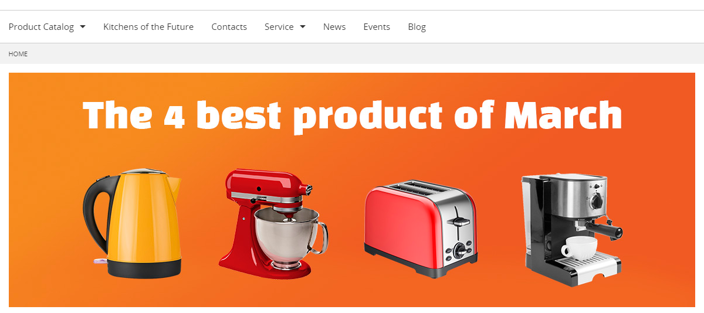
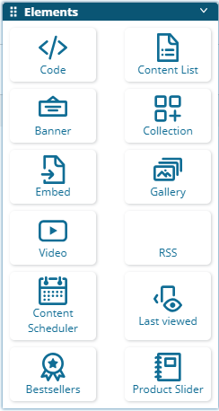
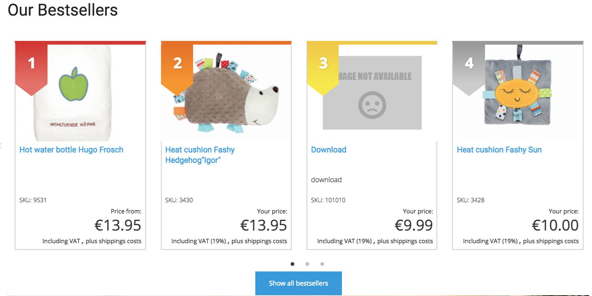
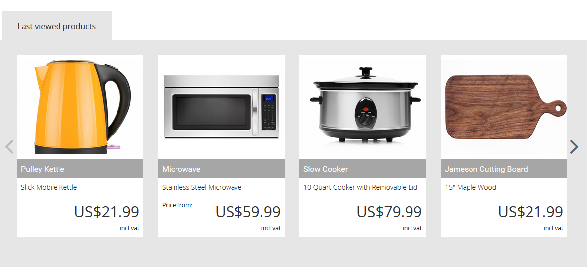
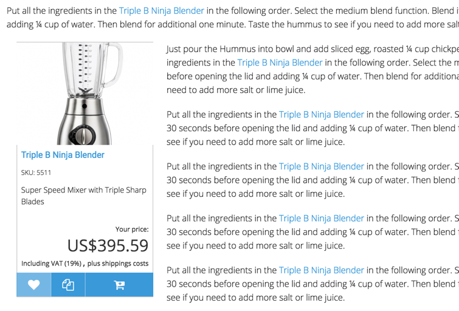
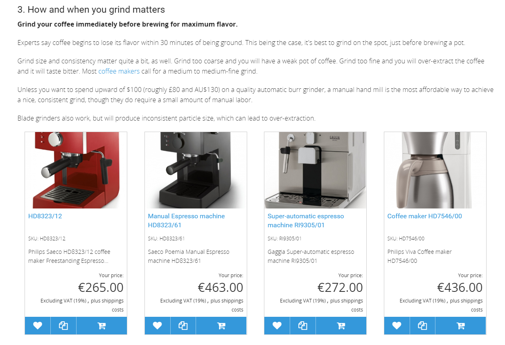
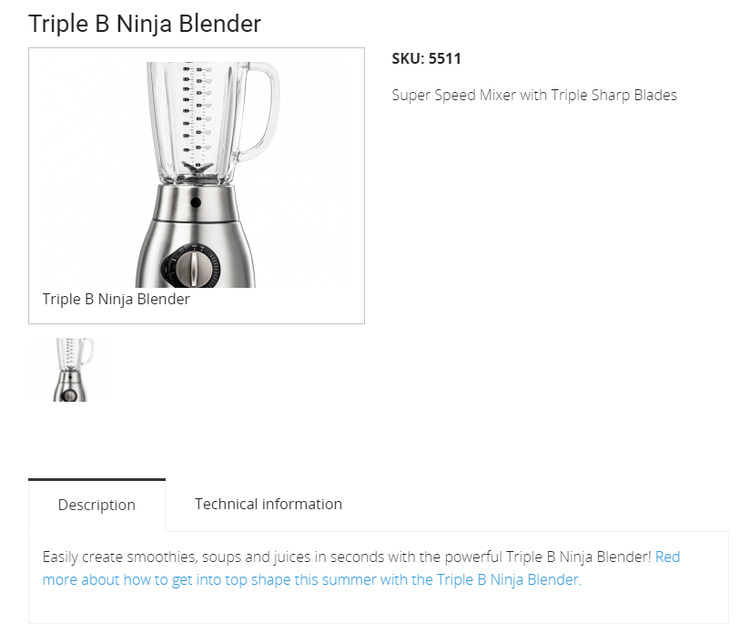

# Content and commerce

In eZ Commerce content and commerce are managed in one system.

## Dynamic menu

In the main navigation, Product Catalog and Content items can be displayed. A partner can configure which Content Types should appear in the menu. The order of the navigation items can be defined by the editor in the Back Office using the priority field.

## Page blocks

eZ Commerce adds the following blocks to the Page Builder:

- Bestseller - display general bestsellers or bestseller of a given group
- Product slider - displays a slider of chosen products
- Last viewed - displays the last viewed products

!!! note

    The Newsletter2Go Plugin adds a Newsletter block to the Page Builder.

Bestseller block:

Product slider:

Last viewed products:

## Embed a product

If product data is stored in regular content, products or product slider can be embedded in the RichText Field (e.g. in articles, news, blog posts and events).

If products are stored in eContent and/or a PIM system, a product slider can be embedded in the RichText Field (e.g. in articles, news, blog posts and events) by using the element "Product card". With eContent it is not possible to embed a single product.

## Embed an article

If product data is stored in regular content, an article or blog post, news or event can also be embedded in product detail description.

