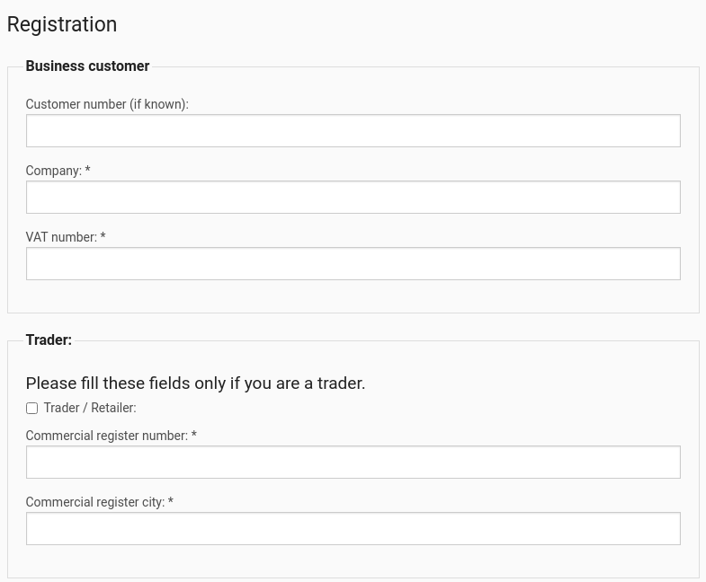

# Customer registration

## Registration in shop (no 3rd party software involved)

A user can create a customer login. A registration form collects the data required to create the account. The account is created using a double opt-in process.

The account is stored as a User Content item.

A user can register as private, business or existing customer.

eZ Commerce offers an enhanced registration form with special B2B features:

- VAT number check for EU VAT codes using an online service (VIES)
- An option to upload a PDF company registration

The shop owner will receive an email with the details of the registration. The standard process in B2B business is that sales will contact the new customer and set up a contract before he can use the online shop. So there is no automatic user set up in the shop.

## Activate account for existing customer

### Secure authentication for existing customers

Existing customers - meaning customers that are set up in the connected ERP - can activate a shop account themselves by entering their customer number and one invoice number. The data is sent to the ERP. If the data in ERP and the entered data match, the customer will get access to the shop immediately and a User Content item is set up automatically with the customer no. from the ERP.

## Login

The standard login for eZ Commerce uses an eZ Platform function - the login requires an email address and a password.

A user can request a new password in case they have forgotten the existing one. Note: eZ Commerce does not use the eZ Platform "forgot password" feature.

## My account

The shop enables the user to change their:

- account data and password
- invoice address
- delivery address(es)

## Manage delivery addresses

The customer can manage their delivery addresses in the address book. The addresses will be offered for selection during checkout process.

