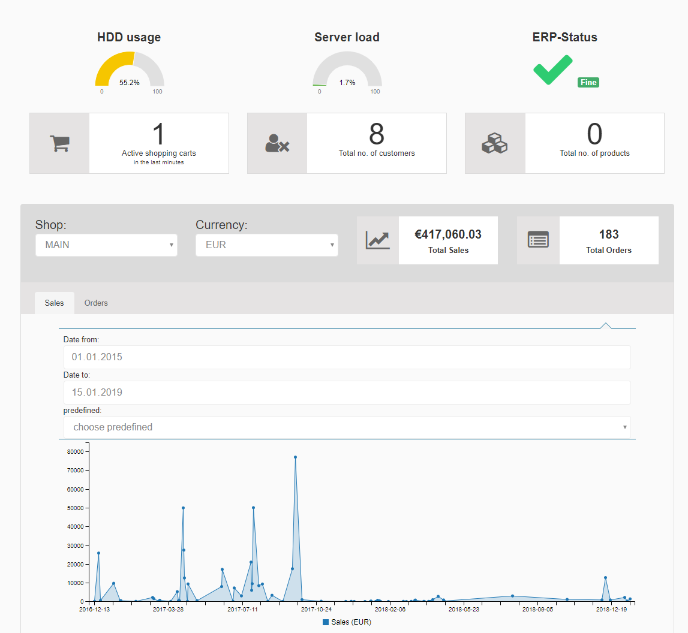
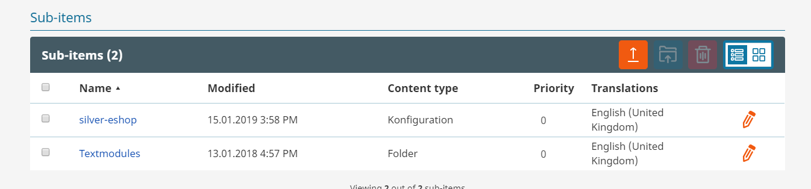
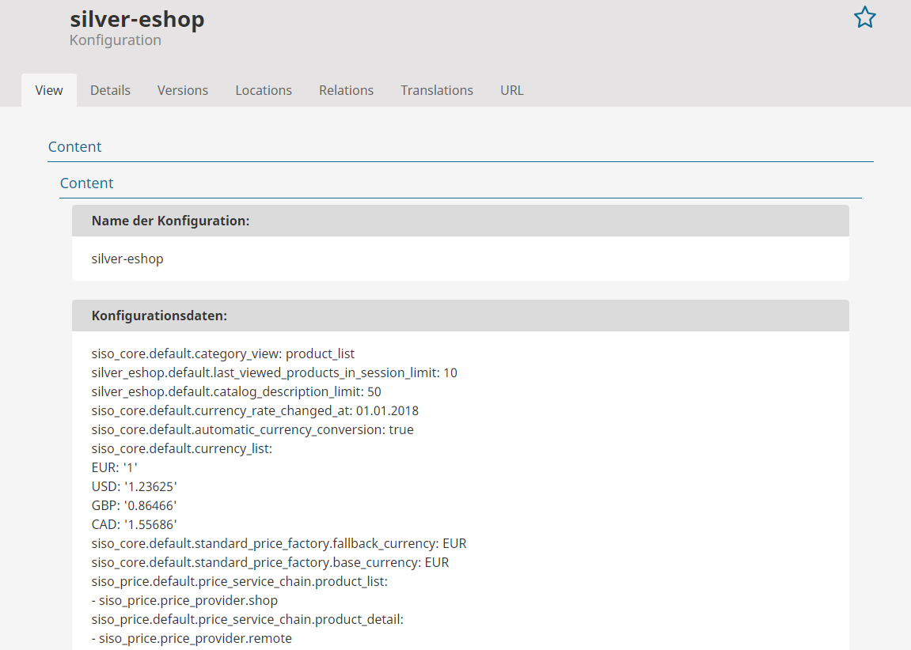
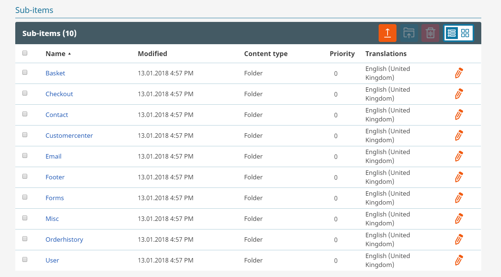
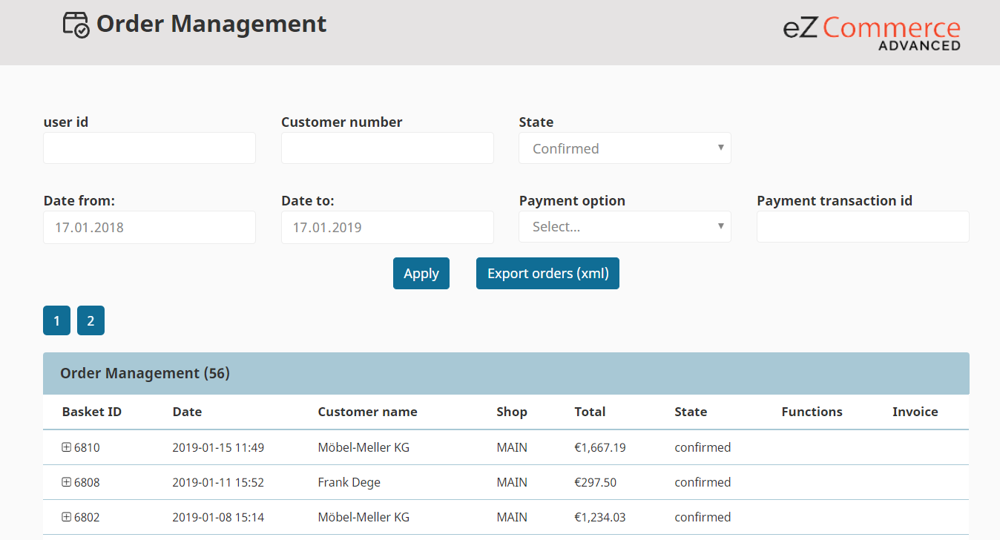
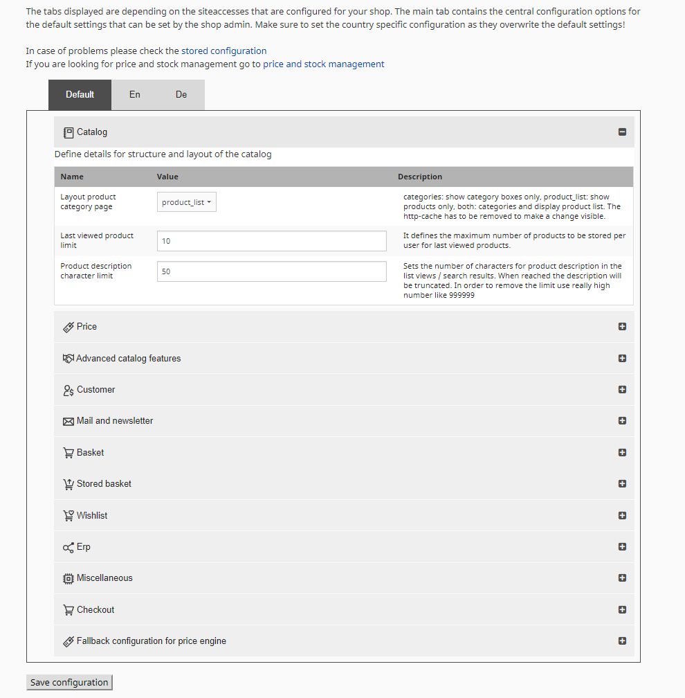
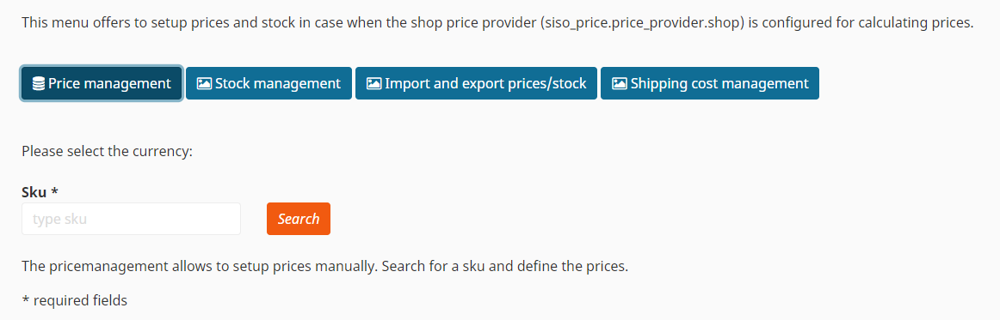

# eCommerce administration

eZ Commerce comes with a convenient configuration and management tools for the shop owner.

## Cockpit

The cockpit provides a good overview of the latest shop statistics, e.g. for sales or orders. It does not replace tools such as Google Analytics.

- Number of customers and active shopping carts
- Top sellers
- Top customers
- Charts: orders and sales for the selected date(s)
- Search statistics
- Status of the ERP system
- Status of the server

## Components

In the components section the shop admin will find the "Textmodules".

The item silver-eshop gives an overview of the currently set configuration.

In the item Textmodules all text concerning the shop can be managed as for basket, checkout, contact, customer center (if activated), email, footer, forms, order history and user.

## Order management

Orders are stored in the backend and can be filtered by date, status or payment information. An export function allows to export the data as XML file.

If the shop is used without ERP integration invoices can be managed as well.

## Configuration

You can configure the main behavior of the shop in the configuration settings in the backend. In addition, you can set currency, payment and shipping options per country (SiteAccess). The configuration is stored using the version control features of the CMS. More advanced settings (e.g. VAT for different countries) can be set up in configuration files.

## Price and shipping cost management

The Price and shipping costs management enables setting up prices and stock when the shop price provider (`siso_price.price_provider.shop`) is configured for calculating prices.

See more details about [managing products, prices and stock](manage_products_prices_and_stock.md).
