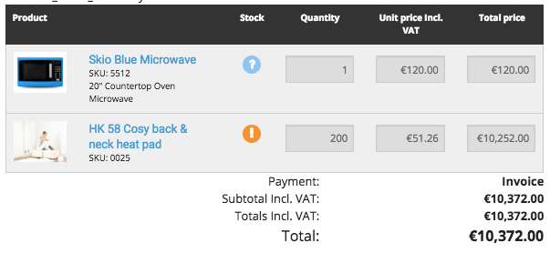
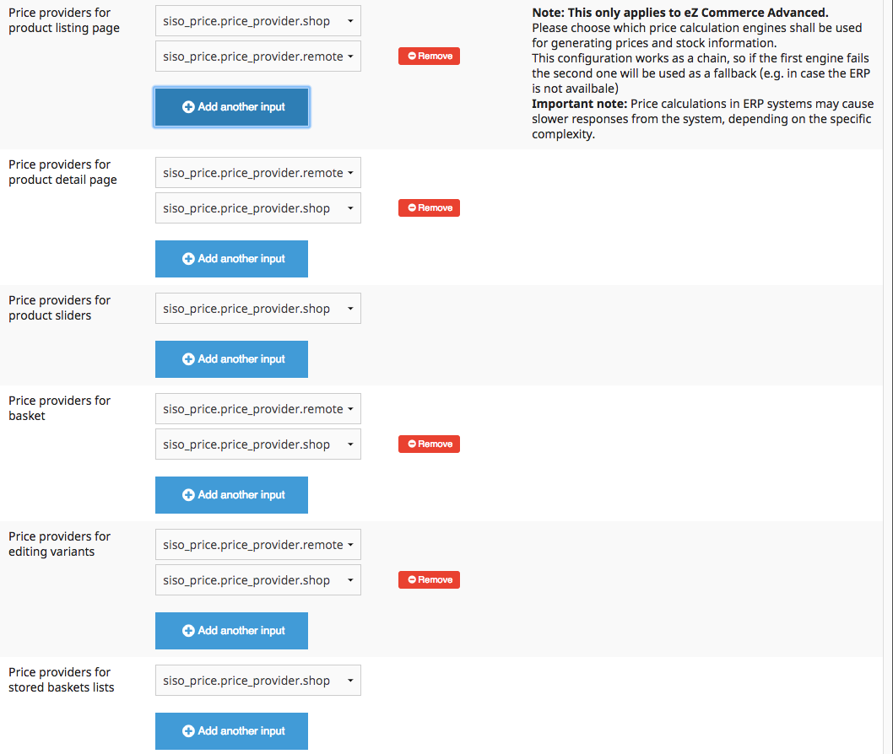
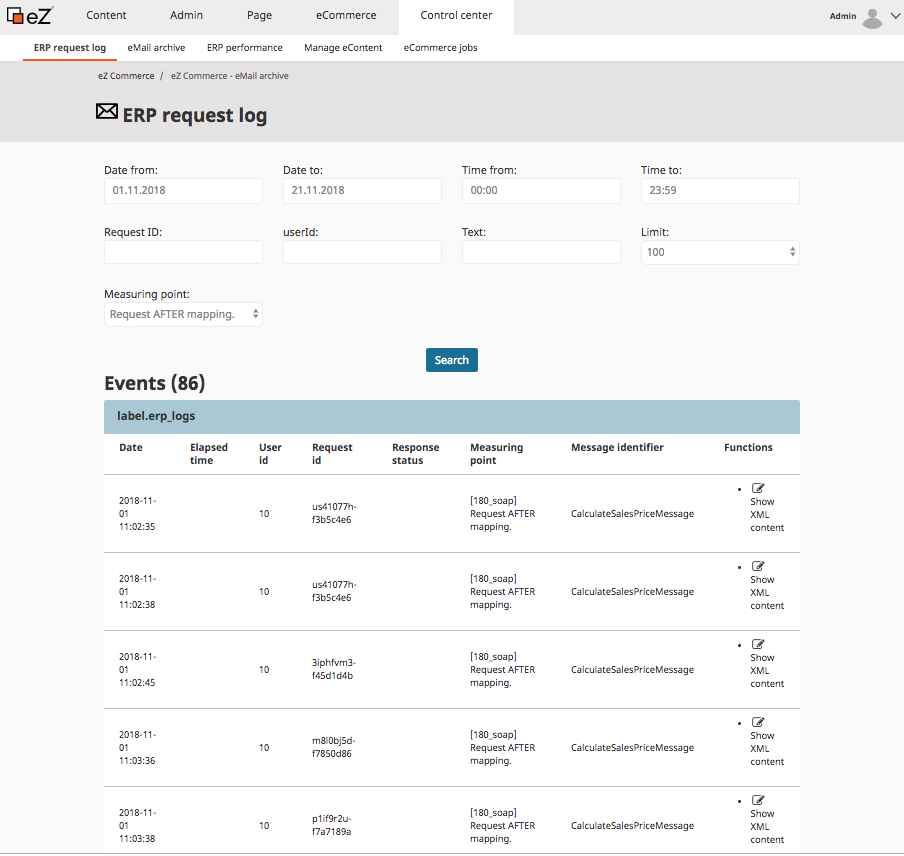
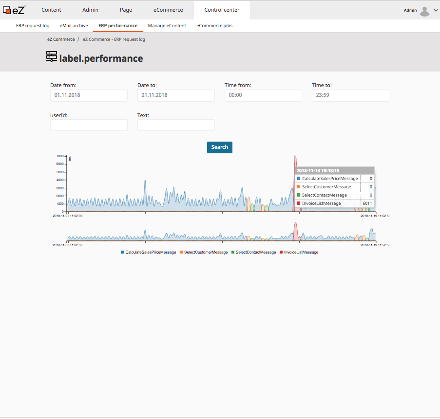

# ERP integration

The ERP Integration offers a set of business processes. It requires an interface to an ERP system.

eZ Commerce offers webconnectors for:

- SAP 
- Microsoft Dynamics NAV and AX

The product provides an open interface which can be adapted to other ERP systems as well.

## Supported business processes

|Process|Details|Advantage|
|--- |--- |--- |
|Login for B2B customer|The shop updates customer data from the ERP in realtime|The shop is using the customer data from the ERP. Always up-to-date. The customer is always using the same data regardless of the channel they are using.|
|Activate B2B account|The shop can validate an account request using the customer number and other parts of an invoice (e.g. invoice number).|Existing customers can create a shop account and get access within minutes which minimizes the internal work for the shop owner.|
|Realtime stock|The shop can request stock information in realtime.|The stock is updated in real time.|
|Realtime prices|The prices used in the shop are coming directly from the ERP. The shop uses the business logic of the ERP.|Prices are always up to date. Complex price rules are used without duplicating the logic.|
|Orders|Orders are directly transferred to the ERP.|The customer gets feedback (e.g. order number) in a few seconds.|
|Documents|The shop requests orders, delivery notes, invoices and credit memos.|The customer can get and print documents for all channels (online, offline orders). Less risks since the data is not duplicated to the shop server.|
|Products|Some ERP systems provides methods to import product data from the ERP.|Automatic product synchronization|

## Fallback scenario

eZ Commerce supports fallback scenarios for the most important processes in case the connection to the ERP is not available:

- The latest customer data is cached after login and used if the ERP is not available after login.
- A fallback price engine is used in case the ERP is not available. The customer is informed that the prices and stock is not up to date.
- An order will be stored in the shop. A job will take care that the order is transmitted to the ERP when it is available again.

## Realtime stock information during checkout and in product detail page

eZ Commerce is able to request real-time stock information from the ERP to ensure that the products are available in the warehouse.

If the stock is lower than the quantity required by the customer an icon and a tooltip will be displayed. It is possible to display the real stock as a numeric value as well.

## Configuration of price providers

The shop owner can define which system will be responsible for calculating prices. 

In B2B the ERP is often the leading system. The price provider `siso_price.price_provider.remote` is the ERP system. 

A fallback price provider (e.g. using imported prices) can be configured. It is use in case the ERP is not available.

## Monitoring in the backend

### Analyse messages between ERP and eZ Commerce

## Show performance

The performance monitor allows to find and identify bottlenecks between eZ Commerce and the ERP system. 

It enables analyzing the communication for a given time period. The view can be filtered by a time period and allows to identify the message which are performing good or not good. 

## ERP connectivity

An ERP system can be connected using different transport protocols:

- web services (SOAP)
- REST

An integrated mapping system provides a powerful feature to map the data provided an ERP to the internal data structure used by eZ Commerce.

The shop is using the standard format UBL (universal business language) for the most used entities such as

- address data
- orders
- invoices

All requests and responses to and from the ERP will be mapped using xslt mapping files. 

The mapping files can be overwritten in a project.
