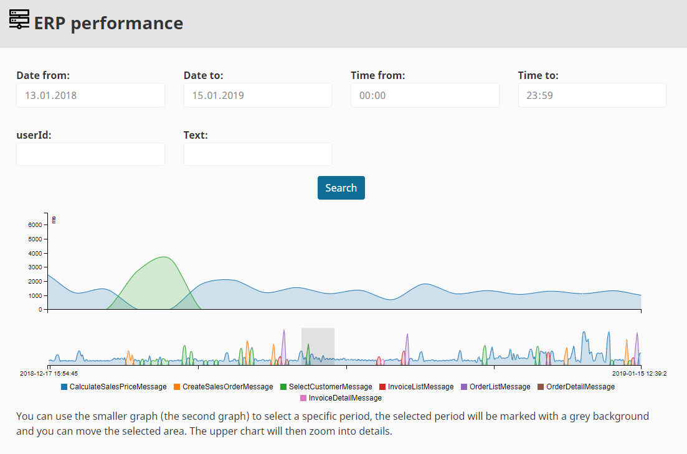
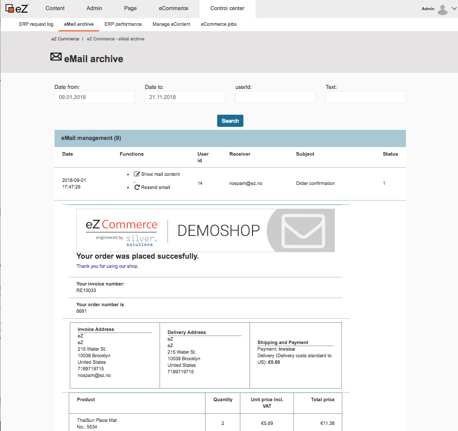
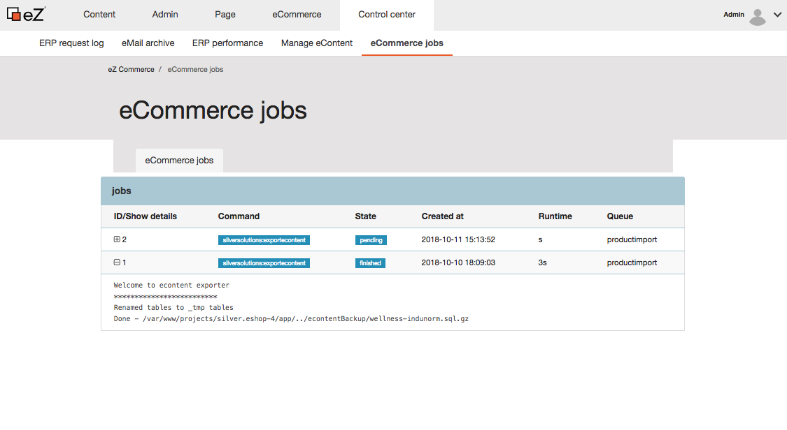

# Monitoring and control

## ERP request log

All communication (request- and response messages), that is sent between shop and ERP system is recorded and can be reviewed.

## ERP Performance

Only if an ERP system is connected!

The ERP performance viewer shows the efficiency of the connection between the shop and the ERP system in a monitoring. It allows to see the number of the different requests per date and time.

The monitoring tool regularly checks the connection to the ERP via a test request.

If the connection has failed, the administrator receives an e-mail. If the connection is successful again, the alarm is ended by another e-mail.

## Email archive

In the tab email archive the shop owner/admin can find all emails which were automatically sent from the shop, with date of dispatch, recipient, subject and status. They can check the emails and resend them if necessary.

The email archive reduces the response time for the support and enables resending an email to the customer.

## eContent

If eContent is used as product data storage the shop owner can see all eContent types (`product_group` and `product`) with the associated attributes and where they are mapped.

In the "eContent tasks" they can see how many products and product groups there are in the shop. Furthermore the shop operator can create a new index, import a backup into the database and create a backup from the database.

In the tab "eContent types" they can see the eContent types with their associated attributes (`product_group` and `product`) and the mapping information.

## eCommerce jobs

The shop is using jobs to perform recurring tasks such as imports, backups etc. The job system lists the last jobs and shows the status and result of the job. 

