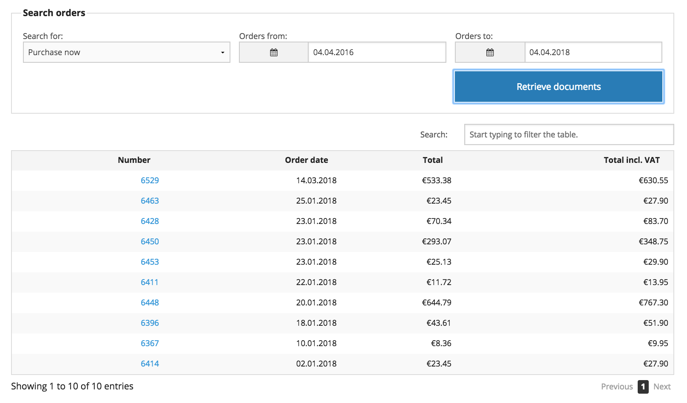
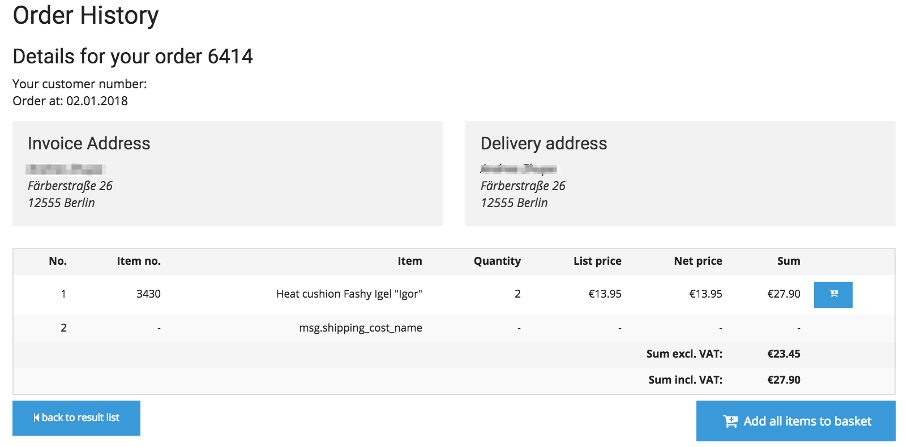

# Order history

Order history enables searching for orders from the past, as well as invoices, delivery note and credit memo from the ERP. It does not matter which channel has been used to create an order (multichannel). The orders can be made by phone, fax, email or via online shop. 
The documents for the chosen dates are fetched in real time.

The user can choose which documents he wants to look for and decide for a period. If the ERP provides a tracking link this information will be displayed as well. 

A customer can order the same products again easily:

