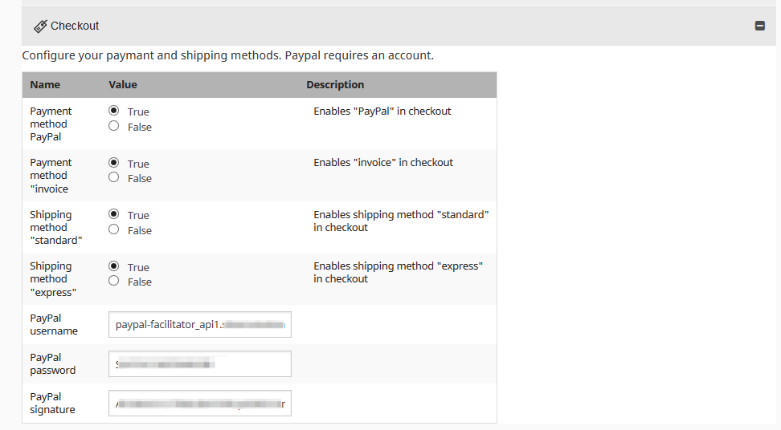
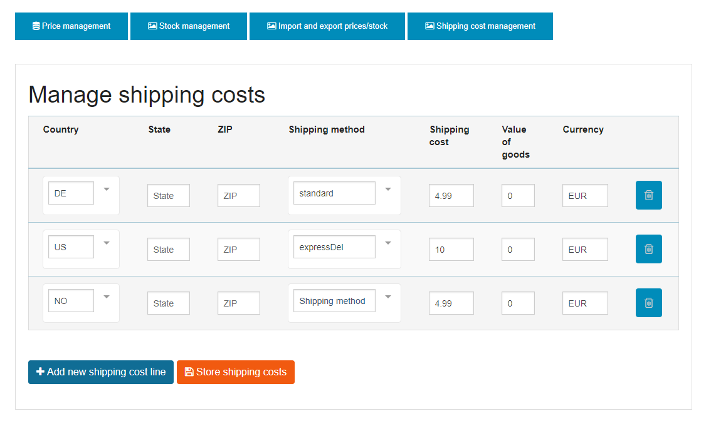

# Payment and shipping options

## Configuration of payment and shipment options

Next to standard payment method invoice an interface to Paypal Express is offered.
Payment providers Ogone/Ingenico and Telecash can be implemented on request.

The payment is based on a standard Symfony bundle. You can also integrate other payment providers.

The payment and shipping methods can be enabled or disabled per SiteAccess.

## Shipping costs

eZ Commerce offers a flexible way to define shipping costs, if they are not set in the ERP system.

Shipping costs can be setup per:

- shop (eZ Commerce offers one shop only)
- currency
- shipping method
- country
- state
- zip code (e.g. for exceptions such as delivery to islands)

In addition it is possible to configure different shipping cost depending on the size of the basket (including free of freight rules):

If no shipping costs are defined for a given country, shipping method, currency and value of goods a fallback cost from the configuration is used.

