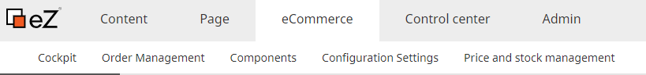

# Product description

## Introduction

eZ Commerce offers all important shop functionalities such as integrated price engine, product data management in backend, price and stock management and much more. It also offers a set of comprehensive B2B and advanced capabilities such as B2B specific features and application interfaces for ERP systems, PIM, CRM, MAM and other business relevant software.

## Used Content Types

eZ Commerce turns eZ Platform into an all-in-one e-commerce and content management solution. 

In addition some new Content Types are provided in eZ Commerce:

- for categories
- products
- product catalogue
- textmodules
- adapted user Content Type 

## Integration into eZ Platform

eZ Commerce is integrated into eZ Platform and is relying and supporting on eZ Platform functions such as user management, search, content, Page Builder.

