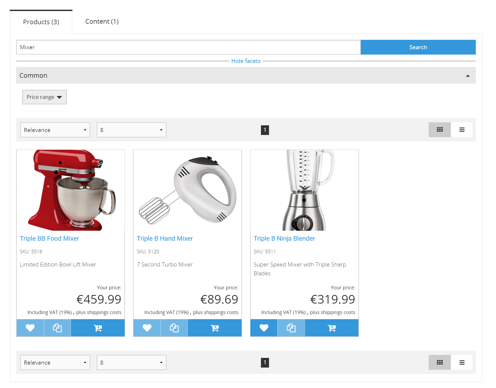

# Search

eZ Commerce uses Solr to index products together with content.

## Autosuggestion

When searching on the front end, autosuggestions are offered for products, categories, downloads and content.

## Filters and facets

Almost all product Fields can be used as a facet if they are indexed.
You can configure which Fields are used as facets in [configuration](../search/search_configuration/search_configuration.md#facet-configuration),
with different facets for the product catalog and search.

