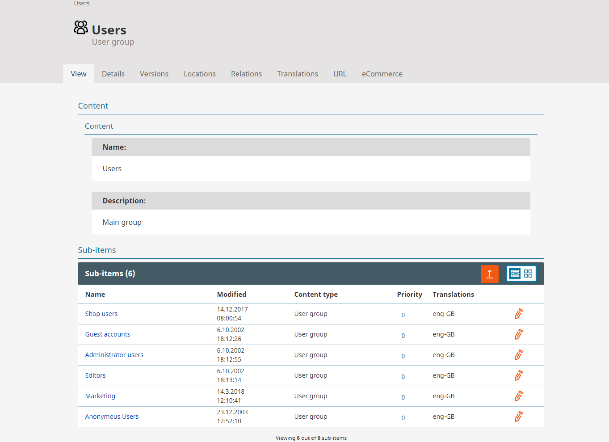
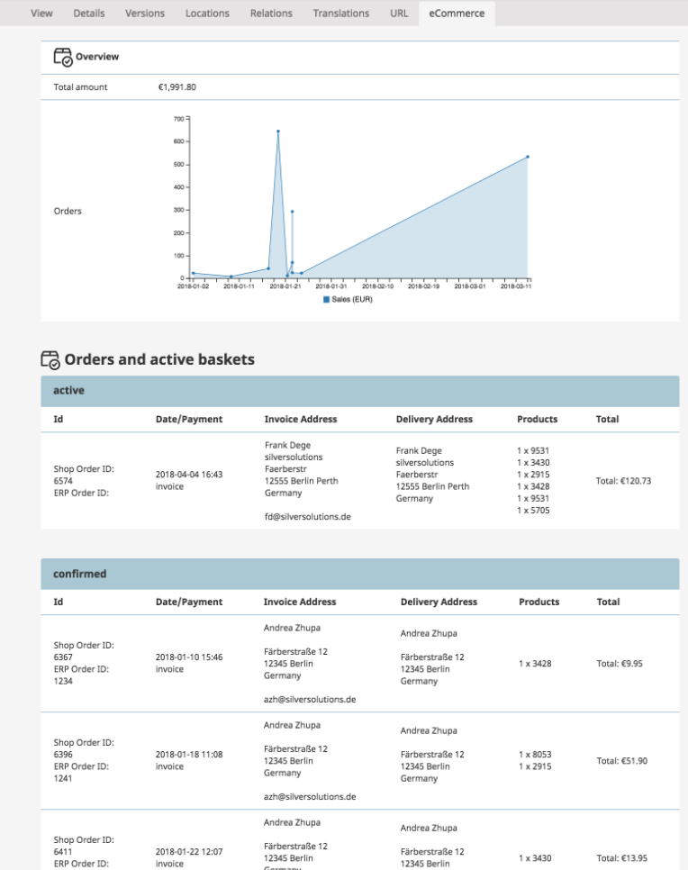
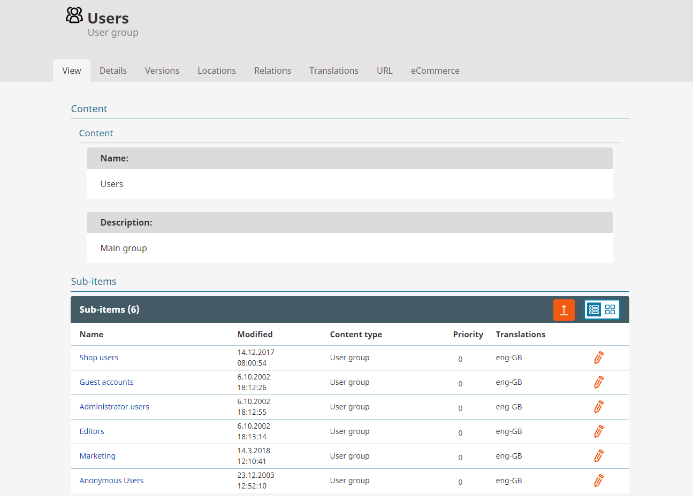
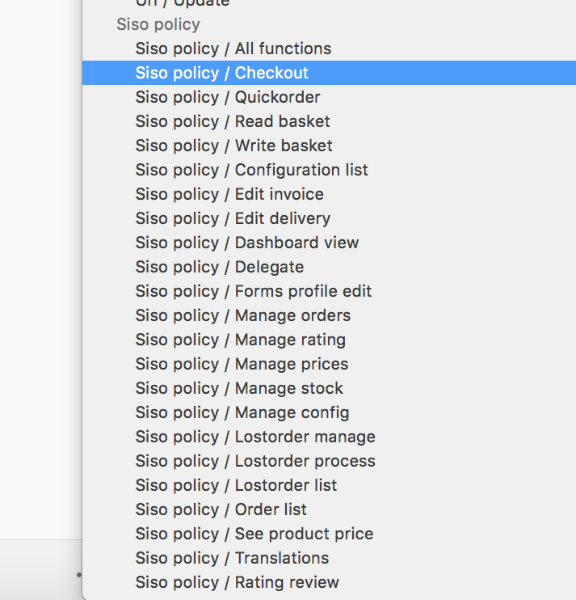
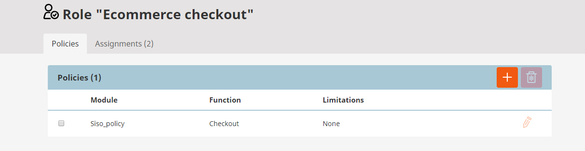
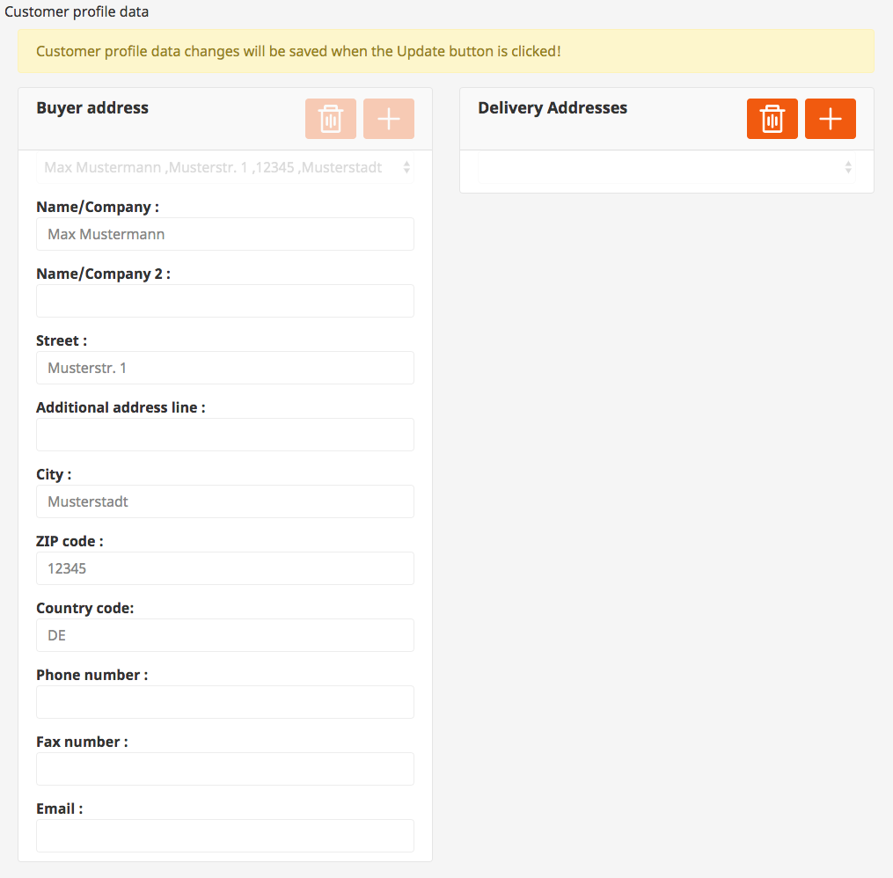

# User management

## Users

eZ Commerce users are stored as User Content items. This enables the shop owner to use the full power of the permission system.

In addition, a shop owner gets information about the last orders and the sales statistics of the customer. If a user has a current basket it is displayed as well.

## User Groups

In the backend user groups can be created.

Afterwards specific Roles can be assigned to the User Group. In eZ Commerce new users are created in a given User Group. The location ID of the User Group is configured in a yml file.

## Available policies

For eZ Commerce special Policies are defined that can be assigned to specific Roles.

## Profile Data
	
Buyer and Delivery Addresses of an user can be edited in the backend. It's possible to add, remove and edit addresses.

