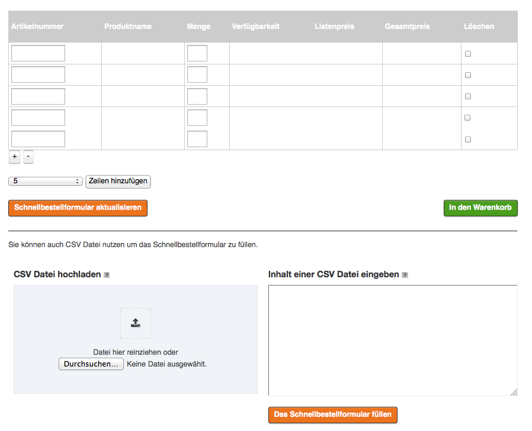
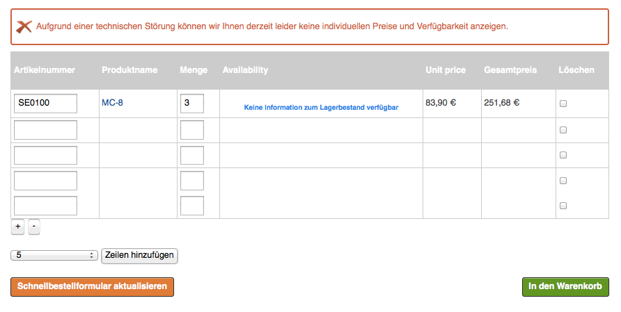
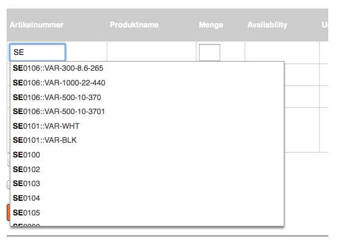
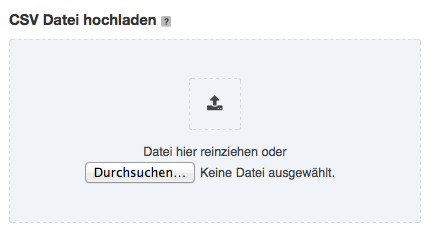
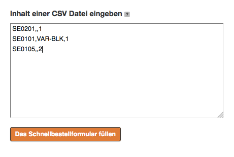

# Quickorder

## Introduction

Quickorder is an order form, that provides a fast and convenient tool for 'power'-users, which speeds up the checkout- / order-process by entering SKUs sequentially and add them altogether into the basket.

It supports autosuggestions, as well as a CSV upload.



Analog to the [basket](../basket/basket.md) there is a possibility to add additional data to the quickorder.

By default you can enable additional text in the quickorder:

`basket.yml`:

``` yaml
#enable/disable additional text line in basket per basket line
ses_basket.default.additional_text_for_basket_line: false
```

## Before you start 

Please keep in mind that Quickorder is really connected with a lot of different modules in our shop. Be sure to check these out:

- [Basket](../basket/basket.md)

## Basic Features

### Add to basket

Users can type SKUs and quantity and either directly add products to the basket by clicking on the 'Add to basket' button, or store items in the quickorder by clicking on the button 'Update quickorder'.

### Update quickorder

If users store items in the quickorder, they will see the real prices and availability.


If the ERP system is offline, users will see the list prices and an error message will be displayed. Also there is no information about the availability.



Users can remove the items from the quickorder by checking the checkbox 'Delete' or entering 0 into the item quantity and then clicking on the button 'Update quickorder'.

#### How long the items will be stored?

- if a user is *anonymous*: as long as the session exists and the user did not click on 'Add to basket button', or removed items from quickorder
- if a user is *logged in*: as long as the user did not click on 'Add to basket' button, or removed items from quickorder

### Add more lines

If users needs more lines in his quickorder, they can add new ones by

- either clicking on the plus icon - will add one line
- or choosing from the drop down list and clicking on the 'Add more lines' button - will add chosen amount of lines


## Advanced features

There are some features, such as autosuggestion or CSV upload, that makes it even easier for the user to use the quickorder form.

### Autosuggestions

*Solr* is used to look-up a list of matching results.

**Autosuggestion results returned from Solr**



If you want to disable the autosuggest in quickorder you can use this setting:

``` yaml
siso_search.default.search.auto_suggest_limit: 0
```

#### Variant handling

Quickorder also supports variants. For this is the autosuggestion feature used. Users can type the product name or SKU and/or a variant code (or parts of it) into the SKU field.

*Solr* will be used to return the list of correct SKUs and variant codes.

##### Configuration

Regarding the variants, users can use different delimiters between SKU and the variant code when typing it into the SKU field.These delimiters are configurable.

``` yaml
parameters:
    siso_quickorder.default.autosuggest_delimiters: [' ', '/', '-', '::']
```

##### Searching for a variant


##### Returned results

The autosuggestion results contain the SKU and the variant code separated by a configurable delimiter.


!!! note "Important"

    The configured delimiter MUST NOT be a part of the existing SKUs or variant codes\!

    This delimiter is used to separate the variant code from the SKU when adding items into the quickorder or to the basket.

``` yaml
parameters:
     #this delimiter can not be a part of sku or variant code!!!
     siso_quickorder.default.sku_variant_code_delimiter: '::'
```

### Line preview

If users leave the SKU field (for example by choosing of one autosuggestion result) and set the cursor position to another field (e.g. quantity field or next line), a background search is automatically started, that will display the product name (and variant code) and the unit price. This visible feedback is a confirmation for users, which indicates that the entered SKU was correct.

.png)

If the SKU was not correct, users will see an error message


In order to see the real prices and the availability, users must click on the 'Update quickorder' button.


### CSV upload

Another possibility how to add items to the quickorder is to use a CSV file. Users can either

- upload one .csv file
- enter a .csv file's content into a textarea

The format of the .csv file is flexible to take 1, 2 or 3 columns:

- **SKU** - required column that has to be provided first (if only 1 column is provided there should be no delimiter at the end of the line)
- **variant code** - optional second column. It can be omitted for the shops that do not use variants
- **quantity** - optional last column which specifies quantity for given SKU. It is always the last column (2nd or 3rd)

!!! note

    Optionally, if custom text is enabled, user has the possibility to also upload custom text via csv upload. In this case the custom text shall be added as 4-th column.

    ``` 
    #enable/disable additional text line in basket per basket line
    ses_basket.default.additional_text_for_basket_line: false
    ```

Examples: 

Only SKU:

```
SE0100
12201300
SE0101
SE0105
SE0302
13201380
```

SKU and quantity:

```	
SE0100,2
12201300,3
SE0101,1
SE0105,5
SE0302,1
13201380,4
```

SKU, variant code and quantity:

```
SE0100,,2
12201300,,3
SE0101,VAR-BLK,1
SE0105,,5
SE0302,,1
13201380,,4
```

The values can by separated by a configurable delimiter:

#### Configuration

``` 
parameters:
    siso_quickorder.default.csv_delimiters: [';', ',']
```

#### Upload CSV file

Users can upload only one .csv file at once. They can either add the file by drag and drop to the upload area or use the search button.



#### Entering CSV file content into a textarea

User can also enter the content of the .csv file directly into a textarea and click on the 'Fill quickorder' button.



#### Result of an uploaded / entered .csv file

It doesn't matter which method was used. In both cases the quickorder will be filled with given data and appropriate messages will be displayed.


