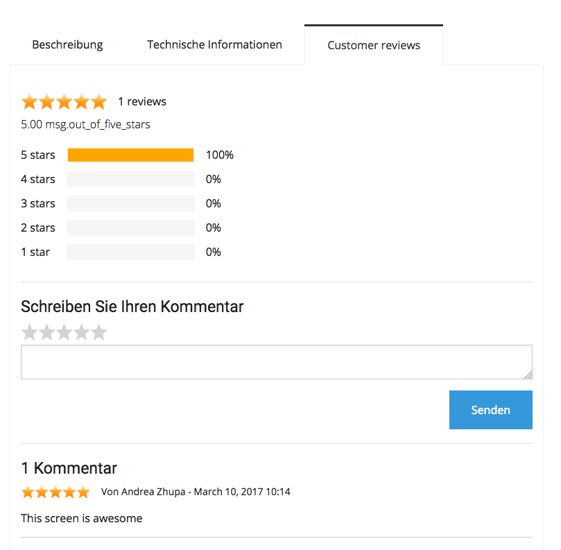
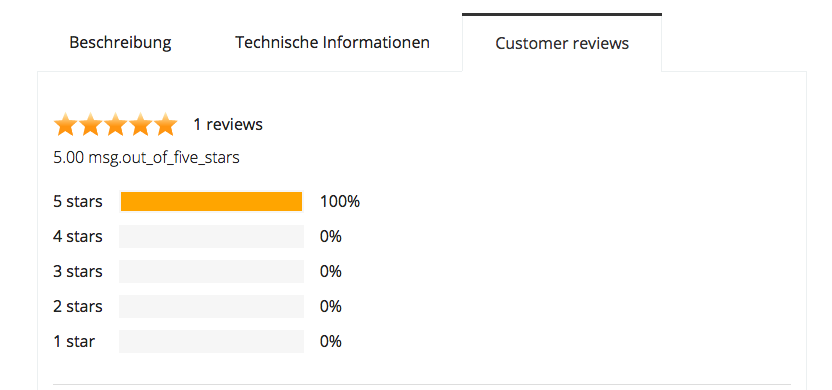
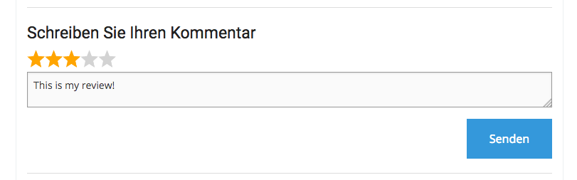
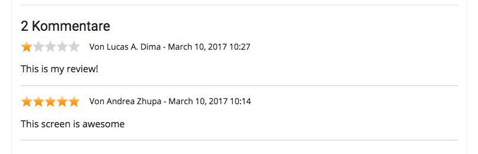
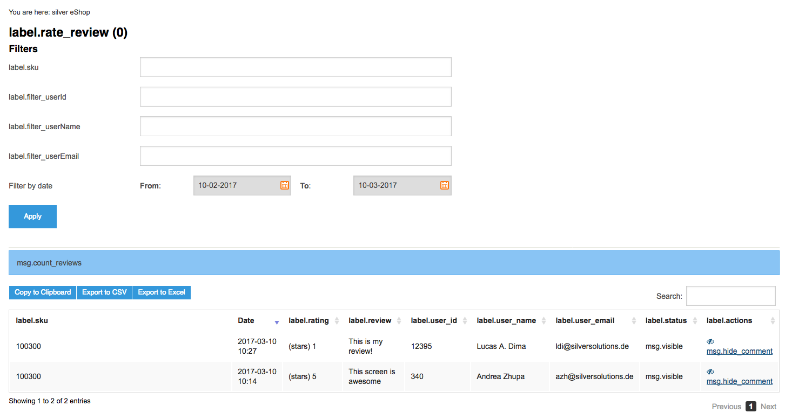

# Rate and Review

## Description

Rate and review is a component that assigns a rate of stars (1 to 5), a review or a comment to eZ Commerce products.

### Frontend

From the frontend perspective the following things are set:

#### A new tab called Customer reviews will appears in every product detail page and the logged user is able to create a review.



#### The tab has a summary part with the total count of reviews and a percentage for every rate.



#### A text field and a star selector to allow the user to enter the rate and review.



#### A list of reviews



### Backend

In eZ Commerce backend there is a simple module that manages user rates and reviews.



## Technical description

!!! note

    Rate and review uses a bundle called FOS/Comment

    https://github.com/FriendsOfSymfony/FOSCommentBundle

Every user review is stored in table **Comment**

The link to the product is the field `thread_id`, in which the product SKU is stored.

Field state represents the following states:

``` php
const STATE_VISIBLE = 0;
const STATE_DELETED = 1;
const STATE_SPAM = 2;
const STATE_PENDING = 3;
```

State 3 means the comment is hidden

Currently we only support states 0 (visible) and 3 (hidden or pending).

**Comments with state 3 are not taken into consideration.**

The star rating is stored in field **rating**. The numbers go from 1 to 5 and represent the amount of starts.

### Controllers and services involved

Original FOS controller was overriden by the following controller:

**SilverEshopThreadController**

Additional logic for manager and some customised features can be found in the following service:

**RateReviewService (ID: `siso_core.rate_review_service`)**

### Routing

FOS Comment bundle uses a rest controller. The following routing entry was added to eZ Platform routing yaml:

``` yaml
fos_comment_api:
    type: rest
    resource: "@SilversolutionsEshopBundle/Resources/config/rest_routing.yml"
    prefix: /api
    defaults: { _format: html }
```

!!! note

    Since this is using rest, the loading of current reviews might not be immediately visible after the product is loaded.

### Templates

Product detail template was modified. A new tab was added with the rate and reviews.

`vendor/silversolutions/silver.e-shop/src/Silversolutions/Bundle/EshopBundle/Resources/views/Catalog/product.html.twig`

Please note that this will be visible only if rate and review is enabled in configuration.

### Configuration

Currently only `reviews_enable` configuration is active.

Only registered users can create rate and reviews. Logic to allow anonymous reviews is not yet implemented.

``` 
siso_core.default.reviews_enabled: %reviews_enabled%
siso_core.default.reviews_allow_anonymous: %reviews_allow_anonymous%
siso_core.default.reviews_email_required: %reviews_email_required%
siso_core.default.reviews_comment_required: %reviews_comment_required%
```
