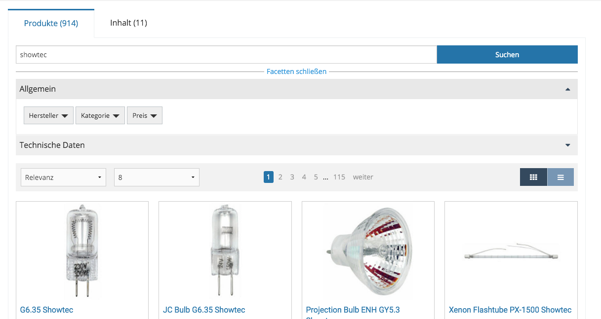
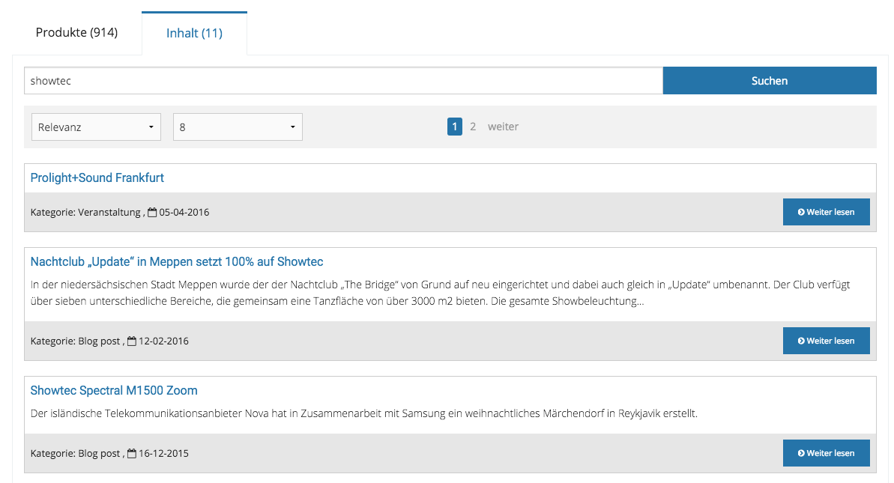
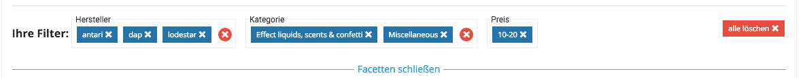
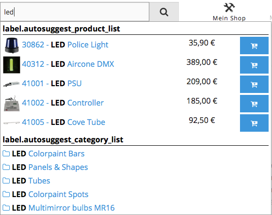

# Search

eZ Commerce comes with a powerful search engine capable of providing one common search for product data and content. 

Product data and content is indexed automatically using the built-in search engine based on Solr. 

The search displays the results in different groups. A group can consist of products, videos, downloads, etc.





Facets can be grouped and the user can remove all facets of a group with one click: 



You can configure groups displayed in tabs such as products and content.
The products can be shown in a list or gallery view.

The user can use the back button to go back without leaving the search.
URLs are unique, so you can share a link to a search result.

The search uses Ajax to refresh the list.

Facets are build dynamically as defined in configuration.
The data which is used for facets can be indexed in a project-specific indexer plugin.
You can configure whether facets are displayed on top of the list or in the left column on the search result page.

Boosting can be defined in the configuration.

The search comes with an extension plugin system which enables indexing custom fields by Content Type. 

### Autosuggestion

eZ Commerce provides a user friendly [autosuggestion](search_features/search_autosuggest/search_autosuggest.md) feature:



### Reindexing

To reindex search content, use the following command:

``` bash
php -d memory_limit=-1 bin/console ezplatform:solr_create_index
```
