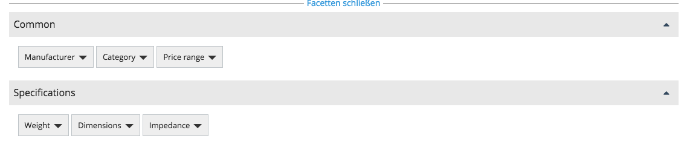
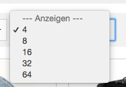

# Search configuration

## General search parameters

### Facet position

There are two possibilities for facet design on search result page:

- `center` - search result page has full width and facets are centered just above search results.
- `left` - facets appear on the search result page in the left column as a block.

``` yaml
parameters:
    # position of facet block in search. Possible values: left, center
    siso_search.default.facet_position: center
```



### Search in product listing

``` yaml
siso_search.default.groups.product_list:
    product_list:
        types:
            - ses_product
        path: '/1/2/'
        section:
            - 1
        visibility: true
```

These parameters define the types that you can search for in the product listing section of the website.
All filters from the search group section are valid here as well.

### Tab configuration

`groups.search` parameters define the tabs and the content of each tab for search section of the website.

``` yaml
siso_search.default.groups.search:
    product:
        types:
            - ses_product
        path: '/1/2/'
        section:
            - 1
        visibility: true
    content:
        types:
            - st_module
            - folder
            - article
            - landing_page
            - blog_post
            - event
        path: '/1/2/'
        section:
            - 1
        visibility: true
    files:
        types:
            - file
            - video
        path: '/1/43/'
        section:
            - 3
        visibility: true
```

In the example above there are three tabs: Product, Content and Files.

Tab label are defined in the translation file `messages.en.php` using the key value as ID.
In this example the key values are: `product`, `content` and `files`.

Inside each tab there are additional definitions:

- `types` - the Content Types that are searched for
- `path` - path to the content
- `section` - possible Sections of the content. In this example products and standard content are in Section 1 and files are in Section 3.
The Sections are defined in the Back Office. If multiple sections are defined, products or content must be assigned to either of them (OR operator).
- `visibility` - enables searching for content that is or isn't visible

### Product groups

`product_groups` defines the groups that are used for the product search.

``` yaml
siso_search.default.product_groups: ['product', 'product_list']
```

### Main Location

`main_location_only` defines whether search returns main nodes only.

``` yaml
siso_search.default.query.main_location_only: true
```

### Preferred search group

`search.preferred` defines which group is preferred for search as a default choice.

``` yaml
siso_search.default.groups.search.preferred: product
```

### Pagination limit

Depending on chosen design layout, you can configure a pagination limit and default limit:

- `siso_search.default.limits` - define the list of all available limit options per design
- `siso_search.default.limits.preferred` - defines elements per page and populates page size drop down

``` yaml
siso_search.default.limits:
    left:
        3: 3
        6: 6
        12: 12
        24: 24
        48: 48
    center:
         4: 4
         8: 8
         16: 16
         32: 32
         64: 64     
siso_search.default.limits.preferred:
    left: 6
    center: 8
```



### Preferred limit

`preferred_limit` defines the default limit per design position for the search.

``` yaml
siso_search.default.preferred_limit:
    left: 6
    center: 8
```

### Sorting options

`sort` parameters define the sorting options for each particular group.

``` yaml
siso_search.default.sort:
    product_list:
        - score
        - name|asc
        - name|desc
        - sku|asc
        - sku|desc
        - price|asc
        - price|desc
    product:
        - score
        - name|asc
        - name|desc
        - sku|asc
        - sku|desc
        - price|asc
        - price|desc
    content:
        - score
        - name|asc
        - name|desc
    files:
        - score
        - name|asc
        - name|desc
```

### Default sorting per group

`sort.preferred` defines default sorting per group.

``` yaml
siso_search.default.sort.preferred:
    product_list: score
    product: score
    content: score
    files: score
```

`score` is a Solr field which is a numeric value that can affect the relevance of the elements.
For more information on Solr score, see [Solr Relevancy FAQ.](https://cwiki.apache.org/confluence/display/SOLR/SolrRelevancyFAQ)

### Configuration for boosting

The boosting influences relevancy calculation. With boosting factors you can control which Fields are more important / more relevant for the search terms than other Fields.
A higher value boosts a hit. This means that if the search engine finds a search term, a boosted Field has a better relevancy.
The existence of search terms is crucial for the calculation of relevancy.
Field boosting has no influence on the order of results if a search was queried without terms (e.g. in a product list in the catalog).

By default the search engine uses a factor of 1. A boosting of values below 1 (e.g. 0.5) reduces the relevance of this Field.

The implementation of the Field boosting API differs for eContent and eZ Content.

#### eZ Content

The configured Field name values are Field identifiers of their respective Content Types (e.g. field `ses_name` of type `ses_product`).
Fields added by an indexer plugin cannot be boosted.

#### eContent

The Field name values are raw Solr field names. All indexed Fields can be taken into consideration for boosting,
but must also be adapted in the configuration whenever they change in the index.
You should specify the default search field `text` here, as it would not be queried otherwise.
Boosts in eContent activate the `qf` parameter which overrides the default field (`df` parameter).

If you specify boosting Fields in eContent, the shop only searches in these Fields.

``` yaml
# eZ Content
siso_search.default.field_boosts:
    product:
        ses_name: 50
        ses_sku: 100
        ses_intro: 20
        ses_short_description: 2
        ses_long_description: 1
        ses_manufacturer: 2
 
# Econtent
siso_search.default.field_boosts:
    product:
        text: 1
        ses_product_ses_sku_value_s: 100
        ses_product_ean_value_s: 100
        ses_product_ses_name_value_t: 50
        ses_product_sub_headline_value_t: 1
        ses_product_long_description_value_t: 20
        ses_product_ses_datamap_product_group_names_value_t: 1
        ses_product_ses_datamap_category_value_t: 2
```

### Facet configuration

``` yaml
globals:
    boxes_visibility_limit: 10
    items_visibility_limit: 5
    mega_visibility_limit: 50
```

- `boxes_visibility_limit` - if this limit is exceeded, boxes are hidden by default and the toggler is enabled in order to show/hide more items
- `items_visibility_limit` - if this limit is exceeded, the search filter is visible inside a single facet box
- `mega_visibility_limit` - if this limit is exceeded, a mega dropdown with columns is used

`simple_facet_definitions` defines the facet configuration.

Each facet can have the following configuration:

- `key` - used to identify each facet. (e.g. `price_range`, `manufacturer`, etc.).
- `filter_type` - possible values are:
    - `single` - the user can select only one facet element.
    - `multi_or` - the user can select multiple facet elements and each of them uses OR as operator. (The results can match one facet OR the other)
    - `multi_and` - the user can select multiple facet elements and each of them uses AND as operator. (The results must match all selected facets, for example if products have connectors and the results should have HDMI and USB-3)

!!! note
    
    If a multiple selection using a `multi_and` facet leads to an empty result page, the only possible way for the user to get back is to click the **remove all facets** button.
    This can be inconvenient if a lot of facets exists and have already been chosen.

- `sort_type` - defines how the facet box is sorted.
- `sort_type_order` - for example for clothes size facet values should be sorted as "S | M | L | XL".
- `index_field`: name of corresponding field in Solr
- `index_range_boundries` - defines the ranges of current values. Available only for the Price Range facet.

``` yaml
siso_search.default.simple_facet_definitions:
    price_range:
        #possible values: single|multi_and|multi_or
        filter_type: 'single'
        #possible values: alpha|numeric|manual|range
        sort_type: 'range'
        #sort_type_order: 'XS|S|M|L|XL|XXL'
        index_field: 'ext_ses_price_range_ms'
        # ONLY VALID FOR THIS FACET
        index_range_boundries: 0|10|20|50|100
    manufacturer:
        filter_type: 'multi_or'
        sort_type: 'alpha'
        index_field: 'ses_product_ses_manufacturer_value_s'
    weight:
        filter_type: 'multi_or'
        sort_type: 'numeric'
        index_field: 'ext_ses_spec_weight_f'
    dimensions:
        filter_type: 'multi_or'
        sort_type: 'alpha'
        index_field: 'ext_ses_spec_dimensions_s'
    category:
        filter_type: 'multi_or'
        sort_type: 'alpha'
        index_field: 'location_parent_id_mid'
        # ONLY VALID FOR THIS FACET
        location_id_values: true
    impedance:
        filter_type: 'single'
        sort_type: 'numeric'
        index_field: 'ext_ses_spec_impedance_s'
    availability:
        filter_type: 'single'
        sort_type: 'alpha'
        index_field: 'ses_product_ses_stock_numeric_value_s'
    discontinued:
        filter_type: 'single'
        sort_type: 'alpha'
        index_field: 'ses_product_ses_discontinued_value_s'
```

`used_facets` defines which facets are displayed for each group.

``` yaml
siso_search.default.used_facets:
    product_list:
        common: ['manufacturer', 'category', 'price_range', 'availability', 'discontinued']
        specifications: ['weight', 'dimensions', 'impedance']
    product:
        common: ['manufacturer', 'category', 'price_range']
        specifications: ['weight', 'dimensions', 'impedance']
```

### Autosuggestion limit

`auto_suggest_limit` and `auto_suggest_fields` configure autosuggestion for quick order.
User input in quick order searches these defined Solr fields.

``` yaml
siso_search.default.search.auto_suggest_limit: 10
siso_search.default.search.auto_suggest_fields:
    - ses_product_ses_sku_value_s
    - ses_product_ses_name_value_s
    - ses_variant_list_s
    - ses_variant_codes_ms
    - ses_variant_sku_ms
    - ses_variant_desc_ms
```

### Mapping specifications

`search_mapping_specification` sets predefined rules for product specification matrix index.

``` yaml
#optional configuration for indexing the specification fields
siso_search.default.search_mapping_specification:
    manufacturer:
        alias: ['Manufacturer', 'Hersteller', 'Peak']
        type: string
    weight:
        alias: ['Weight', 'Netto-Gewicht']
        type: float
    dimensions:
        alias: ['Dimensions (LxWxH)', 'Maße (BxHxT)']
        type: string
```

- `alias` - is useful to specify additional words for a given specification matrix parameter.
The indexer only indexes the first element of the alias array.
- `type` -  specifies a data type for the given specification matrix element.
For example, if float is set, the indexer does a string to float conversion of the value.
- `separator` - if set, the indexer creates a Solr field with multiple elements using the specified separator to explode the string into an array.

For example, if field value is `220 x 110 x 150`, you can specify `x` as separator
The indexer then creates a Solr field with multiple elements that will look like this: `{220, 110, 150}`.

### Category cache

Because category names are not indexed, they are stored in a Stash cache.
``` yaml
siso_search.default.category_cache:
    rootNodeId: 62
    maxProductCategoryDepth: 99
    productCategoryLimit: 999
    add_parent_category_name: true
    parent_category_name_separator: ' / '
```

`rootNodeId` - set with the node of e-shop product main category.
`maxProductCategoryDepth` - defines how many levels of subcategories are set in this cache.
`productCategoryLimit` - defines the maximum category names that are stored in this cache.
`add_parent_category_name` - if set to `true` it also indexes the parent category name.
`parent_category_name_separator` - string separator to concatenate parent category and current category.

### Solr special characters

If you use eContent as catalog data provider, you can configure how Solr special characters are evaluated.

``` yaml
# Configuration to escape or remove Solr special characters from search query.
# Possible values: escape, remove or empty.
siso_search.default.solr_special_characters: escape
```

- `escape`: escapes every Solr special character from the user search query.
- `remove`: removes every Solr special character from the user search query.
- `~`: keeps all Solr special characters.
 
These are the current Solr special characters:

```
+ - && || ! ( ) { } [ ] ^ " ~ * ? : \
```

### Image filtering

`EcontentImageIndexerPlugin` can use the `imageConverter` and requires two additional parameters:

``` yaml
siso_search.default.use_filtered_images: true
siso_search.default.image_filter_resolution: thumb_small
```

- `use_filtered_images` - configure if the `imageConverter` is used or not
- `image_filter_resolution` - specifies in how the images are modified by the `imageConverter`

## eContent search parameters

### Sections

``` yaml
parameters:
    silver_econtent.default.section_filter: enabled
    silver_econtent.default.catalog_filter_default_catalogcode:
        - ALL
        - NORMAL
```

If `section_filter` is enabled, the product/catalog search result list is restricted to elements
which are assigned to catalog codes, provided by `catalog_filter_default_catalogcode`.

## eContent configure cores per SiteAccess

### Solr core

``` yaml
parameters:
    siso_search.default.core: ~
```
    
Use default core (usually siso_econtent = econtent live core)

### Preview core

``` yaml
parameters:
    siso_search.de_preview.core: siso_econtent_back
```
    
Use the back core. This can be useful if an import uses temporary tables in eContent.
Data is then indexed in the `econtent_back` core.

This settings enables using the back core for a preview SiteAccess.

!!! note 

    There is one exception: the service searching for bestsellers does use this setting and uses the live core by default.
