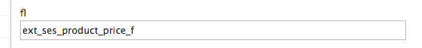

# Search cookbook

## How to implement own custom search 

The is an example of how to implement custom search for our current shop API.

We are going to create a new service which will search for products that :

  - are discontinued,
  - are visible,
  - set the sorting option to "relevance"
  - add facet about manufacturers for filtering
  - boost some of the fields (which means that they will be more important than others)

### Step 1

We will use our current implementation of search interface, which has all necessary methods for searching using eZ solr gateway.

``` php
class EzSolrEshopSearch implements EshopSearchInterface
```

### Step 2

We will create new method in the controller called "searchDiscontinuedProducts".

We will use existing method "searchProducts" as a boiler plate. We will adjust it to use new parameter for filtering only discontinued products.

``` php
class myController extends BaseController
{
    public searchDiscontinuedProducts() {
         
    }
}
```

### Step 3

#### Implementation for the action in controller

1. Inject the search service to our controller.
1. Create a new object EshopQuery. This object will have all the parameters of our new Solr query.
EshopQuery supports different filters/conditions, which are described in docment below.
For our purpose of getting discontinued products we will use SearchTermCondition, which have the search phrase and the specific field.
In this case, in our current data model, all discontinued fields have the word 'DECLINE' in Solr field ses_product_ses_discontinued_value_s.
1. Add a condition for visibility, to make sure only visible products are returned.
1. Add boosting that sku and name is more important than long description.
    1. The field boosting condition is unfortunately not implementation independent. That means, that the field name values, which are passed to the constructor, are different for Econtent and eZ Content search.
    1. For eZ Content, you need to pass the content field identifier strings.
    1. For Econtent you need to pass the raw Solr field names, including the default search field (which is "text" by default).
1. Additionally add offset and limit for pagination purposes.
1. Set sorting by relevance. For more option see document below.
1. Add product facet option for manufacturers. For more option see document below.
1. Now we perform the search with the new parameters.
1. The number of total hits will be available in numFound property.
1. The search results will be available in array resultLines.
1. Facets for search result will be available in array facets.

``` php
class myController extends BaseController
{
    public searchDiscontinuedProductsAction() {
         
        // 1. First we inject the search and facet service
        $searchService = $this->get('siso_search.ezsolr_search_service');
  
        // 2. Now we create the query with all the parameters we want.
        $eshopQuery = new EshopQuery();
        $eshopQuery->addCondition(new SearchTermCondition(array(
            'searchTerm' => 'DECLINE',
            'fieldRestrictions' => 'ses_product_ses_discontinued_value_s'
        )));
  
        // 3. Add visibility
        $eshopQuery->addCondition(new VisibilityCondition(array('visibility' => 0)));
  
        // 4.b Add boosting (eZ Content)
        $boosts = array(
            'ses_name' => 50,
            'ses_sku' => 100
            'ses_intro' => 20
            'ses_short_description' => 2
            'ses_long_description' => 1.5
            'ses_manufacturer' => 2
        );
        // 4.c Add boosting (Econtent)
        $boosts = array(
            'text' => 1,
            'ses_product_ses_name_value_t' => 50,
            'ses_product_ses_sku_value_s' => 100
            'ses_product_ses_intro_value_t' => 20
            'ses_product_ses_short_description_value_t' => 2
            'ses_product_long_description_value_t' => 1.5
            'ses_product_ses_manufacturer_value_s' => 2
        );
        $eshopQuery->addCondition(new FieldBoosting(array('boost' => $boosts)));
  
        // 5. Add offset and limit.
        $eshopQuery->setOffset(0);
        $eshopQuery->setLimit(10);
  
        // 6. Add sorting option by relevance
        $eshopQuery->setSortCriteria(array(new RelevanceSorting()));
  
        // 7. Add product facet option
        $productFacet = new SimpleProductFieldFacet(
            array(
                'fieldName' => 'manufacturer',
                'labelKey' => 'manufacturer',
                'filterType' => 'multi_or',
                'sortType' => 'alpha',
            )
        );
        $eshopQuery->addFacet($productFacet);
        
        // 8. Finally we perform the search.
        $productSearchResult = $searchService->searchProducts($eshopQuery, new SearchContext());
  
        // 9. The hits could be found here
        $numberOfHits = $productSearchResult->numFound;
  
        // 10. The search results can be found in this array:
        $productSearchResult->resultLines
  
        // 11. The search result facets can be found in this array:
        $productSearchResult->facets
    }
}
```

### Conditions API

ContentTypesCondition: filter results by content type. Valid content types are ses_product, ses_category or ses_content among others.

SearchTermCondition: filter results by phrase, also a specific field could be set. Example: search for SE10000 in field sku. That would look like this:

```
$myQuery->addCondition(new SearchTermCondition(array(
    'searchTerm' => 'SE10000',
    'fieldRestrictions' => 'ses_product_ses_sku_value_s'
)));
```

SectionCondition: filter results by section id. Returns only elements that belong to given section id.

SubtreeCondition: filter results by setting a path. Only under this path elements will be fetched.

VisibilityCondition: filter results that are shown or hidden.

### Boosting API

FieldBoosting: defines which fields should be boosted in search result. This means they will have higher priority in search.

### Sorting API

RelevanceSorting: sorts the results by relevance, which is internal solr implementation for "score" field.

ProductFieldSorting: sorting for products, which supports sorting by name, sku or price in given direction.

ContentNameSorting: sorting by eZ field name in given direction.

### Facets API

SimpleProductFieldFacet: facet for specific product field.

ProductSpecificationsFieldFacet: custom facet for product specification information, which is a complex eZ matrix type.

## How to configure new tab in search result

In order to show new tab in the search result page we need to add configuration for new group.

Example: new `download` tab, which contains content information

``` yaml
siso_search.default.groups.search:
    ...
    download:
        types:
            - download
        path: '/1/43/'
        section: 3
        visibility: true 
 
siso_search.default.sort:
    ...
    download:
        - score
        - name|asc
        - name|desc
 
siso_search.default.sort.preferred:
    ...
    download: score
```

## How to implement custom condition for search

If in the project we would need some custom condition we need to implement some classes:

### Step 1: Create new class that implements ConditionInterface

We need to implement a ValueObject which checks if all necessary information for this condition are set

```
class CustomCondition extends ValueObject implements ConditionInterface
{
    /**
     * @var null|array $checkProperties
     */
    protected $checkProperties = array(
        array('name' => 'customString', 'mandatory' => true, 'type' => 'string'),
    );
 
    /**
     * @var string
     */
    protected $customString;
}
```

### Step 2: Create new handler class

Any of the query criteria from eZ Platform can be used here instead "Query\Criterion\Visibility"

```php
class CustomConditionHandler implements EzSearchClauseHandlerInterface
{
    /**
     * @param SearchClauseInterface $searchClause
     * @param Query $query
     */
    public function handleSearchClause(SearchClauseInterface $searchClause, Query $query)
    {
        if (!($query->query instanceof Query\Criterion\LogicalOperator)) {
            return;
        }
        $ezCriterion = new Query\Criterion\Visibility($searchClause->customString);
        $query->query->criteria[] = $ezCriterion;
    }
 
    /**
     * @param SearchClauseInterface $searchClause
     * @return bool
     */
    public function canHandle(SearchClauseInterface $searchClause)
    {
        return $searchClause instanceof CustomCondition;
    }
}
```

### Step 3: Add configuration in services.xml

This will register handler and it will be used whenever search clause is an instance of CustomCondition.

This means that when you add this to eshopQuery it will executre the handler

``` xml
<parameter key="siso_search.search_clause_handler.custom.ezsolr.class">path\to\CustomConditionHandler</parameter>
 
<service id="siso_search.search_clause_handler.custom.ezsolr" class="%siso_search.search_clause_handler.custom.ezsolr.class%">
    <tag name="siso_search.search_clause_handler" type="ezsolr" />
</service>
```

## How to implement custom sorting option for search

If in the project we would need some custom sorting option we need to implement some classes:

### Step 1: Create new class that extends AbstractSortCriterion

We need to implement a ValueObject which checks if all necessary information for this condition are set

``` php
class CustomFieldSorting extends AbstractSortCriterion
{
}
```

### Step 2: Create new handler class

``` php
use eZ\Publish\API\Repository\Values\Content\Query;
use eZ\Publish\API\Repository\Values\Content\Query\SortClause\Field;
 
 
class CustomFieldSortingHandler implements EzSearchClauseHandlerInterface
{
    /**
     * @param SearchClauseInterface $searchClause
     * @param Query $query
     */
    public function handleSearchClause(SearchClauseInterface $searchClause, Query $query)
    {
        $field = new Field('ses_custom_field', 'ext_ses_custom_field_f');
        $query->sortClauses[] = $field;
    }
 
    /**
     * @param SearchClauseInterface $searchClause
     * @return bool
     */
    public function canHandle(SearchClauseInterface $searchClause)
    {
        return $searchClause instanceof CustomFieldSorting;
    }
}
```

### Step 3: Add configuration in services.xml

This will register handler and it will be used whenever search clause is an instance of CustomFieldSorting.

This means that when you add this to eshopQuery it will execute the handler

``` xml
<parameter key="siso_search.search_clause_handler.custom_sort.ezsolr.class">path\to\CustomFieldSorting</parameter>
 
<service id="siso_search.search_sort_handler.custom_sort.ezsolr" class="%siso_search.search_sort_handler.custom_sort.ezsolr.class%">
    <tag name="siso_search.search_clause_handler" type="ezsolr" />
</service>
```

#### Please note that a query could have several sorting criteria

```php
$eshopQuery->setSortCriteria(
    array(
        new MyCustomSorting1(array('direction' => 'asc')),
        new MyCustomSorting2(array('direction' => 'desc')),
        new MyCustomSorting3(array('direction' => 'desc')),
        ...
    )
)
```

The order of the sorting criteria is important. In the example above the sorting will be in the order they are set into the array.

## How to implement an indexer plugin for custom field types

The indexer is a class that implements an interface from "ezplatform-solr-search-engine" called DocumentMapperPluginInterface.

This allows additional data to be indexed in solr. For example to be able to perform search query that as a condition has this additional complex data type like specification matrix, variant matrix, or any other field.

Interface have only two methods that needs to be implemented:

- this method defines which content type is handled by the indexer plugin.

``` 
public function canExtend(Type $type);
```

- this method is called for every indexed content object and language. The output is an array of SPI Fields objects which are used by the main indexer to create Solr fields.

``` 
public function createExtensionFields(Content $content, Type $type, $languageCode);
```

The generated Field instances have a prefix "**ext\_**" in their names to avoid naming conflicts with existing content fields and to distinguish them from standard fields.

### Step 1: Create a class that extends DocumentMapperPluginInterface and define a service for that class

Example:

```
class MyCustomMapperPlugin implements DocumentMapperPluginInterface
```

Make sure your plugin uses this files:

```
use eZ\Publish\SPI\Persistence\Content;
use eZ\Publish\SPI\Persistence\Content\Type;
use eZ\Publish\SPI\Search\Field;
use eZ\Publish\SPI\Search\FieldType\FloatField;
use EzSystems\EzPlatformSolrSearchEngine\DocumentMapperPluginInterface;
use Siso\Bundle\SearchBundle\Helper\EzSolrSpecificationsIndexHelper;
use Siso\Bundle\SearchBundle\Helper\StaticDocumentMapperPluginHelper as Helper;
```

### Step 2. Create a service for your new class

Example from the services.yml file inside search bundle:

``` xml
<parameter key="siso_search.my_custom_mapper_plugin.class">Siso\Bundle\SearchBundle\Service\MyCustomMapperPlugin</parameter>
  
<!-- Start Indexer Plugins -->
<service id="siso_search.my_custom_mapper_plugin" class="%siso_search.my_custom_mapper_plugin.class%">
    <tag name="ezpublish.search.solr.document_mapper_plugin" />
</service>
```

This will allow your plugin execution every time the index is command is executed.

### Step 3. Define which elements will be handled by your plugin using method canExtend()

Example:

``` php
public function canExtend(Type $type)
{
    return $type->identifier === 'ses_product';
}
```

In this case we want to create additional indexes for ses_product. We could also use ses_category, or any other identifier.

### Step 4. Create any logic you want to extend the indexer

Please note that the input parameters of the main methods are not regular catalog elements but standard EzContent and type.

Example:

You will have to use some additional logic to get the field names you need for your custom indexing by implementing:

``` php
public function createExtensionFields(Content $content, Type $type, $languageCode);
```

If you know your field identifier you can use the static method getFieldDefinitionId() from the helper class to get the field ids that will be processed.

```
$myFieldId = Helper::getFieldDefinitionId($type, $myFieldIdentifier);
```

Then you just need to iterate each field over the $content and if the field Id matches the fields you want to process you just add your logic.

```
// Iteration over each field inside the content.
foreach ($content->fields as $field) {
    // If the field matches the id we want to process we can add our logic.
    if ($field->fieldDefinitionId === $myFieldId
        && $field->languageCode === $languageCode
    ) {
        // Our index logic for example indexing price elements as floats:
        $productPrice = Helper::getFieldValue($content, $myFieldId); // This helper function will retrieve the field value.
        if ($productPrice !== null) {
            $outputFields[] = new Field( // We are returning and array of Fields.
                'ext_ses_product_price', //this is the name of the Solr index.
                Helper::normalizeFloatString((string) $productPrice), // this will transform the field to float.
                new FloatField()    // This will specify element data type.
                                        // Valid types are: IntegerField(), FloatField(),
                                    // StringField(), MultipleIntegerField and MultipleStringField().
            );
        }
    }
}
```

Please note that we don't yet support multiple float field for the external Solr field.

At the end we will just return the array of fields:

```
return $outputFields;
```

### Step 5. The Solr index should have the name you defined + `_` + the datatype

We have:

"i" for integer, 
"s" for string, 
"f" for float, 
"mi" for multi integer, 
"ms" for multi string. 

We currently don't support multi float.

Example:

```
{
    "ext_ses_product_price_f": 12.5
},
```


Multiple strings look like this:

```
"language_code_ms": [
    "eng-US",
    "ger-DE"
],
```

### Step 6. If you want to test how your new fields looks like in Solr you have to:

Run command line indexer.
Perform a Solr query directly in Solr interface.

Example:

This command will create Solr index.

``` bash
php -d memory_limit=-1 bin/console ezplatform:solr_create_index
```

Make sure you execute this in your project home directory.

To perform a Solr query go to Solr URL: usually:
http://localhost:8983/solr/

The select your collection (usually collection1) and then select query.

Additionally you can set Solr by only showing your new field by adding your field name to the fl field.


