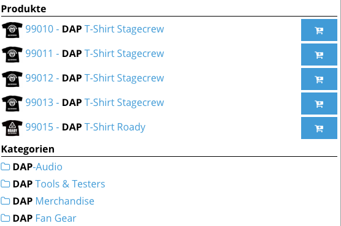
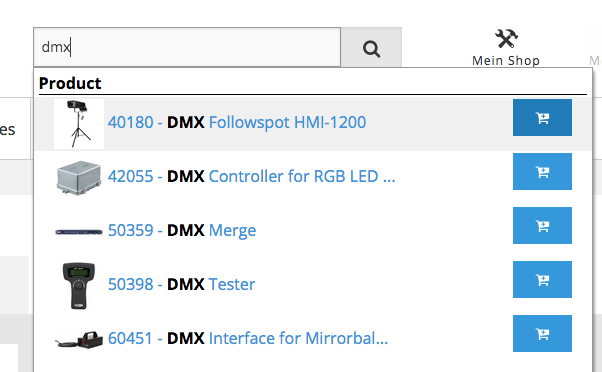
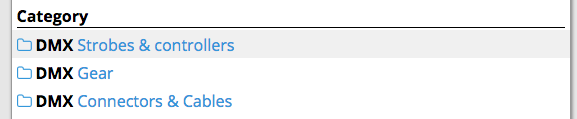
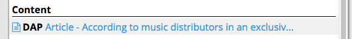
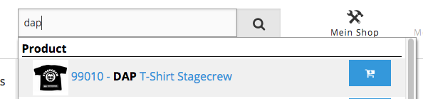

# Autosuggestion



The built-in autosuggestion function provides a user-friendly way to find products, categories, content or downloads
which match the given search criteria.

When you type in main search field, different and configurable search results appear.

Autosuggestion has four different independent modules: product, category, content and download.

1. A user types in a search field.
2. A Solr search is performed using the content of the search field using Solarium.
3. The Solr result is shown according to configuration.
4. A different action is performed according to module type using a redirect controller that works after an element is clicked:
    - A product click redirects to product detail page.
    - A category click redirects to category detail page.
    - A content click redirects to Content item's detail page.
    - A download click starts the download of the current file.

!!! note

    Processing time must be kept as low as possible.
    That's why search is performed directly in Solr without any additional components from eZ Commerce.

### Product module

This module is designed to display eZ Commerce products.

Clicking a product redirects to the product detail page. Due to performance reasons the price is not displayed in this step.

If `add_to_basket` is set to true, an "add to basket" button appears and the user can add the product to basket directly from the autosuggestion window.

If a product has variants, no add to basket option is offered. 

### Category module

This module is designed to display eZ Commerce categories.

Clicking a category redirects to the category detail page.

### Content module

This module is designed to display Content items.

Clicking a Content item redirects to the Content item's detail page.

### Download module

This module is designed to download files.

Clicking this result starts a download of the given element.
This assumes that downloads are meant to be downloaded and not to redirect to their content detail page.

### Configuration

!!! tip

    The order of module configuration keys represents the order of display in the suggestion box.

#### Product

``` yaml
siso_search.default.autosuggest_module_definitions:
    product_autosuggest:
        search_limit: 5
        use_prefix_search: false
        min_score: 1
        images_field:
            ez: main_image_url_s
            econtent: ses_product_ses_datamap_ext_main_image_url_value_s
        add_to_basket: true #add to cart
        type_id:
            - 2
        path: '/2/'
        section:
            - 1
        search_fields:
            - ses_product_ses_sku_value_s
            - ses_product_ses_name_value_s
        result_fields:
            - ses_product_ses_sku_value_s
            - ses_product_ses_name_value_s
        result_fields_separator: ' - '
        text_limit: 35
```

- `search_limit` (int) - number of elements to display.
- `images_field` (string) - image path for products depending on the data provider
- `add_to_basket` (bool) - whether add to basket button is shown.
- `types` (array) - additional filter for element types.
- `path` (string) - additional filter for path.
- `section` (array) - additional filter for Section.
- `search_fields` (array) - Solr search field names to perform the search.
- `result_fields` (array) - Solr result field names to be shown on results.
- `result_fields_separator` (string) - text to be used as a separator for result fields.
- `text_limit` (int) - limits the length of the resulting string.
- `use_prefix_search` (boolean) - if true, ngram fields can be defined.
- `min_score` - used if `use_prefix_search` is `false`. The product is returned inly if Solr score is higher than `min_score`.
- `search_fields` - a prefix for search (searchterm + `*`)

#### Category

``` yaml
siso_search.default.autosuggest_module_definitions:
category_autosuggest:
    search_limit: 5
    images: true
    types:
        - 38
    path: '/2/'
    section:
        - 1
    search_fields:
        - ses_category_ses_name_value_s
    result_fields:
        - ses_category_ses_name_value_s
    result_fields_separator: ' - '
    text_limit: 60
```

- `search_limit` (int) - number of elements to display.
- `images` (bool) - whether category icon is shown.
- `types` (array) - additional filter for element types.
- `path` (string) - additional filter for path.
- `section` (array) - additional filter for Section.
- `search_fields` (array) - Solr search field names to perform the search.
- `result_fields` (array) - Solr result field names to be shown on results.
- `result_fields_separator` (string) - text to be used as a separator for result fields.
- `text_limit` (int) - limits the length of the resulting string.

#### Content

``` yaml
siso_search.default.autosuggest_module_definitions:
content_autosuggest:
    search_limit: 5
    images: true
    section: 
        - 1
    search_fields:
        - article_title_value_s
        - article_intro_value_s
        - article_body_value_s
    result_fields:
        - article_title_value_s
        - article_intro_value_s
        - article_body_value_s
    result_fields_separator: ' - '
    text_limit: 60
```

- `search_limit` (int) - number of elements to display.
- `images` (bool) - whether content icon is shown.
- `section` (array) - additional filter for Section.
- `search_fields` (array) - Solr search field names to perform the search.
- `result_fields` (array) - Solr result field names to be shown on results.
- `result_fields_separator` (string) - text to be used as a separator for result fields.
- `text_limit` (int) - limits the length of the resulting string.

#### Download

```
siso_search.default.autosuggest_module_definitions:
download_autosuggest:
    search_limit: 5
    images: true
    search_fields:
        - file_name_value_s
        - file_description_value_s
    result_fields:
        - file_name_value_s
        - file_description_value_s
    mime_types:
        - application/pdf
    result_fields_separator: ' - '
    text_limit: 60
```

- `search_limit` (int) - number of elements to display.
- `images` (bool) - whether download icon is shown.
- `search_fields` (array) - Solr search field names to perform the search.
- `result_fields` (array) - Solr result field names to be shown on results.
- `mime_types` (array) - search only the MIME types specified here.
- `result_fields_separator` (string) - text to be used as a separator for result fields.
- `text_limit` (int) - limits the length of the resulting string.

## Autosuggest redirect controller

`AutosuggestRedirectController` redirects to different pages according to the passed type.
It speeds up linking to the detail pages without calling other methods to generate a route/URL. 

There are three redirection types. Each redirection type is a service defined in configuration,
for example: `redirect_generator_id: siso_search.autosuggest_redirect_generator.product`

`SearchAutosuggestRedirectGeneratorProduct` fetches the SKU from a `$request` object and returns a string containing the URL to redirect.
The languages are injected into the service from the respective SiteAccess-aware parameter.

`SearchAutosuggestRedirectGeneratorCategory` is similar to the redirect generator for products.
It returns the URL of the category.

`SearchAutosuggestRedirectGeneratorDownload` uses the API to fetch the media element by identifier and language.
Then it creates a download link.

All redirect services implements the `AutosuggestRedirectUrlGeneratorInterface` interface.

## Overriding autosuggestion services

There are four autosuggestion services:

```
SearchBundle/Service/SearchAutosuggestAllService.php
SearchBundle/Service/SearchAutosuggestCategoryService.php
SearchBundle/Service/SearchAutosuggestContentService.php
SearchBundle/Service/SearchAutosuggestDownloadService.php
```

Search logic is built in the `searchProducts()` method.
Output is generated in `getDisplayText()` and `generateHtml()`.
Template is rendered in `generateHtml()`.

All autosuggestion services implement the `SearchAutosuggestInterface` interface.
Their service definitions are, for example:

``` 
search_service_id: siso_search.autosuggest_service.product
```

Yo create a new autosuggestion service, you need to implement the interface and define the service ID in autosuggestion configuration.

## Autosuggestion templates

Each autosuggestion section has its own template located in `EshopBundle/Resources/views/Search/autosuggest`. 

### Product template

The `search_autosuggest_product_line.html.twig` template renders:

- image (if it set)
- autosuggestion text (usually "SKU - Product Name")
- add to basket button.

The add to basket button must have the `js-add-to-basket` class. This allows Ajax to perform adding the product to basket.

The object link is generated as a link, and is not using the link functionality of the autosuggestion JS module.
The link goes to the autosuggesttion redirect controller, which redirects according to the type parameter.



`search_autosuggest_product_line.html.twig`

### Category template

The `search_autosuggest_category_line.html.twig` template only displays an icon for category and autosuggest text.



### Content template

The `search_autosuggest_content_line.html.twig` template only displays an icon for content and autosuggest text.



### Download template

The `search_autosuggest_download_line.html.twig` template only displays an icon for download and autosuggest text.
The download link is generated in the autosuggest redirect controller.


### set_bold_text Twig function

The `set_bold_text` Twig function marks user search terms in autosuggest search result as `<strong>`.

For example, if user searches for "DMX", then all "DMX" occurrences have the `<strong>` tag.



!!! note

    All templates have access to the `resultLine` array, which has all information returned by Solr.
    You can use this information to adapt the template without overriding the services.

!!! note

    Autosuggestions need to be generated as quickly as possible, so do not add additional logic with heavy processing in the template or anywhere else.
    
    For example, avoid using image transformation functions.
    If you need an image of a given size or features, it is strongly recommended to transform it at indexing time using an indexer plugin and then use the processed image.

## Autosuggestion filters

Autosuggestion filters are applied automatically to avoid displaying elements that may be hidden or restricted to certain users.

### Content model filters

- Document Type
- Permissions
- Language
- Visibility

### eContent Filters

- Document Type
- Catalog segmentation
- Languages
- Visibility
