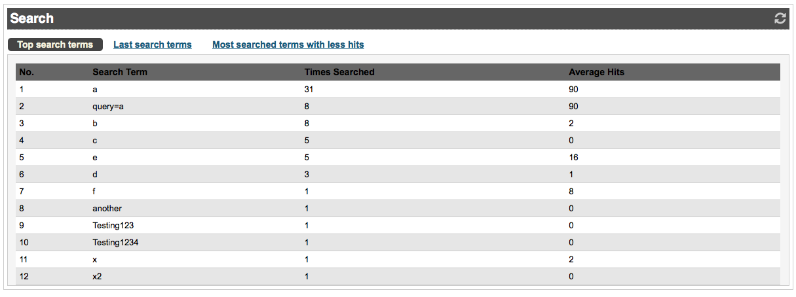
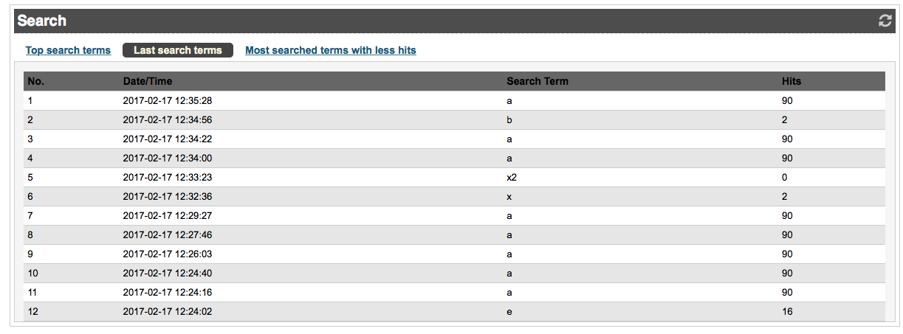
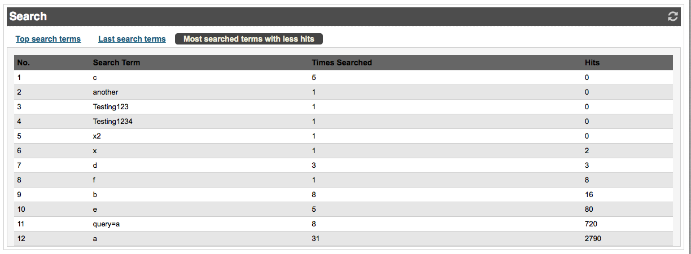

# Search statistics

eZ Commerce provides a functionality to display the searches that are performed by the users.
Every search query is logged into the database table: 

`ses_log_search`

``` 
mysql> select * from ses_log_search order by log_timestamp DESC limit 20;
+------+---------------------+---------------------+-----------+-------------+-------------------+----------------------------+---------+---------+----------+---------+
| id   | log_timestamp       | log_channel         | log_level | log_message | request_id        | session_id                 | user_id | results | language | shop_id |
+------+---------------------+---------------------+-----------+-------------+-------------------+----------------------------+---------+---------+----------+---------+
| 3823 | 2017-02-17 12:35:28 | silver_eshop_search |       200 | a           | el8691ce-000c4cc7 | el8691celljual0kndes20tsl7 | 10      |      90 | ger-DE   | MAIN    |
| 3822 | 2017-02-17 12:34:56 | silver_eshop_search |       200 | b           | el8691ce-fe01c18d | el8691celljual0kndes20tsl7 | 10      |       2 | ger-DE   | MAIN    |
| 3821 | 2017-02-17 12:34:22 | silver_eshop_search |       200 | a           | el8691ce-fbe39c67 | el8691celljual0kndes20tsl7 | 10      |      90 | ger-DE   | MAIN    |
| 3820 | 2017-02-17 12:34:00 | silver_eshop_search |       200 | a           | el8691ce-fa89ecde | el8691celljual0kndes20tsl7 | 10      |      90 | ger-DE   | MAIN    |
| 3819 | 2017-02-17 12:33:23 | silver_eshop_search |       200 | x2          | el8691ce-f838dbbb | el8691celljual0kndes20tsl7 | 10      |       0 | ger-DE   | MAIN    |
| 3818 | 2017-02-17 12:32:36 | silver_eshop_search |       200 | x           | el8691ce-f5473c35 | el8691celljual0kndes20tsl7 | 10      |       2 | ger-DE   | MAIN    |
| 3817 | 2017-02-17 12:29:27 | silver_eshop_search |       200 | a           | el8691ce-e97d9b83 | el8691celljual0kndes20tsl7 | 10      |      90 | ger-DE   | MAIN    |
| 3816 | 2017-02-17 12:27:46 | silver_eshop_search |       200 | a           | el8691ce-e3259dc3 | el8691celljual0kndes20tsl7 | 10      |      90 | ger-DE   | MAIN    |
| 3815 | 2017-02-17 12:26:03 | silver_eshop_search |       200 | a           | el8691ce-dcb4b677 | el8691celljual0kndes20tsl7 | 10      |      90 | ger-DE   | MAIN    |
| 3814 | 2017-02-17 12:24:40 | silver_eshop_search |       200 | a           | el8691ce-d78a57db | el8691celljual0kndes20tsl7 | 10      |      90 | ger-DE   | MAIN    |
| 3813 | 2017-02-17 12:24:16 | silver_eshop_search |       200 | a           | el8691ce-d6021990 | el8691celljual0kndes20tsl7 | 10      |      90 | ger-DE   | MAIN    |
| 3812 | 2017-02-17 12:24:02 | silver_eshop_search |       200 | e           | el8691ce-d52da26b | el8691celljual0kndes20tsl7 | 10      |      16 | ger-DE   | MAIN    |
| 3811 | 2017-02-17 12:23:56 | silver_eshop_search |       200 | e           | el8691ce-d4cc4fa1 | el8691celljual0kndes20tsl7 | 10      |      16 | ger-DE   | MAIN    |
| 3810 | 2017-02-17 12:20:02 | silver_eshop_search |       200 | e           | el8691ce-c62034df | el8691celljual0kndes20tsl7 | 10      |      16 | ger-DE   | MAIN    |
| 3809 | 2017-02-17 12:19:10 | silver_eshop_search |       200 | e           | el8691ce-c2ed2067 | el8691celljual0kndes20tsl7 | 10      |      16 | ger-DE   | MAIN    |
| 3808 | 2017-02-17 12:17:27 | silver_eshop_search |       200 | b           | 5vqrni12-bc78d083 | 5vqrni12v36b3mrsj2shcgilj4 | 10      |       2 | ger-DE   | MAIN    |
| 3807 | 2017-02-17 12:16:30 | silver_eshop_search |       200 | a           | 5vqrni12-b8eac0b5 | 5vqrni12v36b3mrsj2shcgilj4 | 10      |      90 | ger-DE   | MAIN    |
| 3806 | 2017-02-17 12:16:07 | silver_eshop_search |       200 | d           | 5vqrni12-b77df822 | 5vqrni12v36b3mrsj2shcgilj4 | 10      |       1 | ger-DE   | MAIN    |
| 3805 | 2017-02-17 12:15:54 | silver_eshop_search |       200 | c           | 5vqrni12-b6a1caed | 5vqrni12v36b3mrsj2shcgilj4 | 10      |       0 | ger-DE   | MAIN    |
| 3804 | 2017-02-17 12:14:16 | silver_eshop_search |       200 | b           | 5vqrni12-b0879554 | 5vqrni12v36b3mrsj2shcgilj4 | 10      |       2 | ger-DE   | MAIN    |
+------+---------------------+---------------------+-----------+-------------+-------------------+----------------------------+---------+---------+----------+---------+
20 rows in set (0.01 sec)
```

This search statistics can be displayed in eCommerce cockpit.
This logic is generated in the `QuerySearchLogService` service.

There are three tables displayed.

## Top search terms

**Top search terms** displays the most searched terms sorted by times searched.

Query:

``` php
$queryBuilder = $this->searchOrmLogRepository->createQueryBuilder('ses_log_search')
    ->select(
        array(
            'ses_log_search.logMessage',
            'count(ses_log_search.logMessage) as amount',
            'avg(ses_log_search.results) as hits'
        ))
    ->where('ses_log_search.logLevel = 200')
    ->andWhere('ses_log_search.shopId = :shopId ')
    ->groupBy('ses_log_search.logMessage')
    ->orderBy('amount', 'DESC')
    ->setMaxResults($limit)
    ->setParameter('shopId', $shopId);
```



## Last search terms

**Last search terms** displays the last searches order by date and time.

Query:

``` php

$queryBuilder = $this->searchOrmLogRepository->createQueryBuilder('ses_log_search')
    ->select(
        array(
            'ses_log_search.logTimestamp',
            'ses_log_search.logMessage',
            'ses_log_search.results'
        ))
    ->where('ses_log_search.logLevel = 200')
    ->andWhere('ses_log_search.shopId = :shopId ')
    ->orderBy('ses_log_search.logTimestamp', 'DESC')
    ->setMaxResults($limit)
    ->setParameter('shopId', $shopId);
```



## Most searched terms with less hits

**Most searched terms with less hits** gets the most searched terms with less hits.

Query:

``` php
$queryBuilder = $this->searchOrmLogRepository->createQueryBuilder('ses_log_search')
    ->select(
        array(
            'ses_log_search.logMessage',
            'count(ses_log_search.logMessage) as amount',
            'sum(ses_log_search.results) as hits'
        ))
    ->where('ses_log_search.logLevel = 200')
    ->andWhere('ses_log_search.shopId = :shopId ')
    ->groupBy('ses_log_search.logMessage')
    ->orderBy('hits', 'ASC')
    ->addOrderBy('amount', 'DESC')
    ->setMaxResults($limit)
    ->setParameter('shopId', $shopId);
```



## Additional notes

Search queries from main search box are logged.
Search queries from secondary search box are logged only if no facets are selected
and the search term is different from the previous search term. 
