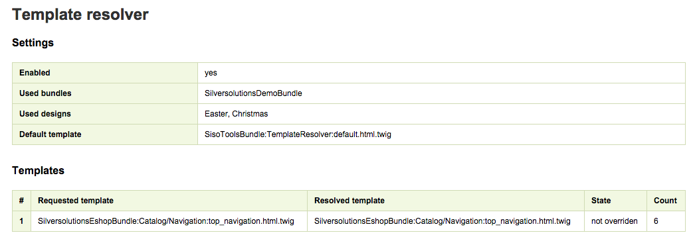

# Template resolver

Template resolver enables overriding templates.
It is an alternative to the [Symfony override functionality](http://symfony.com/doc/current/book/templating.html#overriding-bundle-templates).

The template resolver goes through all configured bundles and designs (if specified), looking for the requested template.
If it can't find the requested template, the template resolver takes this template or default one if the requested template doesn't exist.

An override is activated by a template resolver configuration. You can configure:

- list of bundles
- list of designs (folders with templates)
- default template

## Overriding templates

In this example you have a project with a bundle `src/Client/Bundle/WebsiteBundle`, a SiteAccess `website_de_de`
and you want to override eZ Commerce bundle templates.

### Step 1. Change `config_{env}.yml` or `parameters.yml`

The template resolver is disabled in the default configuration and has to be enabled:

``` yaml
parameters:
    # 1. Enable template resolver
    siso_tools.website_de_de.template_resolver.enabled: true    # true|false
 
    # 2. Define that your bundle is able to override templates
    siso_tools.website_de_de.template_resolver.bundles: [ClientWebsiteBundle]
```

!!! note

    The template resolver uses dynamic configuration of [the ConfigResolver](https://doc.ezplatform.com/en/2.5/guide/config_dynamic/#configresolver).

    If you want to have one configuration for all SiteAccesses, use the `default` scope:

    ``` yaml
    siso_tools.default.template_resolver.enabled: false
    ```

### Step 2. Create new templates

To override templates, you have to reflect the structure of eZ Commerce vendor bundles, e.g.:  

|                   |     |
| ----------------- | --- |
| Original template | `vendor/silversolutions/silver.e-shop/src/Silversolutions/Bundle/EshopBundle/Resources/views/Catalog/catalog.html.twig` |
|      New template | `/src/Client/Bundle/WebsiteBundle/Resources/views/Catalog/catalog.html.twig`  |

In this example the template from `ClientWebsiteBundle` overrides `catalog.html.twig` from `SilversolutionsEshopBundle`.

## Overriding templates using designs

Design is an additional folder in your `Resources/views`.
Templates in the design folder have to reflect the structure of the bundle or bundles that you want to override.

In this example you prepare templates for a website redesign with a provisional name `redesign2020`.

### Step 1. Change `config_{env}.yml` or `parameters.yml`

``` yaml
parameters:
    siso_tools.website_de_de.template_resolver.enabled: true    # true|false
    siso_tools.website_de_de.template_resolver.bundles: [ClientWebsiteBundle]
 
    # Define design name
    siso_tools.website_de_de.template_resolver.designs: [redesign2020]
```

### Step 2. Create new templates in the design folder

Create new folder `Resources/views/designs/redesign2020` in your bundle and put new templates there:

|                   |        |
| ----------------- | ------ |
| Original template | `vendor/silversolutions/silver.e-shop/src/Silversolutions/Bundle/EshopBundle/Resources/views/Catalog/catalog.html.twig`  |
|      New template | `src/Client/Bundle/WebsiteBundle/Resources/views/designs/redesign2020/Catalog/catalog.html.twig` |

In this example the template from the design `redesign2020` in the `ClientWebsiteBundle` overrides `catalog.html.twig` from `SilversolutionsEshopBundle`.

Templates in design folders always have precedence over other templates.

If you have both `redesign2020/Catalog/catalog.html.twig` and `Catalog/catalog.html.twig`, the first one is used.

## Configuration

| Parameter    | Type    | Description       | Default      | Example        |
| ------------ | ------- | ----------------- | ------------ | -------------- |
| `siso_tools.<scope>.template_resolver.enabled`  | bool (`true`\|`false`) | Enable or disable template resolver   | `true`       | `true`   |
| `siso_tools.<scope>.template_resolver.bundles`    | array   | List of bundle names  | `[ ]` (all bundles)  | `[Bundle1, Bundle2, Bundle3]`   |
| `siso_tools.<scope>.template_resolver.designs`  | array   | List of bundle names   | `[ ]` (none)  | `[Design1, Design2]`    |
| `siso_tools.<scope>.template_resolver.default_template` | string  | Default template to return if nothing is found | `SisoToolsBundle:TemplateResolver:default.html.twig` | `SisoToolsBundle:TemplateResolver:default.html.twig` |

## Developing with the template resolver

### Use in templates

To make a template overridable, use the template filter `st_resolve_template` with its name.

``` html+twig

<div class="grid_4">
    {{ include('SilversolutionsEshopBundle:parts:address.html.twig'|st_resolve_template, {'class' : 'styled_list', 'address' : buyerAddress, 'displayEmail' : false, 'displayPhone' : false}) }}
```

!!! note 

    You cannot include blocks with the [`use`](http://twig.sensiolabs.org/doc/tags/use.html) tag
    because of specific implementation of this tag.

    Because `use` statements are resolved independently of the context passed to the template,
    the template reference cannot be an expression.

### Use in PHP code

#### Use in controllers

To make using of the template resolver in controllers easier, you can inherit the controller from
`Silversolutions\Bundle\EshopBundle\Controller\BaseController`.
In this case the `render` and `renderView` methods get rendered with a template using `TemplateResolver`, i.e. overridden template.

``` php
use Silversolutions\Bundle\EshopBundle\Controller\BaseController;
 
class ExampleController extends BaseController
{
    public function showAction(Request $request)
    {
        return $this->render(
            'SilversolutionsEshopBundle:Basket:show.html.twig',
            array(
                'param' => 'example_param'
            )
        );
    }
}
```

#### General usage

Alternatively, you can inject the template resolver in your service (or take it from container) and resolve the template there:

``` php
/** @var TemplateResolverServiceInterface $templateResolverService */
$templateResolverService = $this->get('siso_tools.template_resolver');

$resolvedTemplate = $templateResolverService->resolve('YourBundle:redesign2020/Catalog/catalog.html.twig');
```

## Debugging

You can information about the template resolver configuration and overridden templates in the SilverSolutions tab of the Symfony debug toolbar:


For example:



## Limitations

Using the template resolver has the following limitations:

- `pagelayout.html.twig` can not be resolved by the template resolver
- it is not possible to override templates included with the Twig `use` operator.
- it is not possible to use the template resolver in the configuration,
so for overriding standard templates, for example full eZ templates, you need to override the configuration:

``` yaml
ezpublish:
    system:
        <scope>:
            location_view:
                full:
                    silverModuleRuleset:
                        #change the template name here
                        template: SilversolutionsEshopBundle::st_module.html.twig
                        match:
                            Identifier\ContentType: [st_module]
                    silverEshopProductCatalogRuleset:
                        #change the template name here
                        template: SilversolutionsEshopBundle::ses_productcatalog.html.twig
                        match:
                            Identifier\ContentType: [ses_productcatalog]
```
