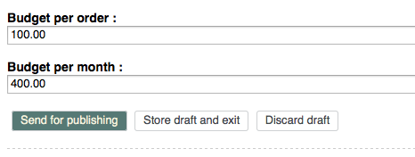
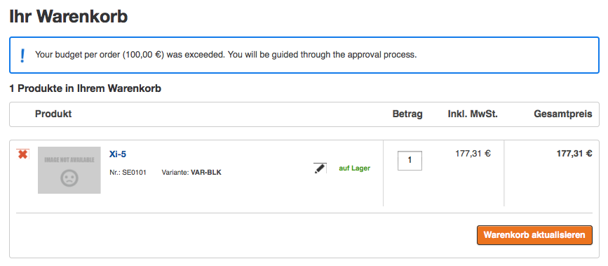
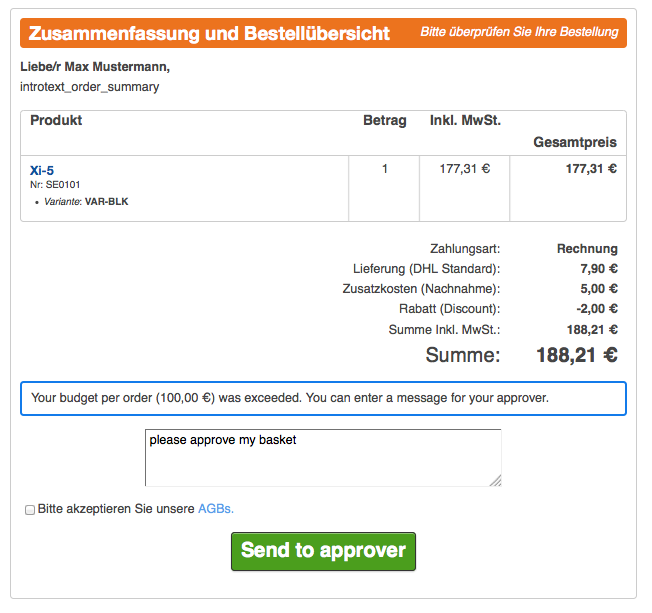
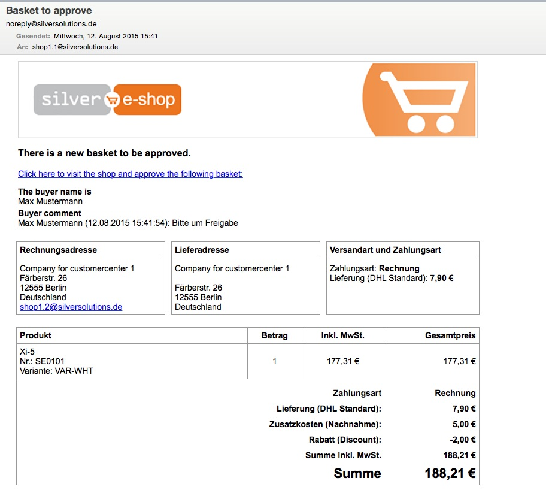
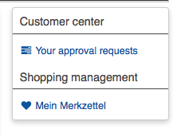
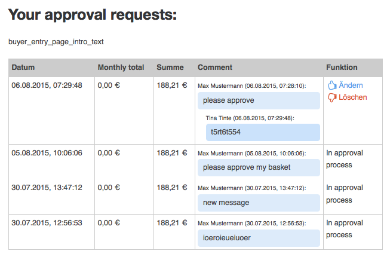
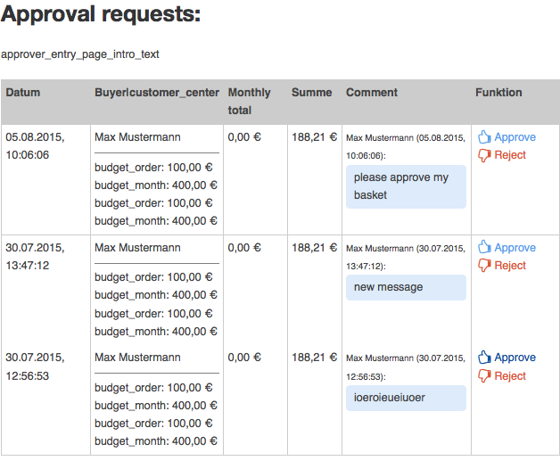

# Budget workflow

Customer Center comes with standard handling for budget workflow. If a user with Customer Center has a defined budget (e.g. budget per order, budget per month),
eZ Commerce checks the budget during the checkout process.

If the budget is exceeded, the user cannot make the order and is processed through an approval process.
The approvers in the company are informed by email and have to approve the user basket or reject it.

Customer center considers budget per order and budget per month by default.

### Setting up a budget

User budget is stored in the User Content item in the default customer currency.

If user exceeds their budget and enters the basket, they see an error message.

In the checkout process on the last page the user can enter a comment and send the basket to the approver.
All approvers in the company receive an email. If there is no approver, the email is sent to the main contact.

The approvers get the following email:

### Checking status of approval request

You can find your approval requests in the user profile.

There you can see the request status and take action.
If the basket is still not handled by an approver, you cannot take any action. Otherwise, you can:

- **Delete** - delete the basket (e.g. if it is not possible to change the amount under the budget, because an item is too expensive).
- **Change** - take over the basket, change it and order again.

## Approver workflow

After a user exceeds their budget, the approver gets an email with a direct link to the approval request.
The approver can also find this link in their user menu. The user profile contains a list of all baskets that need to be approved.

The approver can take the following actions:

- `approve` - take over the basket and order, sending it to ERP. Both approver and buyer get a confirmation email.
- `reject` - leave a comment for the buyer and reject the basket. The basket is assigned back to the buyer.

