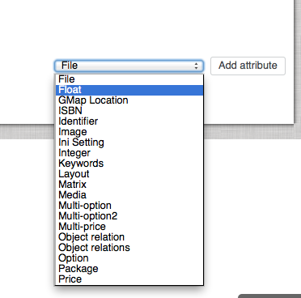
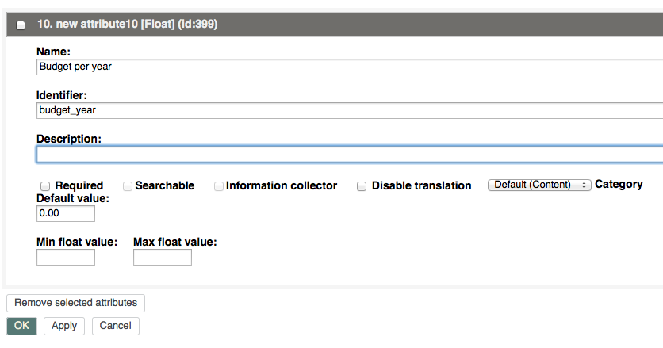
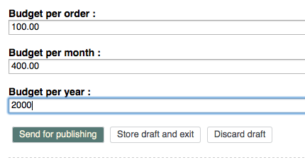

# Customer center cookbook

## Extending the Customer center forms

The following example shows how to extend the Customer center forms by adding more fields to the forms
to display the "Cost center" of the user.
The cost center is stored in the content model and can be sent to the ERP during the order process.
You need to add this dynamic field to your form configuration.

!!! note

    This example explains how to extend the form with additional data.
    Sending this additional data (e.g. in the order process) is part of a different process that needs to be implemented separately.
    See [Sending additional data in the order](../../erp_integration/checkout_order/order_submission/order_submission.md#sending-additional-data-in-the-order) for more information.

1\. Extend the User Content Type with a new Field `cost_center`. The Field must be one of the supported Field Types: Text line, Float, Integer, or Checkbox.

2\. Add this new Field to the form configuration as a dynamic field. First choose the [form field type](https://symfony.com/doc/3.4/reference/forms/types.html) which defines how the field should be rendered.

3\. Add validation and other settings. The options depend on the form field type.

``` yaml
siso_customer_center.default.form.request_user:
    attributes:
        dynamic:
            cost_center:
                type: text
                options:                    
                    constraints:
                        Symfony\Component\Validator\Constraints\NotBlank:
```

4\. The new Field appears in the form and can be edited. The data is stored in the content Field.
If you extended the request form, the new Field can also be sent to ERP when the new contact is created in ERP.

!!! caution

    The content Field identifier and the field identifier in the configuration must match, if you want to store data in the content model.

## Writing a new form data processor

If you need a special process to be started after a form is submitted, you need to write a new data processor.
In the example below you need to update the contact data in ERP after editing the user in the shop.

You need to have an `updateContact` message prepared to update the contact data in ERP.
If you don't know how to create a message that is sent to ERP, see [Creating a project-specific message](../../erp_integration/erp_communication/guides/creating_a_new_erp_message/create_project_specific_message.md).  

1\. Create a new form processor that implements [FormProcessorInterface](customer_center_api/formprocessorinterface.md).

``` php
class UpdateContactInErpProcessor implements FormProcessorInterface
{
    public function execute(Form $form, array $lastResult = array())
    {    
        try {
            $updateContactMessage = $this->messageInquiry
                ->inquireMessage(UpdateContactFactoryListener::UPDATECONTACT);
        } catch(MessageInquiryException $messageException) {
           //TODO handle exception
        }

        if (!$updateContactMessage instanceof UpdateContactMessage) {
           //TODO handle exception
        }

        /** @var UpdateContact $updateContactMessage */
        $updateContactRequest = $updateContactMessage->getRequestDocument();
        
        //TODO set request data

        try {
            $updateContactResponse = $this->transport->sendMessage($updateContactMessage)->getResponseDocument();

            if (!$updateContactResponse instanceof ResponseUpdateContact) {
                //TODO handle missing response
            }
            
            //TODO if required set some response data into last result
            //Example: $lastResult['updateContact'] = $updateContactResponse->status;

        } catch (\RuntimeException $rtException) {
            //TODO handle exception
        }    

        return $lastResult;
    }
}
```

2\.  Define the processor as a service:

``` xml
<parameter key="siso_customer_center.processor.update_contact_in_erp.class">Project\Bundle\MyProjectBundle\Service\Forms\UpdateContactInErpProcessor</parameter>

<service id="siso_customer_center.processor.update_contact_in_erp" class="%siso_customer_center.processor.update_contact_in_erp.class%">    
</service>
```

3\. Add the data processor to the form configuration:

``` yaml
siso_customer_center.default.form.edit_user:
    invalidMessage: error_message_customer_center_forms
    validMessage: success_message_customer_center_edit_user
    #this initialFormValuesService will prefill the form
    initialFormValuesService: siso_customer_center.initial_edit_user_values_service
    formProcessors:
        - siso_customer_center.processor.store_user_form_in_ez
        - siso_customer_center.processor.update_user_roles
        - siso_customer_center.processor.save_profile_in_session
        - siso_customer_center.processor.update_contact_in_erp
```

## Extending the budget with budget per year

To provide user budget per year, extend the User Content Type.
The Field must be one of the supported Field Types: Text line, Float, Integer, Checkbox.
Add a new Field of type Float. 



Name the attribute and add a unique identifier, e.g. `budget_year`.



Then you can assign the user budget per year to some users.



By default only the budget per order and budget per year are checked by the shop.
[`OrderBudgetService`](customer_center_api/budgetserviceinterface.md#orderbudgetservice) is used to check the budget service.

Override this service in your project and consider also the budget per year in the interface methods:

``` xml
<parameter key="siso_customer_center.budget_service.order.class">CompanyName\Bundle\ProjectBundle\Service\OrderBudgetService</parameter>

<service id="siso_customer_center.budget_service.order" class="%siso_customer_center.budget_service.order.class%">
    <argument type="service" id="ezpublish.api.repository" />
    <argument type="service" id="silver_basket.basket_repository" />
    <argument type="service" id="silver_common.logger"/>
    <argument type="service" id="silver_trans.translator" />
    <argument type="service" id="ses.customer_profile_data.ez_erp" />
    <argument type="service" id="request_stack"/>
</service>
```

Override the bundget service with `CompanyName\Bundle\ProjectBundle\Service\OrderBudgetService`:

``` php
public function isBudgetExceeded($amount, $userId)
{
    $userService = $this->ezRepository->getUserService();
    try {
        $user = $userService->loadUser($userId);

        $budgetPerOrder = $user->getFieldValue(self::BUDGET_PER_ORDER_IDENTIFIER);
        $budgetPerMonth = $user->getFieldValue(self::BUDGET_PER_MONTH_IDENTIFIER);
        $budgetPerYear = $user->getFieldValue(self::BUDGET_PER_YEAR_IDENTIFIER);

        if ($budgetPerOrder instanceof FloatValue) {
            $isBudgetPerOrderExceeded = $this->isBudgetPerOrderExceeded($amount, $budgetPerOrder);
            ...
        }
        if ($budgetPerMonth instanceof FloatValue) {
            $isBudgetPerMonthExceeded = $this->isBudgetPerMonthExceeded($userId, $amount, $budgetPerMonth);
            ...
        }
        if ($budgetPerYear instanceof FloatValue) {
            $isBudgetPerYearExceeded = $this->isBudgetPerYearExceeded($userId, $amount, $budgetPerMonth);
            if ($isBudgetPerMonthExceeded) {
                $message = 'budget per year exceeded';            
                throw new BudgetExceededException($message);
            }
        }

    } catch(NotFoundException $e) {
        $this->logger->addError('BudgetService: Exception catched: ' . $e->getMessage());
    }

    return false;
}

/**
 * checks if the orders from last year plus given amount crosses the yearly budget
 * 
 */
protected function isBudgetPerYearExceeded($userId, $amount, FloatValue $budget)
{
    //value 0 means that budget is not set
    if ($budget->value == 0) {
        return false;
    }

    //get user orders from the last year
    $orders = $this->basketRepository->getUserOrdersFromLastYear($userId);
    $sumLastYear = $amount;

    if (is_array($orders)) {
        foreach($orders as $order) {
            if (array_key_exists('totalsSumGross', $order)) {
                $sumLastYear += $order['totalsSumGross'];
            }
        }
    }

    return $budget->value < (float) $sumLastYear;
}
```
