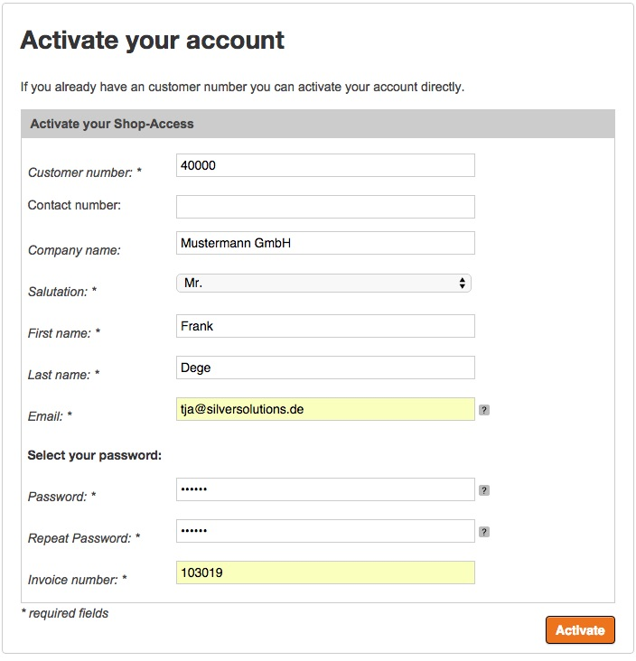
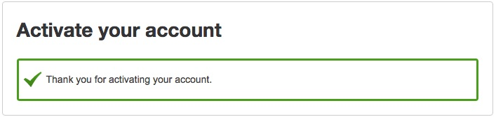
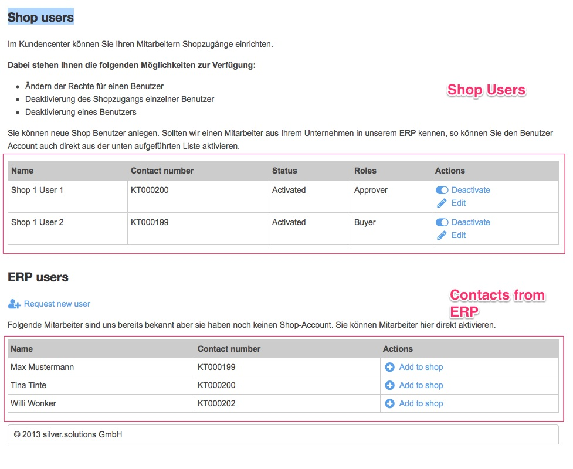
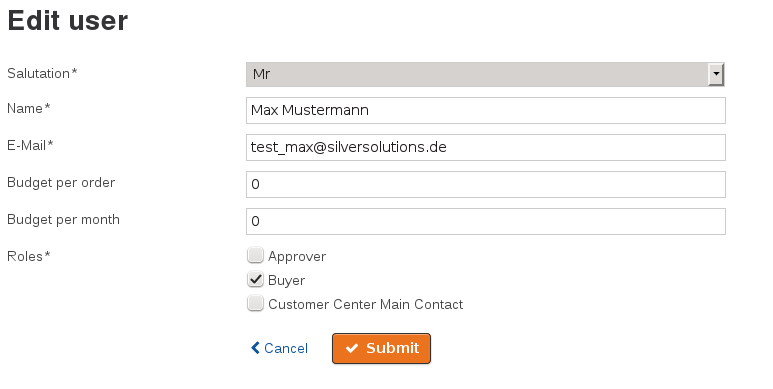
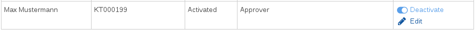
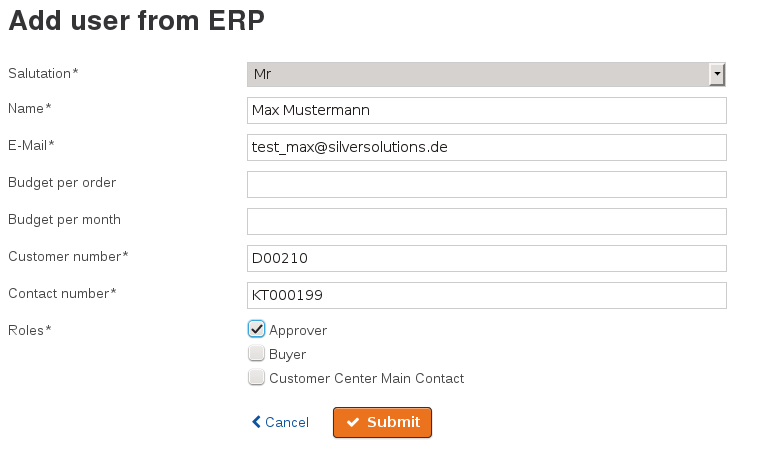
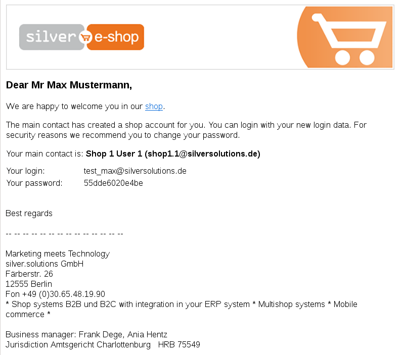
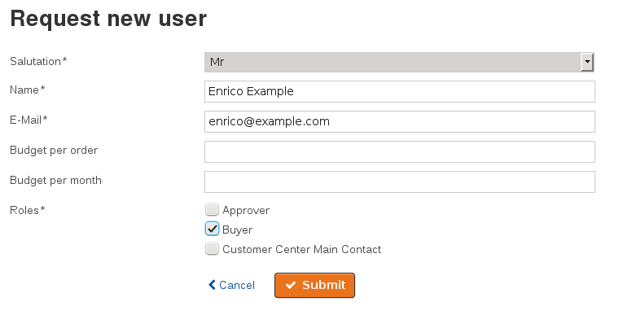

# Customer center functions

!!! note

    The Customer center is available for customers who have a flag enabling it in the ERP.
    The ERP provides two important fields:

    - flag which indicated that the company has a Customer center
    - email address of the Customer center administrator

## Activate the Customer center

During account activation the shop checks if the customer has access to the Customer center.
For a successful activation you need:

- a customer number
- an invoice number
- an email address which is defined in the ERP as a main contact

If Customer center is enabled for the customer, the shop creates a company. A main contact is assigned to the company in the User section of the Back Office.
If no Customer center is defined for the customer, a standard user is created in the section "Business users"

The customer is logged in.

### Error messages

"Your company is using a Customer center. Please contact your shop administrator %email% for activating an account." - if a Customer center is activated for a company, only the shop administrator in this company is able to set up new accounts.

## Customer center overview

The Customer center is visible for users only if they have the rights for it.
The main contact who has activated the account is always able to use the Customer center.

The Customer center can be accessed in **My Profile** and **Users management**. 

The list displayed on the entry page shows:

- the shop users already registered for the shop, including user name, the status and the roles assigned.
- a list of ERP contacts, which are not yet set up as a user in the shop.

## Edit a user

You can change the salutation, name and email address of the user.
All three pieces of information are required.

In addition, you can assign Roles to the user and define budgets.
At least one Role must be defined.

The password must be changed by the shop users themselves. 

## Activate or deactivate a user

You can activate or deactivate a user.
A deactivated user cannot log in to the shop anymore. 

This feature is available in the user management overview.

## Add an existing user to the shop

You can add a user who is displayed in the "ERP users" list to the shop.

You cannot change the customer number and contact number. After storing the form, the user gets a shop account.

After sending the form, the user receives an email with all information about how to access the shop and their account data:

## Request a new user

The function **Request new user** sets up a new user for the shop. 
The new user's email cannot be used by another shop user.

After sending the form the user gets an email with all information about how to access the shop and their account data.
