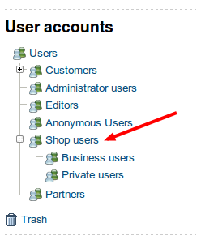
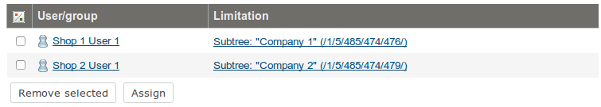

# Customer center installation

Customer Center is implemented as a dedicated repository with `CustomerCenterBundle`.

## Installation

### Step 1. Add Customer center package

### Step 2. Extend composer.json with autoload paths


``` json
"autoload": {
    "psr-0": {
        ...
        "Siso\\Bundle\\CustomerCenterBundle": "vendor/silversolutions/silver.customercenter/src/"
    }
},
```

``` bash
php composer.phar dumpautoload
```
#### Step 3. Enable bundle

Enable the bundle in the kernel:

``` php
public function registerBundles()
{
    $bundles = array(
        ...
        new SisoCustomerCenterBundle()
    );
}
```

Enable the bundle configuration in `config.yml` (or another relative configuration file):

``` yaml
imports:
    - { resource: "@SisoCustomerCenterBundle/Resources/config/customercenter.yml" }
```

Enable routing:

``` yaml
siso_customer_center:
    resource: "@SisoCustomerCenterBundle/Resources/config/routing.yml"
    prefix: /
```

Text modules can be installed via the [ses_customercenter_textmodules-1.0-1.ezpkg](../../img/ses_customercenter_textmodules-1.0-1.ezpkg) package.

Use the `register/customer_center_activation` route to link to the activation process.

## Configuration

### Content Types

#### Create Company Content Type

Package for the company class: [ses_company_class-1.0-1.ezpkg](../../img/ses_customercenter_textmodules-1.0-1.ezpkg)

Name: Company

Identifier: `ses_company`

Container: yes

Fields:

| Name            | Identifier       | Type      |
| --------------- | ---------------- | --------- |
| Name            | `name`             | Text line |
| Customer number | `customer_number` | Text line |

!!! caution

    The Company Content Type has to be added under the 'Users' Content Type group.
    It is required if you want to create users in company Content items.

#### Modify the User Content Type

Name: User

Identifier: `user`

Add the following Fields:

| Name             | Identifier    | Type  |
| ---------------- | ------------- | ----- |
| Budget per order | `budget_order` | Float |
| Budget per month | `budget_month` | Float |

!!! note

    You can extend the User Content Type with the following Field Types:
    
    - Text line
    - Float
    - Integer
    - Checkbox
    
    If you want to add/edit these Fields via Customer center forms,
    you have to add them to the configuration as dynamic fields.

### Content structure

Create initial content structure:

|Content item name|Description|Parent Cocation|Applied Roles|
|--- |--- |--- |--- |
|Shop users|The root of customer center. The name could vary, e.g.: Shop users UK, Shop Germany, etc.|Users|Anonymous, Member|
|Business users|The root for companies.|Shop users||
|Private users|The root for private users.|Shop users||

Example of content structure:



### Roles

Use migration tool to install Content Types and Roles. (Two YAML files in plugin bundle)

`php bin/console kaliop:migration:migrate --path=vendor/silversolutions/silver...`

#### Customer Center Main Contact

This Role defines the main contact of a company.

Policies:

| Module               | Function | Limitation     |
| -------------------- | -------- | -------------- |
| `siso_customercenter` | `view`     | No Limitations |

#### Customer Center Main Contact Subtree

This Role gives main contacts permissions to use customer center and manage users.

Policies:

| Module  | Function | Limitation                           |
| ------- | -------- | ------------------------------------ |
| `content` | `create`   | Class( User, Company )               |
| `content` | `edit`     | Class( User )                        |
| `content` | `read`     | Class( User group , User , Company ) |

The Customer Center Main Contact Subtree Role must always be applied to main contacts with subtree Limitation.
Subtree in this case is the Location of the Company Content item.

Example of assigning this Role to users:



#### Other Roles

Other Roles are project specific and depend on project requirements.
Main contacts can assign these Roles to other shop users of their companies, for example: Approver or Buyer.

### Configure Customer center

``` yaml
# Logging in with customer number is enabled. Possible values: true, false
siso_core.default.enable_customer_number_login: false

# A contact in the ERP is created if this is set to true
siso_customer_center.default.create_contact_in_erp_processor_is_active: true

# Location identifiers of Customer center User Groups (Business users, Private users, etc)
siso_core.default.user_group_location: 485
siso_core.default.user_group_location.business: 474
siso_core.default.user_group_location.private: 475
siso_core.default.user_group_location.editor: 14
```

Configure Role identifiers:

``` yaml
# Main contact Role identifier
siso_customer_center.default.main_contact_role: Customer Center Main Contact

# List of Roles that can be assigned or unassigned by main contact
siso_customer_center.default.roles: [Approver, Buyer]
```

### Configure the budget workflow

``` yaml
# Configure email subjects
siso_customer_center.approve_basket.subject: 'Basket to approve'
siso_customer_center.reject_basket.subject: 'Basket was rejected'

# Order in which comments should be sorted by date, values: ASC, DESC
siso_customer_center.sort_buyer_approver_comments: ASC
```
