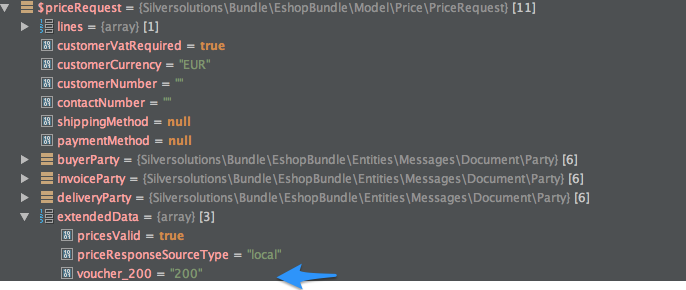

# Vouchers - FAQ

Q: How the voucher data is send to ERP?

A: Voucher data will be sent to ERP in the **PriceRequest** and **CreateOrderRequest**.

If enabled in the [configuration](vouchers_api.md), also additional line with negative quantity will be sent. NAV must response with negative cost.

#### Data send in the header

``` xml
//Data sent in the header, in SesExtension:
<SesExtension>
    <voucherNumber>[voucher_number]</voucherNumber> 
    <voucherNumber>[voucher_number2]</voucherNumber>  
</SesExtension>

//Additional line sent
<OrderLine>    
    <LineItem>
        <Item>
            <SellersItemIdentification>
                <ID>[voucher_number]</ID>
            </SellersItemIdentification>
        </Item>
        <Quantity>-1</Quantity>
        <Price>
            <PriceAmount></PriceAmount>
        </Price>
    </LineItem>
    <SesExtension>
        <isVoucher>1</isVoucher>
        <voucherNumber>[voucher_number]</voucherNumber>        
    </SesExtension>
</OrderLine>
```

Q: What happens if voucher is invalid?

A: ERP can send a message that the voucher is invalid. In that case this message will be displayed in the basket. The message must be mapped into Response like this:

``` xml
<SesExtension>
    <ErpMessage>008</ErpMessage>
</SesExtension>
```

In addition in the OrderLine (Response) the LineType and CostType has to be set:

``` xml
<SesExtension>
    <ErpMessage>008</ErpMessage>
</SesExtension>
```

Q: Does the price engine has access to a voucher code?

A: The priceRequest contains the voucher code:



Important:

A use can provide one or more vouchers during checkout. The extendedData structure provides simple data structures only. This is why the field name contains the voucher number as well (here voucher\_200).
