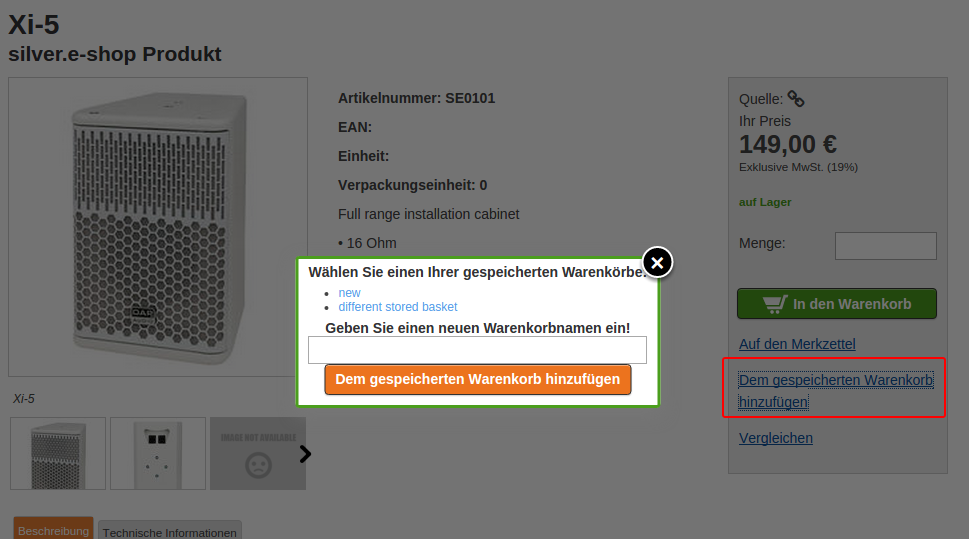
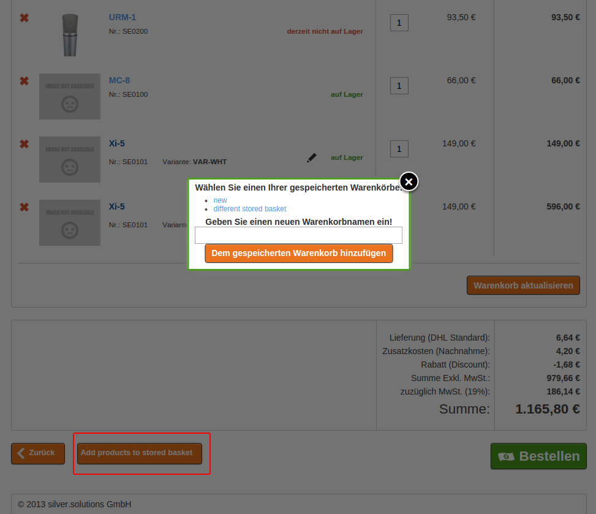
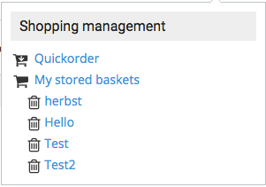
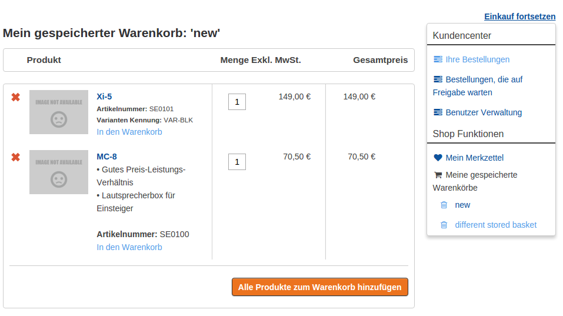

# Stored baskets

Stored baskets are available only for logged-in users. One user can have multiple named baskets.

You can store the whole basket under a name for later purposes and new stored basket will be created.

### Adding products to a stored basket

There are two ways to add products to a stored basket:

- You can add a product to a stored basket from the product detail page:

- You can add all items from the basket into a stored basket (choose a stored basket from a list or provide a new one).  

In the pop-up you can either:

- save a new stored basket - if you do not have any stored baskets yet, you see a pop-up-window where you have to enter a basket name.
- choose existing stored basket - if you already have some stored baskets, you see a pop-up-window where you can choose which stored basket you want to add item to. You can also add a new basket.

If the product is a variant, you must choose all options to be able to add it.

### Stored basket links

You can find the list of stored baskets in your profile page. Click on one of the stored baskets to see the details. 

#### List of stored baskets

You can find a list of all stored baskets in the shop functions.

The list has an overview where you can choose or delete any of the stored baskets.

#### Stored basket detail page

!!! note
    
    The prices in the stored basket are updated immediately after you enter the stored basket page.

The overview contains the following information about the products:

- name
- SKU
- short description
- image
- variant information
- price and availability
- the stored quantity - can be changed before adding to basket

#### Adding products to basket

You can add a single product or all products from a stored basket into the basket.

##### Quantity field

When adding to the basket, you can define how many products you want to add. If there is no quantity field, the minimum order quantity is used.

Products stay in the stored basket until you remove them.

#### Removing products from a stored basket

You can remove products from a stored basket by deleting it or by deleting the whole stored basket (use the trash icon in the right user menu section).

#### Unavailable products

If a product is not in the catalog anymore, you can see a message in the overview page.
