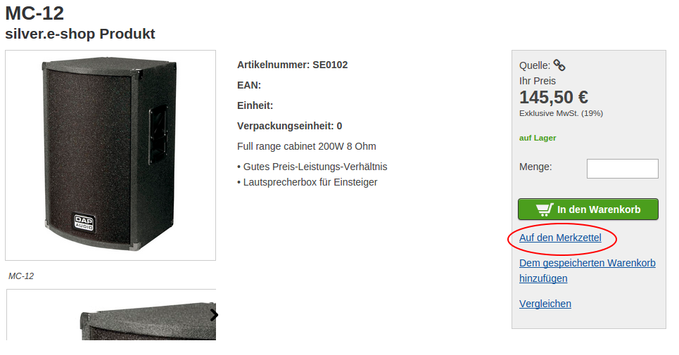
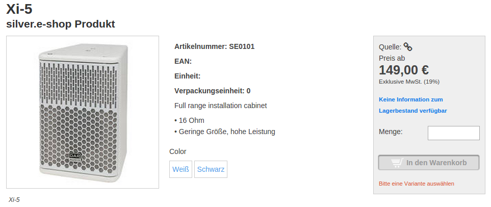
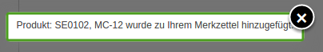
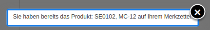
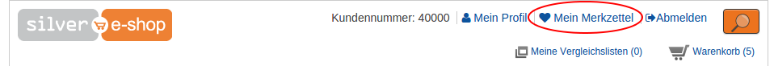
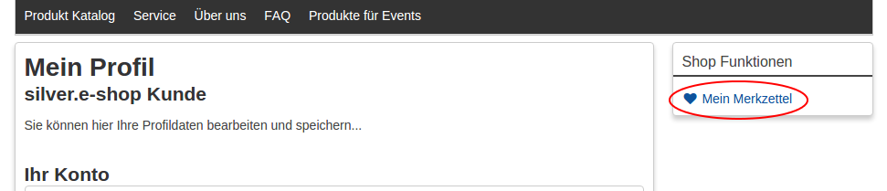

# Wishlist

Wishlists are only available for logged-in users.

One user can only have one wishlist.
To store products in different list, use a stored basket.

### Adding products to the wishlist

The link for adding to wishlist is located in the product detail page in the right column:

For products that are variants you need to choose an actual variant to be able to store it.
Adding to wishlist is not visible until all options are selected:

After successfully adding a product to the wishlist you see a notification:

Items can be stored only once:

When adding product to the wishlist no prices and no quantity is stored.

### Wishlist links

You can find the wishlist in the header of the website and in the profile page in right user menu:

### Wishlist overview page

The overview contains the following information about the products:

- name
- SKU
- short description
- image
- variant information

#### Adding products to basket

You can add a single product or all products from a stored basket into the basket.

##### Quantity field

When adding to the basket, you can define how many products you want to add. If there is no quantity field, the minimum order quantity is used.

Products stay in the wishlist until you remove them.

#### Removing products from wishlist

User can remove products from wishlist one by one.

#### Unavailable products

If a product is not in the catalog anymore, you can see a message in the overview page.
