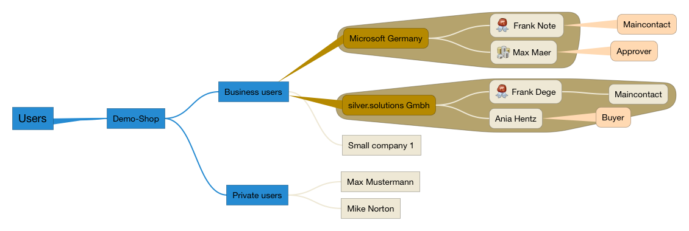
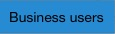
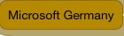
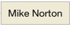

# Customer Center and user management 

# Introduction

The users will be stored in the User section of the system.

The following screenshot shows the users assigned to the Demo-Shop: 

The brown marked structure is introduced by the **Customer Center**. All users which have a customer center are directly assigned to a company. 

Used Content-Types in Z Publish:

<table>
<colgroup>
<col style="width: 50%" />
<col style="width: 50%" />
</colgroup>
<thead>
<tr class="header">
<th>Element</th>
<th>Contenttype</th>
</tr>
</thead>
<tbody>
<tr class="odd">
<td>

</td>
<td>User group</td>
</tr>
<tr class="even">
<td>

</td>
<td>Company</td>
</tr>
<tr class="odd">
<td>

</td>
<td>User</td>
</tr>
</tbody>
</table>

## Registration and where are users stored

The shop distinguishes between business and private users. The users are stored in different locations. 

In addition the customer center handles business customer differently, if they are using a customer center or not. 

<table>
<colgroup>
<col style="width: 33%" />
<col style="width: 33%" />
<col style="width: 33%" />
</colgroup>
<thead>
<tr class="header">
<th>Use case</th>
<th>Stored in</th>
<th>Note</th>
</tr>
</thead>
<tbody>
<tr class="odd">
<td>A <strong>new</strong> customer registers and chooses <strong>private customer</strong></td>
<td>/Shop users Demo-Shop/Private users/&lt;new customer&gt;</td>
<td> 
</td>
</tr>
<tr class="even">
<td>A <strong>new</strong> customer registers and chooses <strong>business customer</strong> </td>
<td>
 

</td>
<td>
New business users require a validation done by the shop administrator, since they might get better prices.

So by default they are not stored in the shop immediately and have to wait for a customer number.
</td>
</tr>
<tr class="odd">
<td>
A <strong>business</strong> customer activates himself in the shop and for this customer <strong>no customer center</strong> is planned in the ERP
</td>
<td>
/Shop users Demo-Shop/Business users/&lt;new customer&gt;
</td>
<td> 
</td>
</tr>
<tr class="even">
<td>A <strong>business</strong> customer activates himself in the shop and for this customer <strong>a customer center</strong> is assigned in the ERP</td>
<td>/Shop users Demo-Shop/Business users/&lt;new company&gt;/&lt;new user&gt;</td>
<td>
If there is no customer center yet for this customer (Custmer Number is used to check this) the shop will try to create it, after checking Customer Number is not already in use.

If the user is the <strong>MainContact</strong> (Defined in ERP):

<ul>
<li>The shop will create a customer center for this business customer.</li>
<li>The user will be created inside this customer center and this used will assigned as a main contact for this company.</li>
</ul>

If the user is not <strong>MainContact</strong> (Defined in ERP):

<ul>
<li>Error message is shown to contact main contact person for the company.</li>
<li>After that the main contact person can create an account for this user</li>
</ul></td>
</tr>
</tbody>
</table>

When a customercenter for a given customer number shall be created the customercenter will check if a company object (Contenttype ses\_company) with the given customer number is already created.

## Login process

When a customer logs in, the shop searches for a user with given email inside the "Demo-Shop" or "Editors" user tree.

For details see [Login and registration](Login-and-registration_29819127.html)
