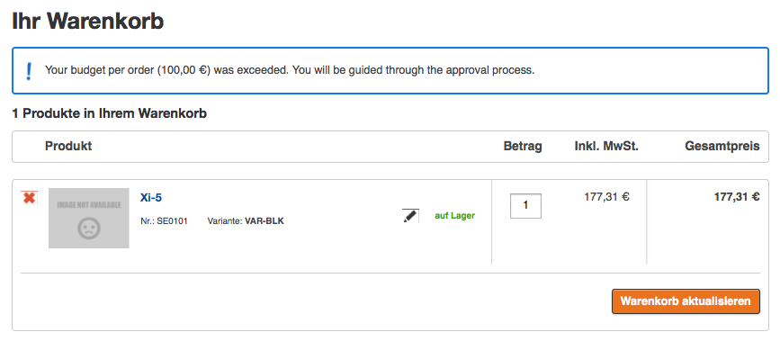

# Customer Center budget workflow

## What is the budget workflow?

Customer Center comes with standard handling for budget workflow. If the user of customercenter has a defined budget, that can not be exceeded (e.g. budget per order, budget per month), silver.eShop advanced will check the budget during the checkout process.

If the budget is exceeded, user can not order and will be processed through the approval process. In that case the approvers of the company will be informed by email and they have to approve the user basket or reject it.

By default the budget per order and budget per month are considered.

### How to set up the budget for a user?

The user budget is stored in the User object in eZ Platform. There is no currency, because in the shop the default customer currency will be taken.

### What happens if user exceeds his budget?

If user exceeds his budget and enters the basket, he will see an error message.

In the checkout process on the last page he has the possibility to enter a comment for the approver and send the basket to the approver. Then an email is sent to all approvers of the company. If there is no approver, email is sent to the main contact.

The approvers will get an email:

### How the user will know the status of his approval request?

User can find in his profile a menu with his approval requests.

There he can see the status and can take some actions. If the basket was still not handled by an approver, user can not take any action. Otherwise user can:

- delete - delete the basket (e.g. if it is not possible to change the amount under the budget, because an item is too expensive)
- change - he can take over the basket, change it and order

## Workflow for the approvers

After user exceeds his budget, approver will get an email with a direct link to the approval requests. But he can find this link also in his user menu in his profile. There he can find a list of all baskets that needs to be approved.

He can take actions:

- approve - he can take over this basket and order, both (approver and buyer) will get a confirmation email
- reject - he can let a comment for the buyer and reject the basket. Then the basket will be assigned back to buyer.

### What happens if an Approver orders

The order will be send to the ERP system. An email will be send to the approver and the buyer.
