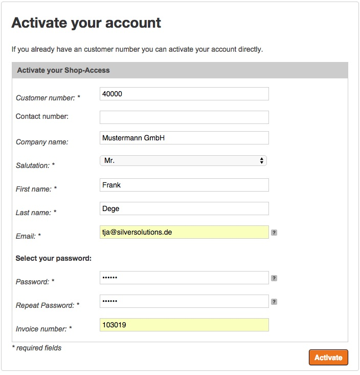
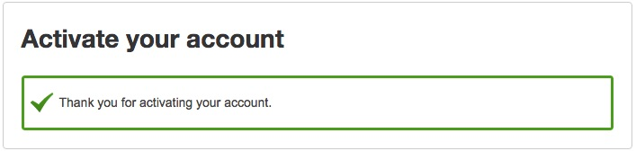
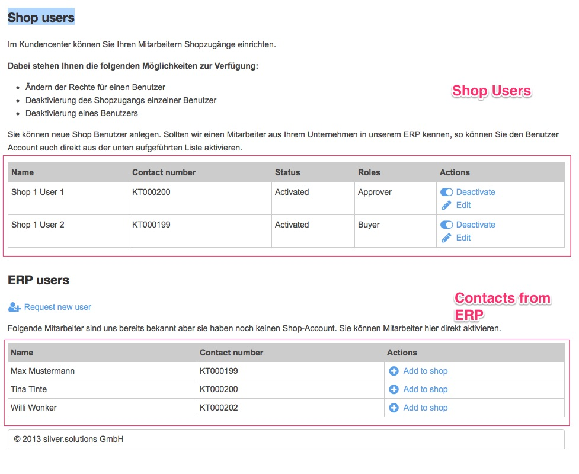
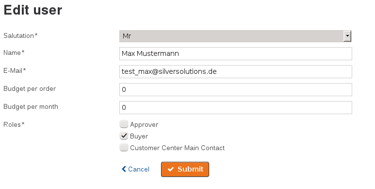
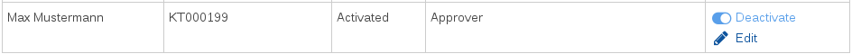
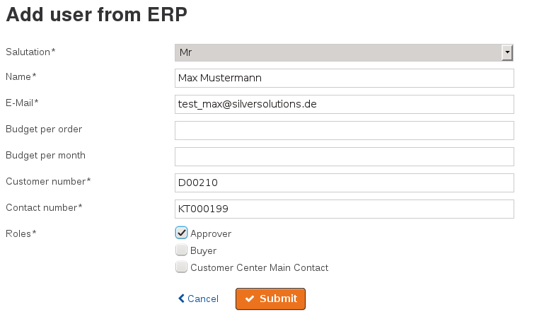
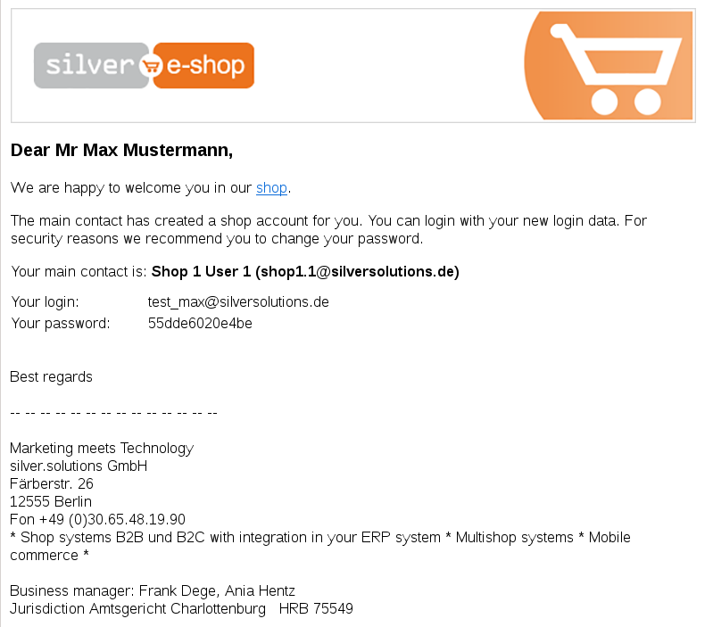
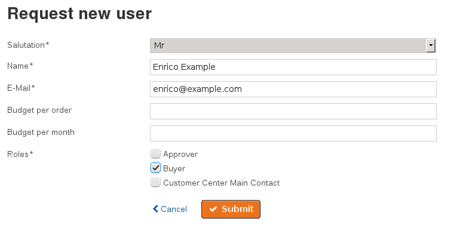

# Customer Center functions

!!! note

    The customer-center is available for customers having a flag in the ERP that the customer-center is enabled.

    There are two important fields to be provided by the ERP:

    - a flag: company has a customer-center
    - the email address of the customer-center administrator

    If a customer does not have a shop account yet he has to use the activation feature in the shop.

## Activation of the customer-center

The first step is to activate an account. During this process the shop checks if the customer has been enabled for a customer-center or not.

The customer-center uses the existing activation function.  For a successful activation

- a customer number
- an invoice number
- an email address which is defined in the ERP as a main contact

are required.

In case a customer-center is enabled for this customer, the shop will create a company and a main contact will be assigned to this company in the user section of the backend. If no customer-center is defined for this customer, a standard user will be created in the section "business users"

The customer will be logged in.

**Possible error messages**

| Message                                                                                                            | Reason                                                                                                                          |
| ------------------------------------------------------------------------------------------------------------------ | ------------------------------------------------------------------------------------------------------------------------------- |
| Your company is using a customer-center. Please contact your shop administrator %email% for activating an account. | If a customer-center is activated for a company, only the shop admin in this company is able to setup new accounts |

## Customer-center overview

The customer-center will be visible for users only if you have the rights for it. The main contact who has activated the account is able to use the customer-center.

The customer-center can be accessed in "My Profile" and "Users management". 

The list displayed  on the entry page shows 

- the shop users already registered for the shop. You will see the User name, the status and the roles assigned
- a list of ERP contacts, which are not yet set up as a user in the shop
The customer-center offers a list of features. The input forms of these features are described in the following sections. The cancel button of each feature's form will link back to customer-center's overview. For a more detailed description about the form configuration concept, please have a look the sub-section [Customer center - user actions](Customer-center---user-actions_29819124.html).

## Edit a user

You can change the 

- salutation
- name
- E-mail address

In addition, you can assign roles to the user and define budgets.

The password must be changed by the shop users themselves. 

Please ensure that:

- the required fields "Salutation", "Name" and "E-Mail" are set.
- at least one role is selected.

## Activate or deactivate a user

You can activate or deactivate a user.

An user, which has been deactivated, cannot login to the shop anymore. 

This feature does not have a specific form view and is available in the user management overview.

## Add an existing user to the shop

This feature adds an user, who is displayed in the list "ERP users", to the shop.

The customer number and contact number cannot be changed. After storing the form the user will get a shop account.

After sending the form, the user will get an email that contains all information about how to access the shop and his account data:

## Request a new user

The function "Request new user" sets up a new user for the shop. 

Please ensure that:

- the required fields "Salutation", "Name" and "E-Mail" are set.
- at least one role is selected.
- the email is not yet used for another shop user.

After sending the form, the user will get an email similar to the email of: [Add an existing user to the shop](#CustomerCenterfunctions-Addanexistingusertotheshop)
