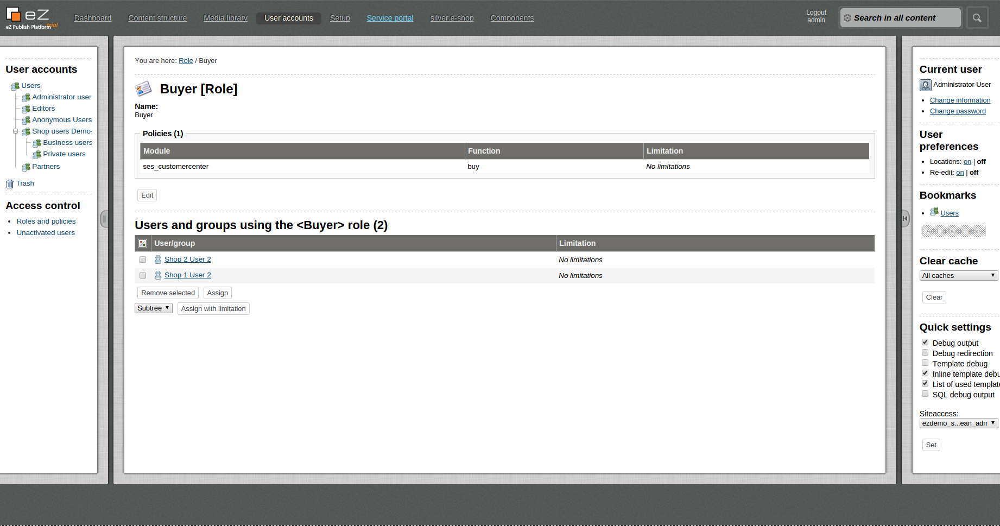

# Customer center roles 

The customer center is using roles from the eZ Platform to assign rights to a user. They are configured in backend.

There is no limitation for user roles. One user can have multiple roles.

## Predefined Roles

<table>
<thead>
<tr class="header">
<th>Role</th>
<th>Functions</th>
<th><br />
</th>
</tr>
</thead>
<tbody>
<tr class="odd">
<td>Customer Center Main Contact</td>
<td><div class="content-wrapper">
<p>Defines the role for the main contact for customer center. Only this role is able to create new customer center and assign roles to other users.</p>
<p></p>
</td>
<td><br />
</td>
</tr>
<tr class="even">
<td>Approver</td>
<td><p>This role is assigned to users, which can approve orders created by buyers, when they exceeded their budget.</p>
<p><span style="line-height: 1.4285715;background-color: transparent;">This role is used to send out email during the budget workflow.</p></td>
<td><br />
</td>
</tr>
<tr class="odd">
<td>Buyer</td>
<td>This role is assigned to users, which can order in the shop. They additionally can have a defined budget, which they cannot exceed without approval.</td>
<td><br />
</td>
</tr>
</tbody>
</table>

## How are roles defined?

**Configuration**

Each role has to be setup in the configuration file. There are 2 parameters which are responsible for roles:

``` 
parameters:
    siso_customer_center.default.main_contact_role: Customer Center Main Contact
    siso_customer_center.default.roles: [Approver, Buyer]
```

1.  First parameter defines a main contact role. There can be more that one main contact per company. The only limitation is that user with main contact cannot deactivate himself. This can cause a break in customer center and no possibility to login.
2.  Second parameter is a list of all available roles in the customer center. This can be extended with new roles.  
      
Those predefined roles should not be changed

How to setup a new role for a user

New role can be easily added in two steps:

1.  Create new entry in "**siso\_customer\_center.default.roles**" parameter to be able to use it in customer center.
2.  Add a role to eZ Platform backend. Example for Buyer below:  
      
    
3.  Start using role to for example check rights to access some parts of website
