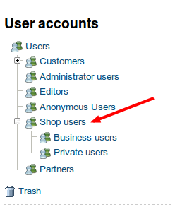
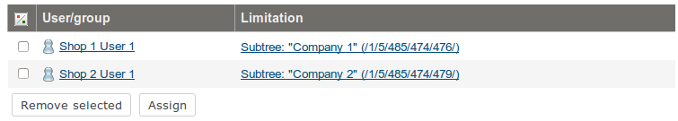

# Customer Center - installation and configuration 

## Introduction

Customer Center is a separate solution, it is shipped separately from silver.eShop  advanced.

Customer Center is implemented as a dedicated repository with CustomerCenterBundle.

## Installation
Step 1-2 are relevant if customer center is planned to be installed without composer.
#### Step 1. Clone repository

``` 
cd vendor/silversolutions
git clone http://gitlab.silversolutions.de:8081/ssl/silver.customercenter.git 
```

#### Step 2. Extend composer.json with autoload paths

**composer.json**

``` 
"autoload": {
    "psr-0": {
        ...
        "Siso\\Bundle\\CustomerCenterBundle": "vendor/silversolutions/silver.customercenter/src/"
    }
},
```

Update autoloads

``` 
php composer.phar dumpautoload
```
#### Step 3. Enable bundle

Enable the bundle in the kernel

**app/AppKernel.php**

``` 
public function registerBundles()
{
    $bundles = array(
        ...
        new SisoCustomerCenterBundle()
    );
```

Enable bundle configuration in config.yml (or another relative configuration file)

**app/config/config.yml**

``` 
imports:
    - { resource: "@SisoCustomerCenterBundle/Resources/config/customercenter.yml" }
```

Enable routing

**app/config/routing.yml**

``` 
siso_customer_center:
    resource: "@SisoCustomerCenterBundle/Resources/config/routing.yml"
    prefix:   / 
```

Textmodules can be installed/ imported via a package:

[ses\_customercenter\_textmodules-1.0-1.ezpkg](attachments/29819309/29829819.ezpkg)
Please use the new route to link to the activation process:

register/customer\_center\_activation

## Configuration

### Preparing eZ Platform for Customer Center

#### Content types

**Create content type for companies**

Package for the company class: [ses\_company\_class-1.0-1.ezpkg](attachments/29819309/29829818.ezpkg)

Name: Company

Identifier: ses\_company

Container: yes

Fields:

| Name            | Identifier       | Type      |
| --------------- | ---------------- | --------- |
| Name            | name             | Text line |
| Customer number | customer\_number | Text line |

This content type group 'Company' has to be added under the 'Users' content type group tree in Backend. It is required if we want to create users in company content objects.

**Modify user content type**

Name: User

Identifier: user

New fields:

| Name             | Identifier    | Type  |
| ---------------- | ------------- | ----- |
| Budget per order | budget\_order | Float |
| Budget per month | budget\_month | Float |

#### Content object structure

Create initial content object structure

<table>
<thead>
<tr class="header">
<th>Content object name</th>
<th>Description</th>
<th>Parent content location</th>
<th>Applied roles</th>
</tr>
</thead>
<tbody>
<tr class="odd">
<td>Shop users</td>
<td><p>The root of customer center.</p>
<p>The name could vary, e.g.: Shop users UK, Shop Germany, etc.</p></td>
<td>Users</td>
<td>Anonymous, Member</td>
</tr>
<tr class="even">
<td>Business users</td>
<td>The root for companies.</td>
<td>Shop users</td>
<td><br />
</td>
</tr>
<tr class="odd">
<td>Private users</td>
<td>The root for private users.</td>
<td>Shop users</td>
<td><br />
</td>
</tr>
</tbody>
</table>

Example of content object structure in a legacy admin UI:



#### Roles

Use migration tool to install content types and roles. (Two yaml files in plugin bundle)

`php bin/console kaliop:migration:migrate --path=vendor/silversolutions/silver...`

**Customer Center Main Contact**

This role defines main contact of a company.

Policies:

| Module               | Function | Limitation     |
| -------------------- | -------- | -------------- |
| siso\_customercenter | view     | No limitations |

**Customer Center Main Contact Subtree**

This role gives main contacts permissions to use customer center and manage users.

Policies:

| Module  | Function | Limitation                           |
| ------- | -------- | ------------------------------------ |
| content | create   | Class( User, Company )               |
| content | edit     | Class( User )                        |
| content | read     | Class( User group , User , Company ) |

The role 'Customer Center Main Contact Subtree' msut be always applied to main contacts with subtree limitation. Subtree in this case is a location of company object

Example of assigning this role to users:



**Other roles**

Other roles are project specific and depend on project requirement. Main contacts can assign these roles to other shop users of their companies. Examples: Approver. Buyer.

#### Configure shop for customer center

Configure shop parameters

``` 
# If login with customer number is enabled. Possible values: true, false
siso_core.default.enable_customer_number_login: false
 
# if a contact in the ERP shall be created as well set this to true
siso_customer_center.default.create_contact_in_erp_processor_is_active: true

# Location identifiers of customer center user groups (Business users, Private users, etc)
siso_core.default.user_group_location: 485
siso_core.default.user_group_location.business: 474
siso_core.default.user_group_location.private: 475
siso_core.default.user_group_location.editor: 14
```

Configure role identifiers

``` 
# Main contact role idenifier
siso_customer_center.default.main_contact_role: Customer Center Main Contact

# List of roles that can be assigned or unassigned by main contact
siso_customer_center.default.roles: [Approver, Buyer]
```

#### Configure the budget workflow

``` 
#configure the email subjects
siso_customer_center.approve_basket.subject: 'Basket to approve'
siso_customer_center.reject_basket.subject: 'Basket was rejected'

# the order how the comments should be sorted  by date
# values: ASC, DESC
siso_customer_center.sort_buyer_approver_comments: ASC
```
