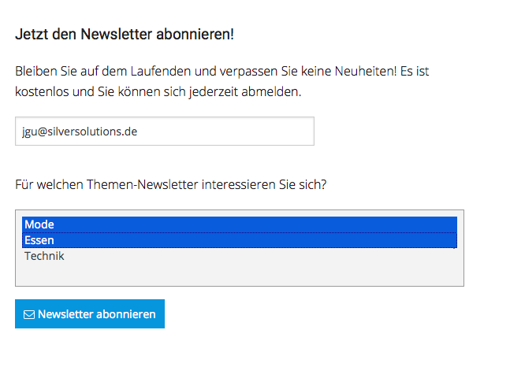

# Newsletter2Go 

Welcome to Newsletter2Go plugin documentation.

<table>
<tbody>
<tr class="odd">
<td>Name</td>
<td>SisoNewsletter2GoPluginBundle</td>
</tr>
<tr class="even">
<td>Motivation</td>
<td>Provide a working implementation for the eShop's newsletter API.</td>
</tr>
<tr class="odd">
<td>Target group</td>
<td>Shop owners</td>
</tr>
<tr class="even">
<td>Short description</td>
<td>silver.eShop provides an API to enable customers to register their e-mail addresses to a newsletter. This bundle integrates the newsletter service <span style="color: rgb(3,102,214);"><a href="https://www.newsletter2go.de" class="external-link">https://www.newsletter2go.de</a> into this API.</td>
</tr>
<tr class="odd">
<td>compatible to silver.eShop version</td>
<td>4.0</td>
</tr>
<tr class="even">
<td>Demo available</td>
<td><a href="http://demo.silver-eshop.de/" class="external-link">demo.silver-eshop.de</a></td>
</tr>
<tr class="odd">
<td>Change history</td>
<td><div class="content-wrapper">
<p>11 Apr 2018 </p>
</td>
</tr>
<tr class="even">
<td>Contact persons</td>
<td><br />
</td>
</tr>
<tr class="odd">
<td>Source (git)</td>
<td><a href="http://gitlab.silversolutions.de:8081/silver.eshop-plugins/Newsletter2GoPluginBundle" class="external-link">http://gitlab.silversolutions.de:8081/silver.eshop-plugins/Newsletter2GoPluginBundle</a></td>
</tr>
</tbody>
</table>

# Introduction

silver.e-shop offers a newsletter interface. This allows user to un/subscribe from/to newsletters and see the newsletter status or update newsletter details information in his profile.

Newsletter2Go offers several address books. The reason is, that user can be stored in one, or several address books. One address books equals one newsletter topic, so user can choose, if he wants to subscribe e.g. on food, clothes and technique separately.

Usage of several address books is optional and by default there is the default address book.

silver.e-shop in standard works with default address book only. See [FAQ](Newsletter2Go---FAQ_29819459.html), if you want to support several address books in your project.

In Newsletter2Go backend the address book can be choosen in the header menu. Every address book has a different dashboard with different mailings, receivers and reports.


#### Additional attributes

Attributes, that do not exist in the newsletter provider has to be created first.


## Before you start 

Please keep in mind that this plugin is really connected with a lot of different modules in our shop. Be sure to check these out:

  - [CustomerProfileData](Customers_29819216.html)
  - [Landing page tool](/pages/createpage.action?spaceKey=EC14&title=Landing+page+tool&linkCreation=true&fromPageId=29819223)

## Installation and Configuration

Read the manual for installation and configuration of the Newsletter2GoPlugin.

[README.md](http://gitlab.silversolutions.de:8081/silver.eshop-plugins/Newsletter2GoPluginBundle/blob/master/README.md)

## Cookbook

Check our recipies to learn more about the silver.eShop newsletter implementation:

  - [How to send additional data to Newsletter2Go](https://doc.silver-eshop.de/display/EC14/How+to+send+additional+data+to+Newsletter2Go)
  - [How to use the Newsletter2Go API to implement custom functions](https://doc.silver-eshop.de/display/EC14/How+to+use+the+Newsletter2Go+API+to+implement+custom+functions)

## FAQ

How to send additional data to the newsletter provider?

Check the cookbook recipe:  [How to send additional data to the Newsletter provider?](https://doc.silver-eshop.de/display/EC14/How+to+send+additional+data+to+Newsletter2Go)

How to work with several newsletters (address books)?

silver.e-shop is working with the default address book only. If you want to offer several newsletter topics in your project, you need to follow these steps:

1.  Provide an user interface, where the user can choose one/several newsletter topics. In Newsletter2Go you need to provide an address book per newsletter topic.



2\. Behind every newsletter topic the address book id must be configured

3\. When submitting the newsletter form data, you need to submit also list of all subscribed newsletter address books

``` 
<form method="post" action="{{ path('siso_newsletter_subscribe') }}">
  <input name="email" type="text" placeholder="{{ 'Email address'|st_translate }}" class="float-left" required="">
  <select name="list_ids[]" multiple="multiple">
    <option value="oty804fn">Mode</option>
    <option value="ws2uc1v7">Essen</option>
    <option value="hu51kis">Technik</option>
  </select>
  <button type="submit" name="subscribe_newsletter_submit_button" class="button"><i class="fa fa-envelope-o" aria-hidden="true"></i> {{ 'subscribe newsletter'|st_translate() }}</button>
</form>
```

4\. You need to change the configuration in order to allow working with several address books

``` 
parameters:
  siso_newsletter.default.support_several_newsletters: true
```

5\. User will be created in selected address books


