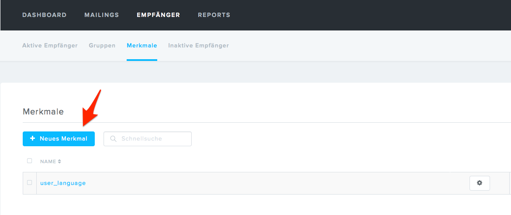
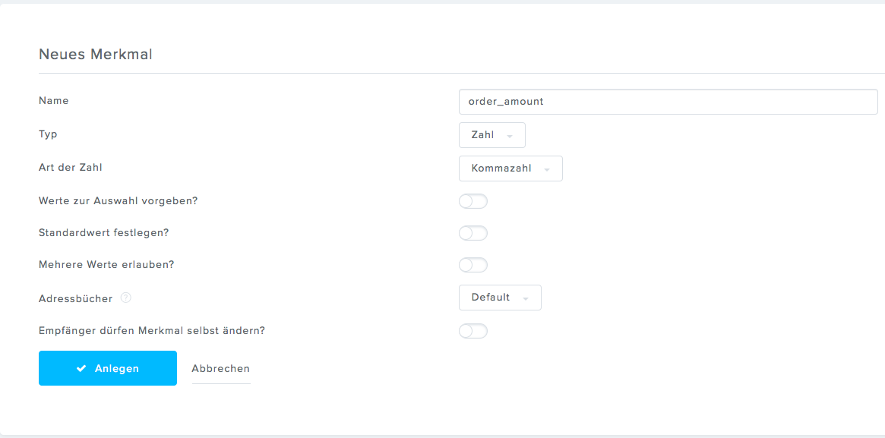
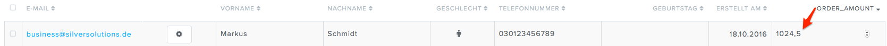

# How to send additional data to Newsletter2Go

Before a user is created in the Newsletter2Go address book, an [event is dispatched](../newsletter2go_api/newsletter2go_service.md), that allows you to send some additional data. Any data can be send to Newsletter2Go, but custom attributes have to be created first in the Newsletter2Go backend.

Let´s say you want to send the amount of the user orders to the Newsletter2Go.

1.  Add a new property

    
    
    
2.  Implement [necessary event listener](../../../developer_manual/newsletter/newsletter_cookbook/how_to_send_additional_data_to_the_newsletter_provider.md)

The amount of user orders will be stored in Newsletter2Go when the user is created.

