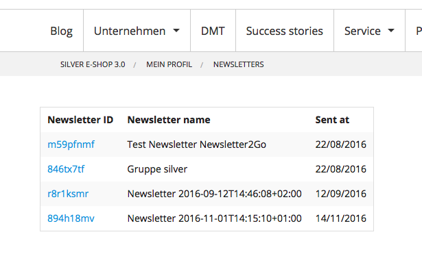

# How to use the Newsletter2Go API to implement custom functions

## How to use the Newsletter2Go API to extend the newsletter functionality

If you need to implement custom functions to extend the newsletter functionality, you can make usage of:

- Newsletter2GoService
- Newsletter2GoApiService

See full documentation of the [Newsletter2Go API](https://docs.newsletter2go.com/?_ga=1.186190697.1183183675.1471410241).  
Let´s say, you want to get a list of all newsletters for the default address book.



ProjectController.php:

``` php
public function showNewslettersAction()
{
    $response = $this->getAllNewsletters();
    $newsletters = array();

    if (isset($response) && isset($response['status']) && $response['status'] == NewsletterConstants::STATUS_CODE_SUCCESS) {
        foreach($response['value'] as $newsletter) {
            $newsletters[] = array(
                'id' => isset($newsletter['id']) ? $newsletter['id'] : '',
                'name' => isset($newsletter['name']) ? $newsletter['name'] : '',
                'sentAt' => isset($newsletter['statistic_last_sent']) ? $newsletter['statistic_last_sent'] : ''
            );
        }
    }

    return $this->render('ProjectBundle:Newsletter:newsletters.html.twig', array('newsletters' => $newsletters));
}

/**
 * get a list of all newsletters
 */
public function getAllNewsletters()
{
    $newsletter2GoService = $this->get('siso_newsletter.newsletter.newsletter2go_service');
    $newsletter2GoApiService = $this->get('siso_newsletter.newsletter.newsletter2go_api_service');

    $defaultListId = $newsletter2GoService->connectApiToGetDefaultListId();

    $response = $newsletter2GoApiService->connectApi(
        sprintf(self::NEWSLETTERS_PATH, $defaultListId) . '?_expand=true',
        NewsletterConstants::METHOD_GET
    );

    return $response;
}
```
