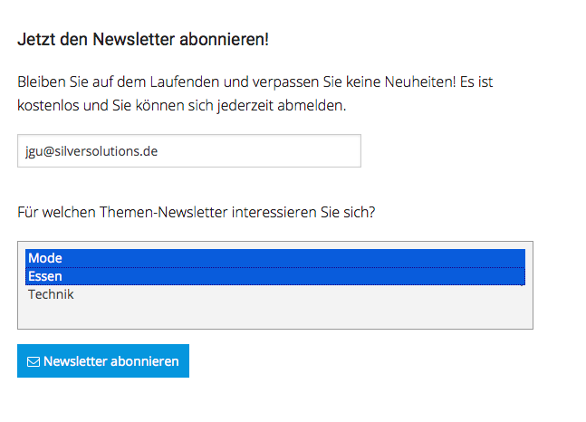
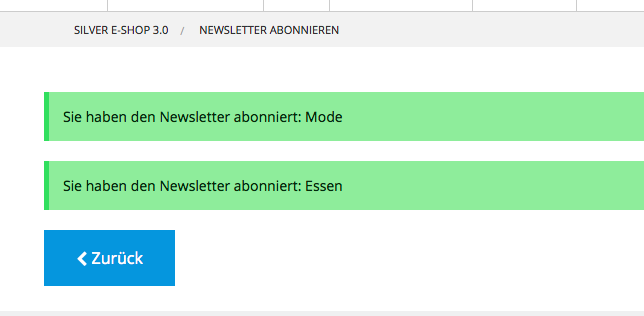

# Newsletter2Go - FAQ 

## How to send additional data to the newsletter provider?

Check the cookbook recipe:  [How to send additional data to the Newsletter provider?](https://doc.silver-eshop.de/display/EC14/How+to+send+additional+data+to+Newsletter2Go)

## How to work with several newsletters (address books)?

silver.e-shop is working with the default address book only. If you want to offer several newsletter topics in your project, you need to follow these steps:

1.  Provide an user interface, where the user can choose one/several newsletter topics. In Newsletter2Go you need to provide an address book per newsletter topic.



2\. Behind every newsletter topic the address book id must be configured

3\. When submitting the newsletter form data, you need to submit also list of all subscribed newsletter address books

``` 
<form method="post" action="{{ path('siso_newsletter_subscribe') }}">
  <input name="email" type="text" placeholder="{{ 'Email address'|st_translate }}" class="float-left" required="">
  <select name="list_ids[]" multiple="multiple">
    <option value="oty804fn">Mode</option>
    <option value="ws2uc1v7">Essen</option>
    <option value="hu51kis">Technik</option>
  </select>
  <button type="submit" name="subscribe_newsletter_submit_button" class="button"><i class="fa fa-envelope-o" aria-hidden="true"></i> {{ 'subscribe newsletter'|st_translate() }}</button>
</form>
```

4\. You need to change the configuration in order to allow working with several address books

``` 
parameters:
  siso_newsletter.default.support_several_newsletters: true
```

5\. User will be created in selected address books


