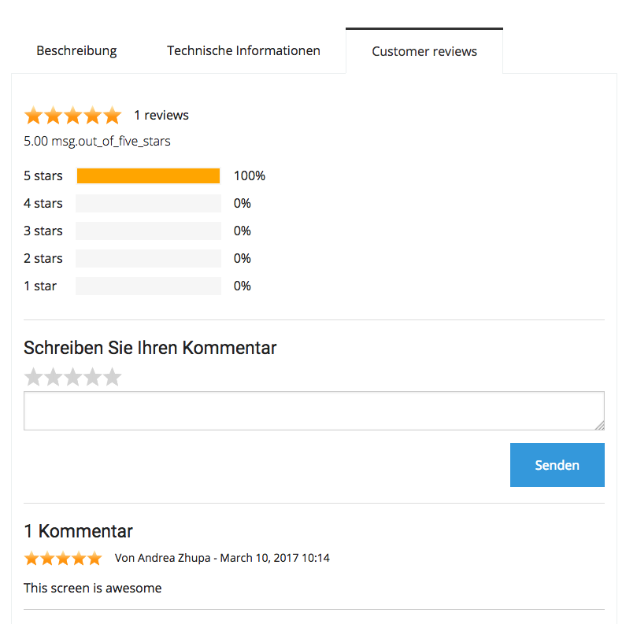
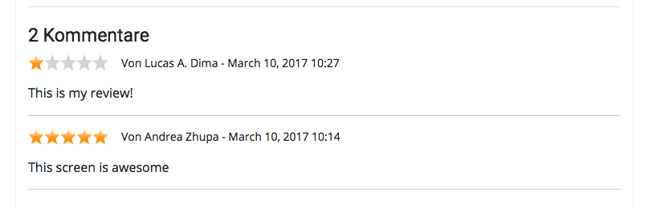
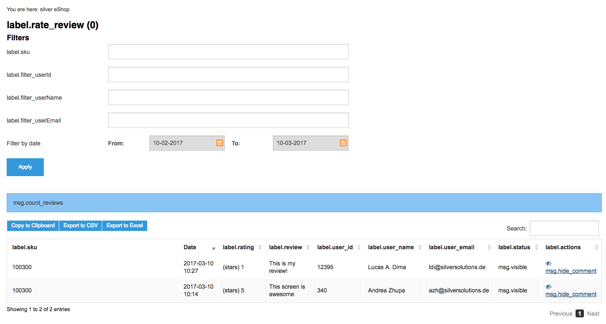

# Rate and Review 

## Description

Rate and review is a component to assign a rate of stars (1 to 5) and a review or comment to silver.eShop products.

### Frontend

From the frontend perspective the following things are set:

<table>
<thead>
<tr class="header">
<th><br />
</th>
<th><br />
</th>
</tr>
</thead>
<tbody>
<tr class="odd">
<td><p><br />
</p>
<p>A new tab called Customer reviews will appears in every product detail page and the logged user is able to create a review.</p></td>
<td><div class="content-wrapper">

</td>
</tr>
<tr class="even">
<td><p>The tab has a summary part with the total count of reviews and a percentage for every rate.</p>
<p><br />
</p></td>
<td><div class="content-wrapper">

</td>
</tr>
<tr class="odd">
<td>A text field and a star selector to allow the user to enter the rate and review.</td>
<td><div class="content-wrapper">

</td>
</tr>
<tr class="even">
<td>A list of reviews</td>
<td><div class="content-wrapper">

</td>
</tr>
</tbody>
</table>

### Backend

In silver.eShop backend there is a simple module to manage user rate and reviews.



## Technical description

Rate and review uses a bundle called FOS/Comment

<https://github.com/FriendsOfSymfony/FOSCommentBundle>

Every user review is stored in table **Comment**

The link to the product is the field **thread\_id**, in which the product SKU is stored.

Field state represents the following states:

``` 
const STATE_VISIBLE = 0;
const STATE_DELETED = 1;
const STATE_SPAM = 2;
const STATE_PENDING = 3;
```

State 3 means the comment is hidden

Currently we only support states 0 (visible) and 3 (hidden or pending).

**Comments with state 3 are not taken into consideration.**

The star rating is stored in field **rating**. The numbers go from 1 to 5 and represent the amount of starts.

### Controllers and services involved

Original FOS controller was overriden by the following controller:

**SilverEshopThreadController**

Additional logic for manager and some customised features can be found in the following service:

**RateReviewService (ID: siso\_core.rate\_review\_service)**

### Routing

FOS Comment bundle uses a rest controller. The following routing entry was added to eZ Platform routing yaml:

``` 
fos_comment_api:
    type: rest
    resource: "@SilversolutionsEshopBundle/Resources/config/rest_routing.yml"
    prefix: /api
    defaults: { _format: html }
```

Since this is using rest, the loading of current reviews might not be immediately visible after the product is loaded.

### Templates

Product detail template was modified. A new tab was added with the rate and reviews.

    vendor/silversolutions/silver.e-shop/src/Silversolutions/Bundle/EshopBundle/Resources/views/Catalog/product.html.twig

Please note that this will be visible only if rate and review is enabled in configuration. 

### Configuration

Currently only reviews\_enable configuration is active.

Only registered users can create rate and reviews. Logic to allow anonymous reviews is not yet implemented.

``` 
siso_core.default.reviews_enabled: %reviews_enabled%
siso_core.default.reviews_allow_anonymous: %reviews_allow_anonymous%
siso_core.default.reviews_email_required: %reviews_email_required%
siso_core.default.reviews_comment_required: %reviews_comment_required%
```
## Attachments:

 [Screen Shot 2017-03-10 at 10.19.12.png](attachments/29819573/29829789.png) (image/png)  
 [Screen Shot 2017-03-10 at 10.22.45.png](attachments/29819573/29829790.png) (image/png)  
 [Screen Shot 2017-03-10 at 10.26.02.png](attachments/29819573/29829788.png) (image/png)  
 [Screen Shot 2017-03-10 at 10.27.16.png](attachments/29819573/29829794.png) (image/png)  
 [Screen Shot 2017-03-10 at 10.28.29.png](attachments/29819573/29829795.png) (image/png)  
 [Screen Shot 2017-03-10 at 10.30.04.png](attachments/29819573/29829793.png) (image/png)  
