#  Catalog and Search 

## The catalog

The catalog is build using categories and products which are setup as eZ Content objects in the backend. The categories and products can be translated. 

**eContent for eZ Commerce Advanced**

In the Advanced version all categories and products are setup in eContent. eContent is a storage provider for eZ Commerce which can store product data in a very efficient way. It allows  to store data (mostly for products and product groups) in database tables with a simple structure.

  - Fast imports (e.g. from ERP or PIM systems)
  - Supports more than one million products
  - search ready
  - Fast access
  - avoids to store products in the CMS content model
  - eContent offers a staging feature and enhanced catalog segmentation features and allows imports during production and switching catalogs. 

Additionally a PIM system can be used to manage all product data. 

eZ Commerce is prepared to sell physical products. It can be enhanced by partners to sell other products such as digital products.

### Categories/Product groups

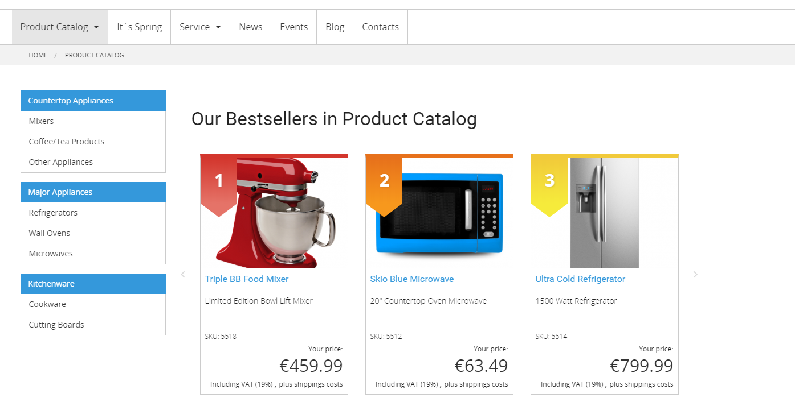

The 'category' represents a product group. silver.eShop allows to show a product category page using different layouts. The layout can be configured in the backend.

3 different layouts are provided in the standard (display sub- categories, product list or both) on the entry page of a category) It can also be configured if best sellers of the group should be displayed. This is done in the configuration settings in the backend of the shop.

#### Display product directly

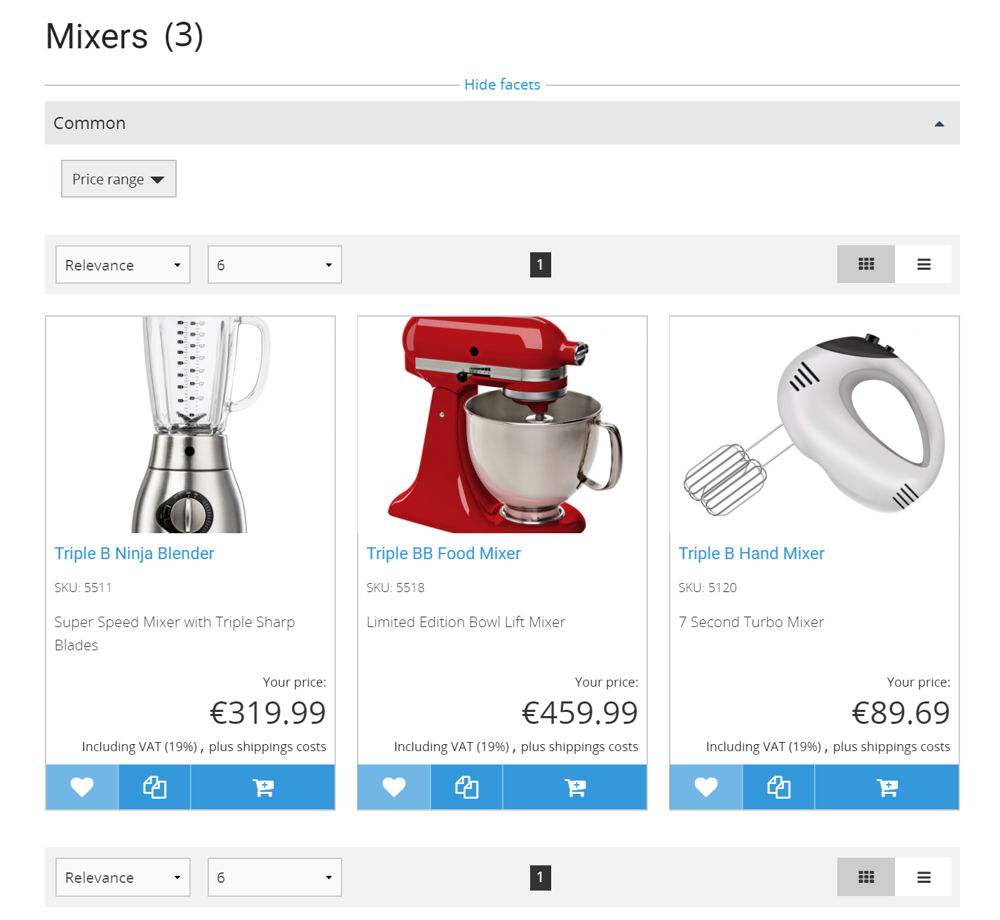

#### Display only subcategories

These can have sev3ral levels of subcategories. On the last level the product list is shown.

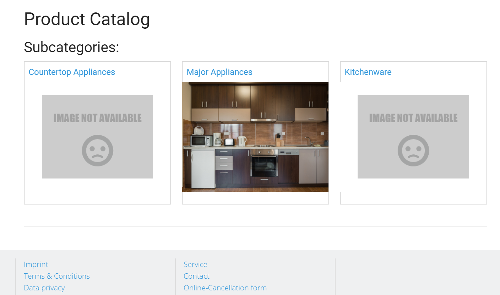

#### Display subcategories and product list

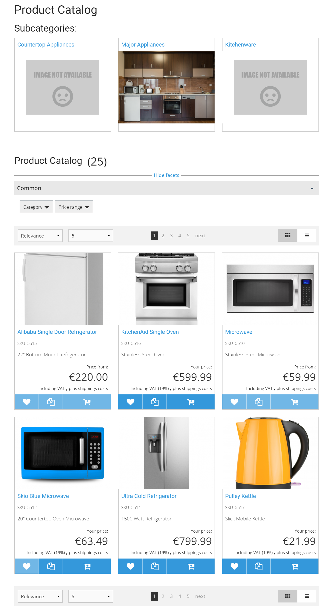

### Product list view

The product list offers two different views (grid and list). From the list view the user can directly add a product (if it is not a variant product) to basket, wishlist or comparison or go to the product detail page.

The catalog shows filters depending on the displayed products and their attributes.

### Product type

The product type (not to be confused with variants) represents a collection of very similar products, that differ only for some characteristics. It is used to show a list of products in a tabular way, every product can be added to basket directly from this overview page. 

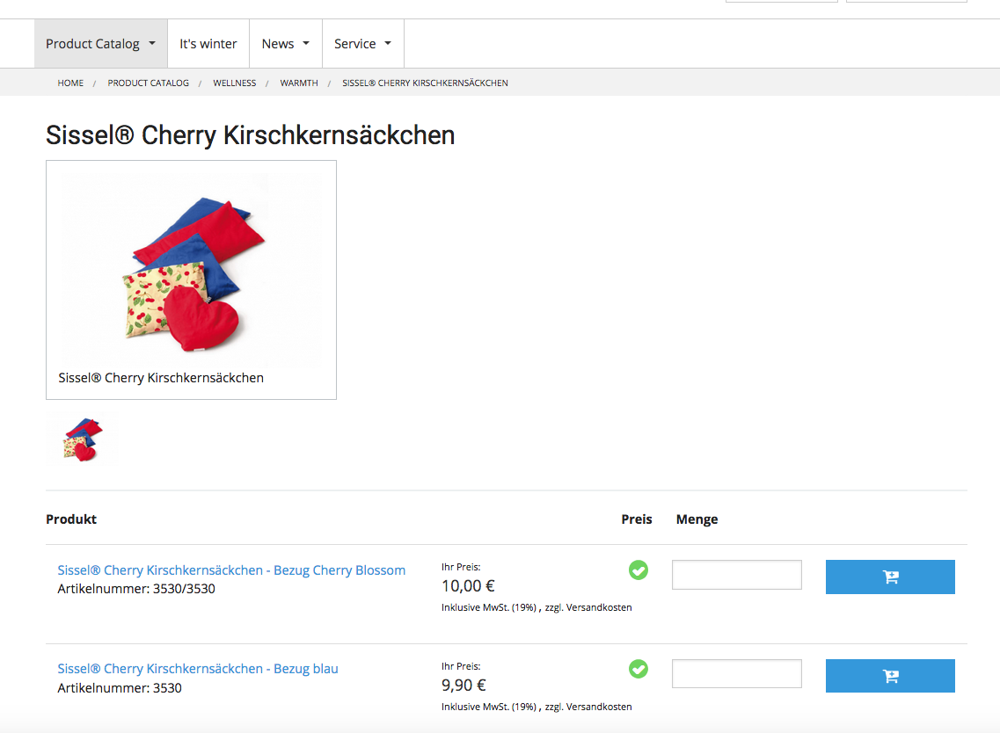

### Product detail

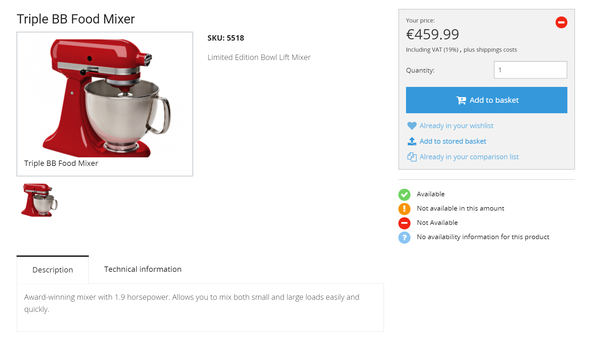

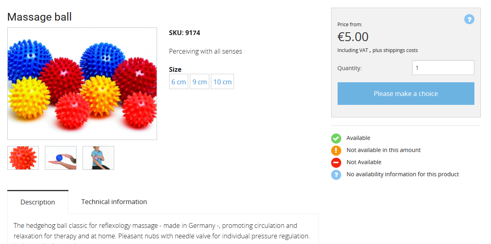

A product can have:

- one or more images (in the standard config up to 3),
- a SKU
- text fields (name, description, intro)
- specifications offering different groups of data as marketing data, technical data, others depending on the data that have been created in the backend

From the product detail the user can directly add a product to basket, wishlist, comparison or stored basket.

### Variant product
	
silver.eShop supports variants with 1 or 2 levels.
The user can choose a first attibute, the shop will then narrow down the options for the second level.

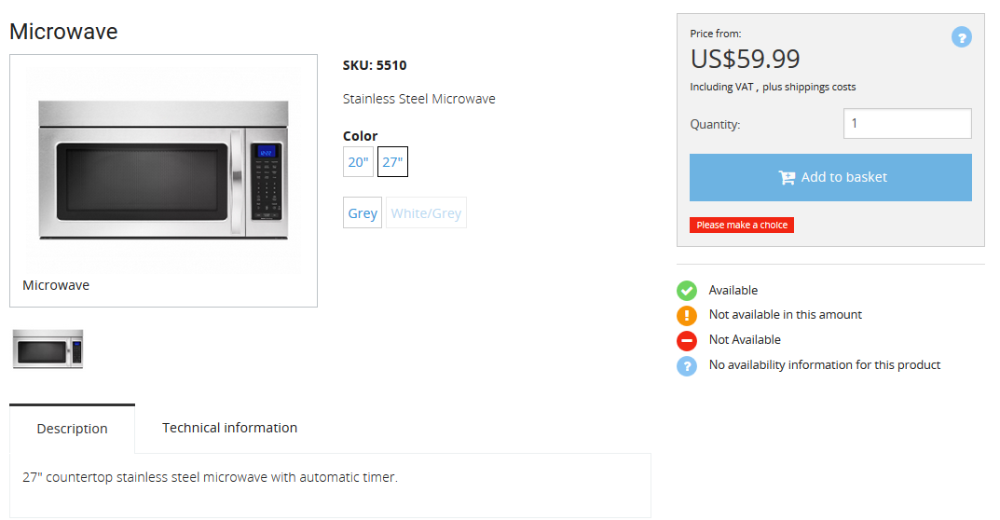

The user can change the variant selection in the basket.

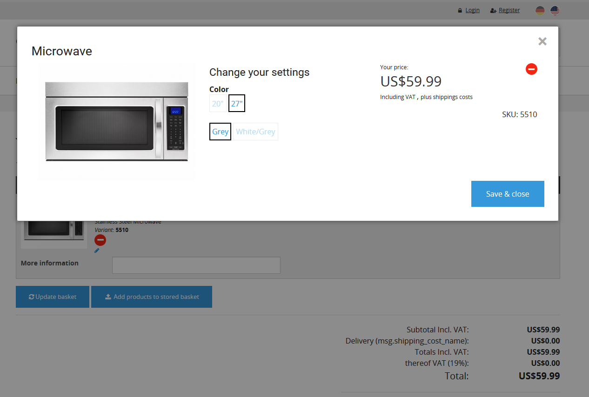

### Product comparison

A customer can compare products in a comparison list. The comparison list automatically groups products per product category (so e.g. mixer cannot be compared to microwave).
The customer can change the order of the sorting per drag&drop and he can decide to display only differences of the products.

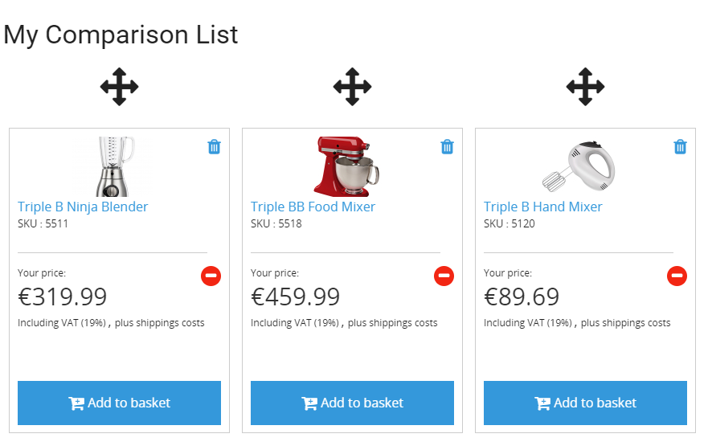

### Whishlist

After login customers can add products to a personal whishlist. Products that are not in the active catalog any more are automatically marked as "not available".

### Stored baskets

Customers with a login can store named baskets and can reuse them later on for recurring orders.

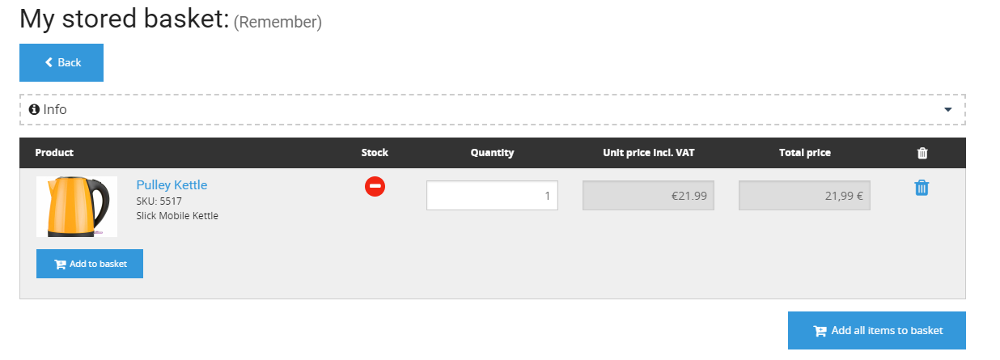

## Search and filtering

All data such as products and content is indexed in a powerful search engine (Solr). 

### Search

The integrated search engine offers one global search for products and content in the system:

- products 
- content such as blog entries, news, articles
- assets such as downloads

It respects the rights and roles of the customer.

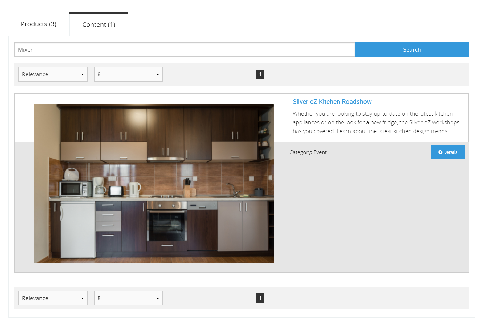

### Filters and facets

Almost all product fields can be used as a facet if they are indexed. This can be controlled by a configuration file which allows to setup different facets for the product catalog and search.

Facets can be grouped. For more complex facets new fields can be implemented using the IndexPlugin features of Solr platform search.

Note: There are restrictions for variants, it is not possible to mix the variant attributes as facet if the same attribute is set for main products.

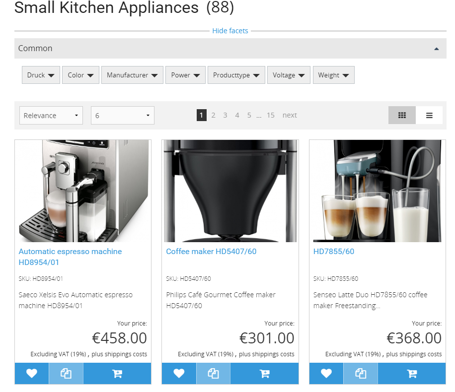

### Autosuggest

The autosuggest feature offers suggestion as you type and allows to add an orderable product to the basket directly from the search box. It suggests products, categories, downloads and content. The autosuggest matches products where the name starts with the searchterm.

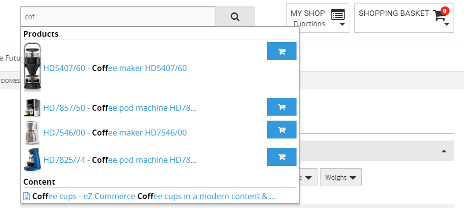