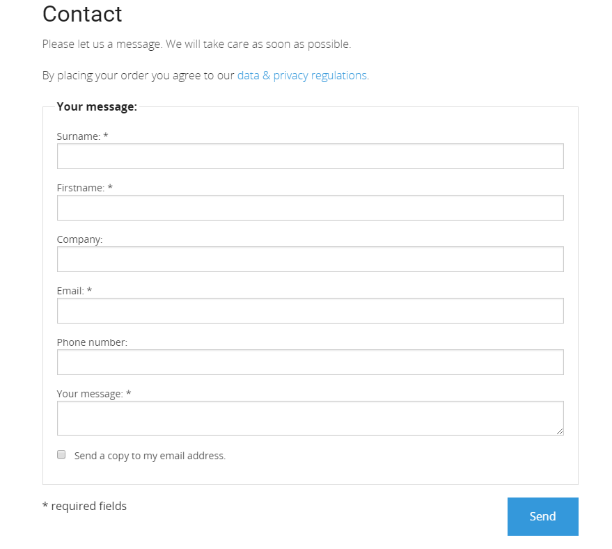
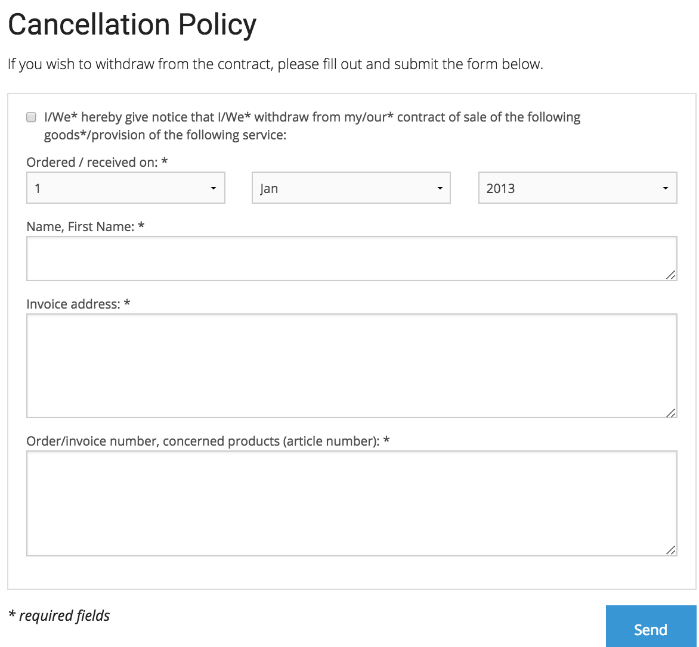
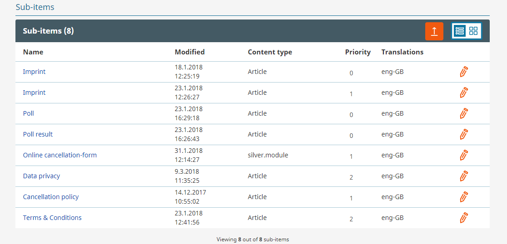

#  Contact forms and legal aspects 

## GDPR compliance

silver.eShop offers the tools to set up a shop that is compliant with GDPR (General Data Protection Regulation)

- Prepared articles with dummy text for T&C, data privacy and cancellation policy
- The important legal documents (e.g. T&C oder data privacy) can be linked using permanent urls
- Checkboxes in checkout and registration to confirm the T&C, cancellation policy and data privacy
- Processes: double opt in for registration
- Cancellation policy text included in order confirmation email 
- Cookie Consent feature with a link to data privacy to inform the user about the cookies used
- Textmodules allow to add legal text i.e. for the contact form

## Contact form

## Cancellation form

For returning goods. The data is sent to the shop owner by email.

## T&C and data protection

These documents can be edited and translated in the backend of the system in the "service folder". Each document stores a code which allows to link the documents in templates or textmodules using a permanent URI.

