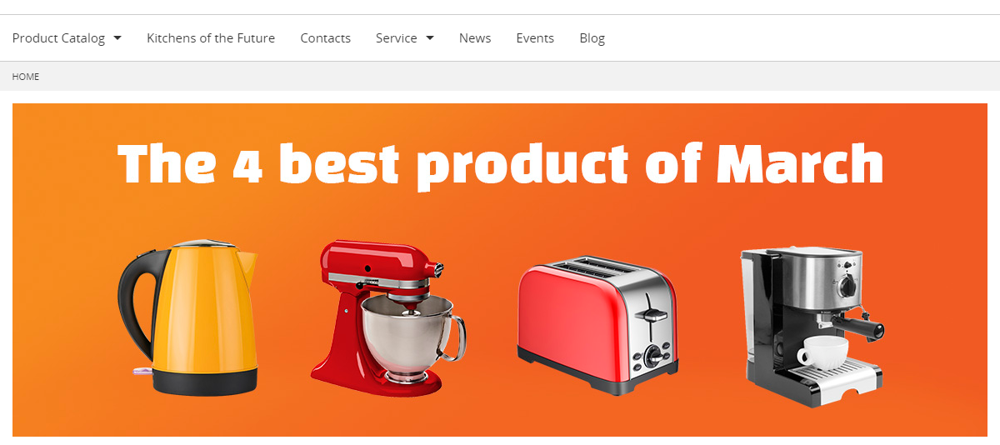
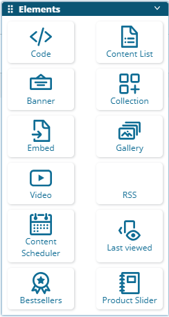
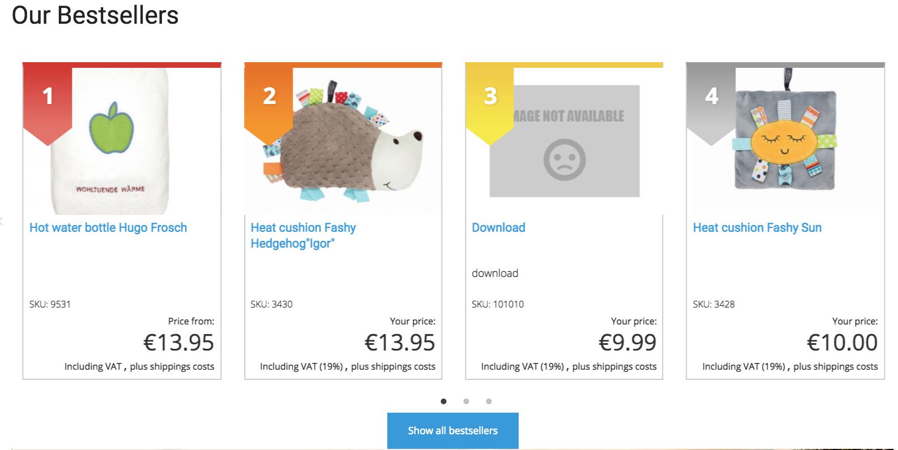
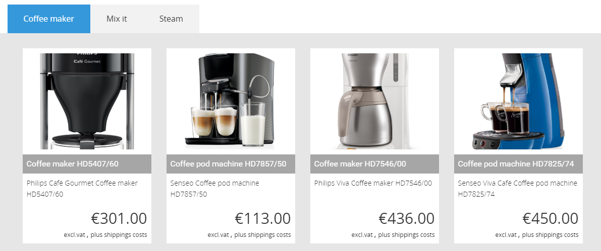
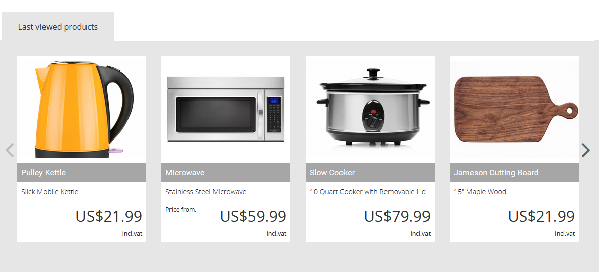
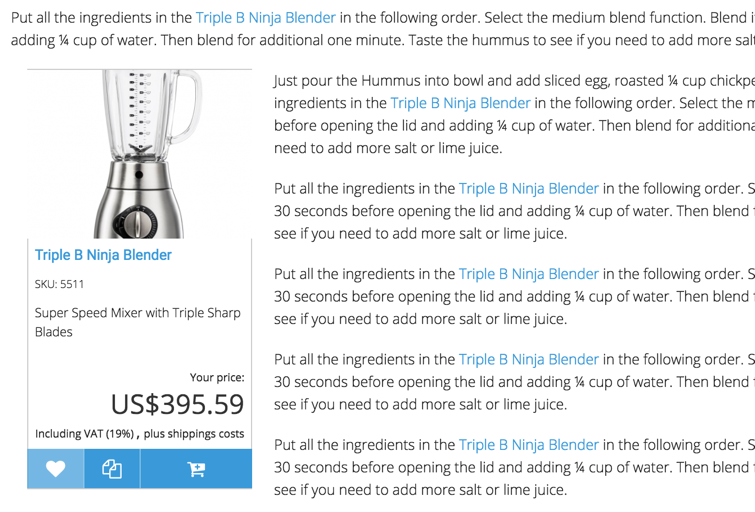
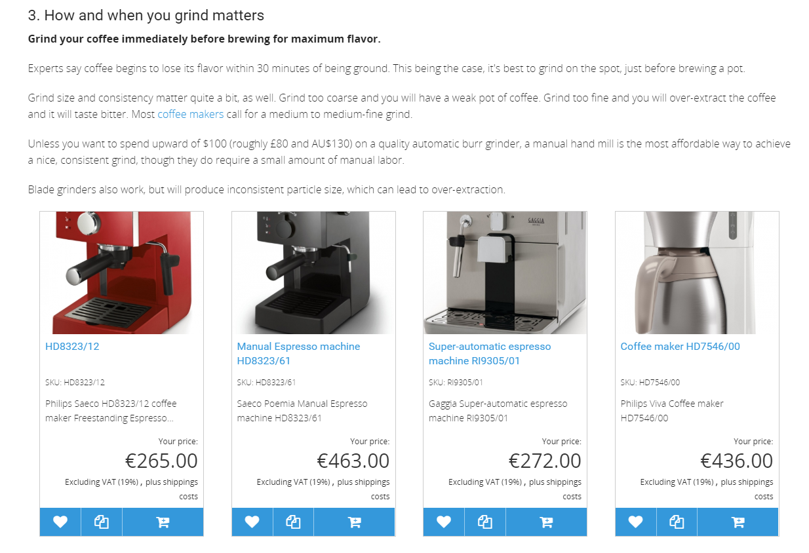
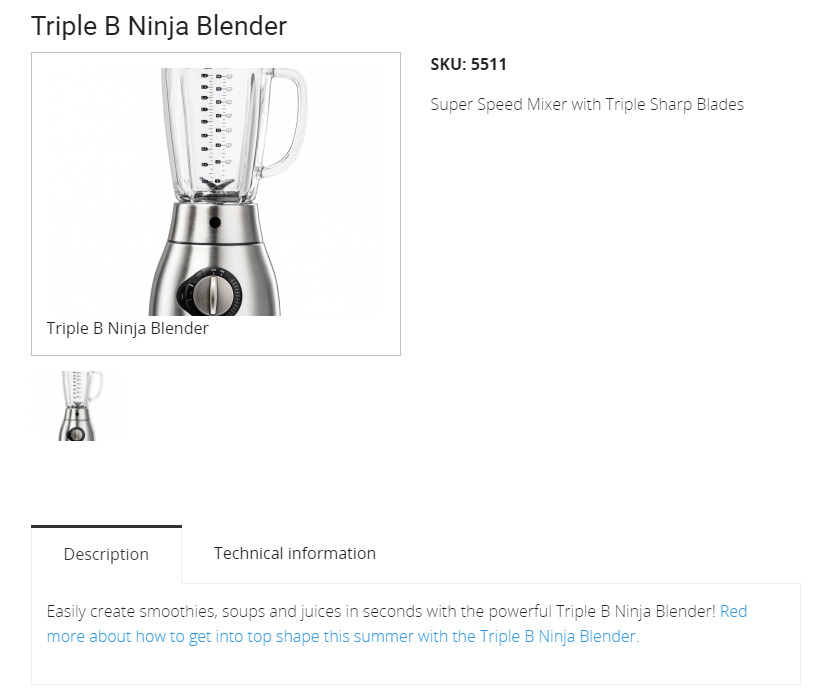

#  Content & Commerce 

One of the main USPs of the solution is that Content\&Commerce are managed in one system. This allows to mix content and products on different places.

## Dynamic menu

In the main navigation Product Catalog and Content Objects can be displayed. A partner can decide which ContentTypes should appear in the menu using a configuration. The order of the navigation items can be defined by the editor using the priority field of eZ.

## Content types

Special landing pages can be created with special content, e.g. Winter Sales. Use banner, slider, product slider, videos, etc. for this landingpage. Then create a banner on the homepage with a link to the "Winter Sales" - landing page. 

silver.eShop adds 3 new blocks to the landing page tool:

- Bestseller - display overall bestsellers or bestseller of a given group
- Product slider - displays a slider of chossen products
- Last viewed - a block showing the last viewed products
- Note: When the Newsletter2Go Plugin is installed a Newsletter-Block can be displayed in addition

Bestseller block:

Product slider:

Last viewed products:

## Embed a product

If product data are stored in eZ, products or product slider can be embedded in all kind of text elements (it has to be a rich text field) e.g. in article, news, blog posts and events. 

The text floats around the product box. This allows to place or advertise products directly in all kinds of rich text fields attractively.

If products are stored in eContent and/or a PIM system a product silder can be embedded in all kind of text elements by using the element "Product card" (it has to be a rich text field) e.g. in article, news, blog posts and events. With eContent it is not possible to embed a single product.

## Embed an article

If product data are stored in eZ an article or blog post, news or event can also be embedded in a product detail description.

