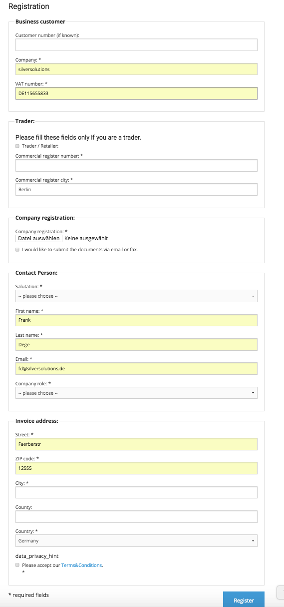

#  Customer registration 

## Registration in shop (no 3rd party software involved)

A user can create a customer login. A registration form collects the data required to create the account. The account is created using a double optin process.

The account is stored as an eZ User.

Advanced version only

A user can register as private, business or existing customer.

silver.eShop Advanced offers an enhanced registration form with special B2B features as

- VAT number check for EU VAT codes using an online service (VIES)
- An option to upload a PDF company registration 

The shop owner will receive an eMail with the details of the registration. The standard process in B2B businessis that sales will contact the new customer and set up a contract before he can use the online shop. So there is no automatic user set up in the shop.

## Activate Account for existing customer

Secure authentication for existing customers:

Existing customers - meaning customer that is set up in the connected ERP - can activate a shop account themselves by entering their customer number and one invoice number. The data is send to the ERP. If the data in ERP and the entered data match, the customer will get access to the shop immediately and an eZ user is set up automatically with the customer no. From the ERP.

## Login

The standard login for silver.eShop uses an eZ Platform function - the login requires an email address and a password.

A user can request a new password in case he has forgotten his password. Note: silver.eShop is not using the eZ Platform function for the forgot password feature.

## My account

The shop enables the user to change his

- account data and password
- his invoice address
- his delivery address(es)

## Manage delivery addresses

The customer can manage his delivery addresses in the address book. The addresses will be offered for selection during checkout process.

