#  Manage products, prices and stock 

This section is only relevant if eZ is used as product data storage. If an ERP is integrated - Advanced version only  - this data will be coming fro the ERP and eventually a PIM.

## Manage categories

The product catalog is fully integrated into the content tree of the CMS.

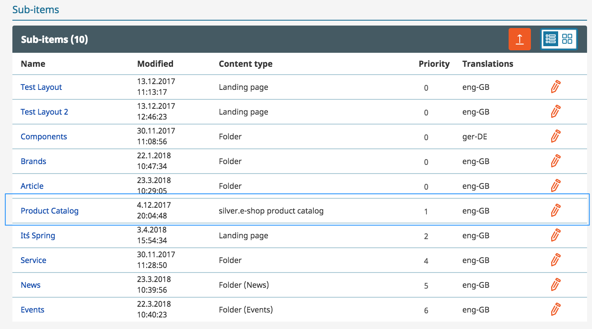

Products and categories can be assigned to the product catalog.

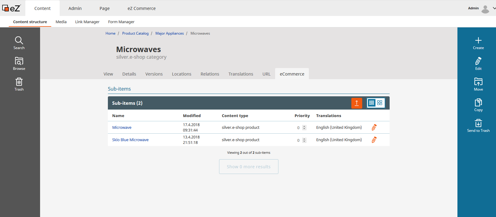

## Flexible categories

A category contains a standard set of fields. A category is a CMS content type and can be extended with additional fields by the eZ Partner.

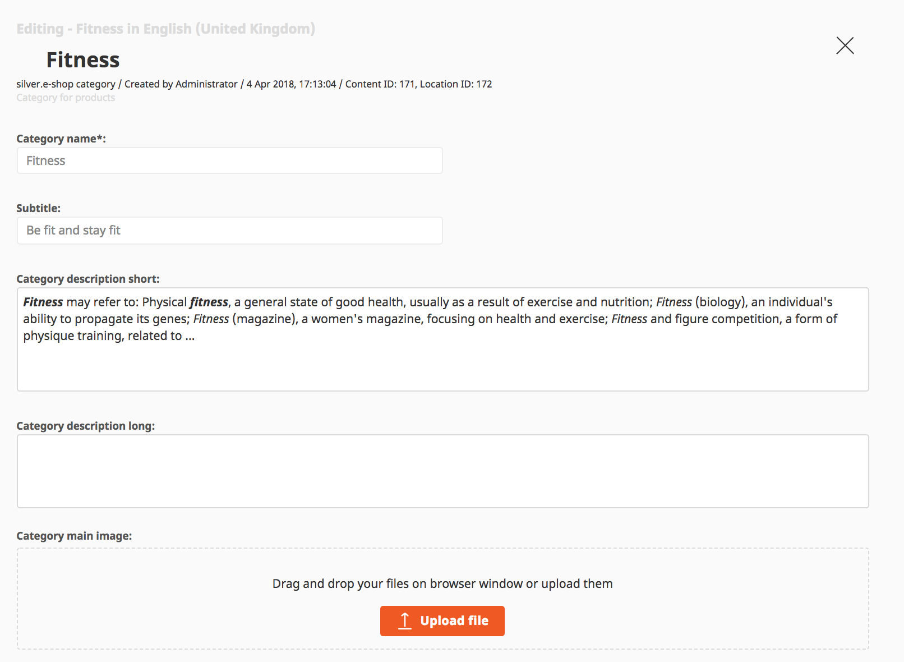

## Product - product texts

silver.eShop offers a set of product fields. Since a product is build using the flexible eZ content type system it can be extended with new fields easiliy.

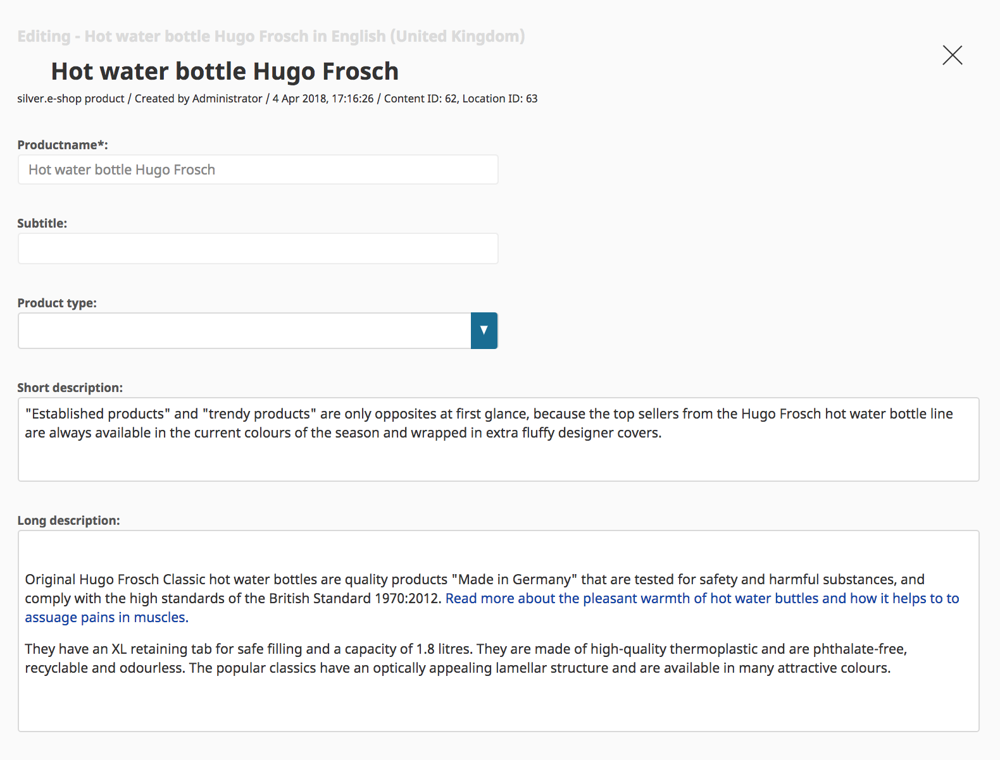

## Product - flexible attribute system

The attribute system allows to manage product attributes in a fast and flexible way.

Attributes can be setup using a template system (shared attributes) or extended with product specific attributes.

The attributes can be grouped.

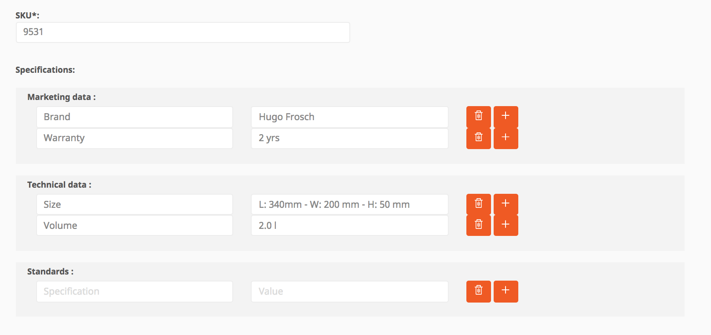

Product attributes are indexed in the search engine as well and can be used for facet search. 

## Product - Variants

silver.eShop offers one or two level variants. A variant can be added directly on the product view.

There are 3 preconfigured variant types:  Color, Size, Color & Size

The list of variant types can be extended in the configuration by the eZ Partner.  

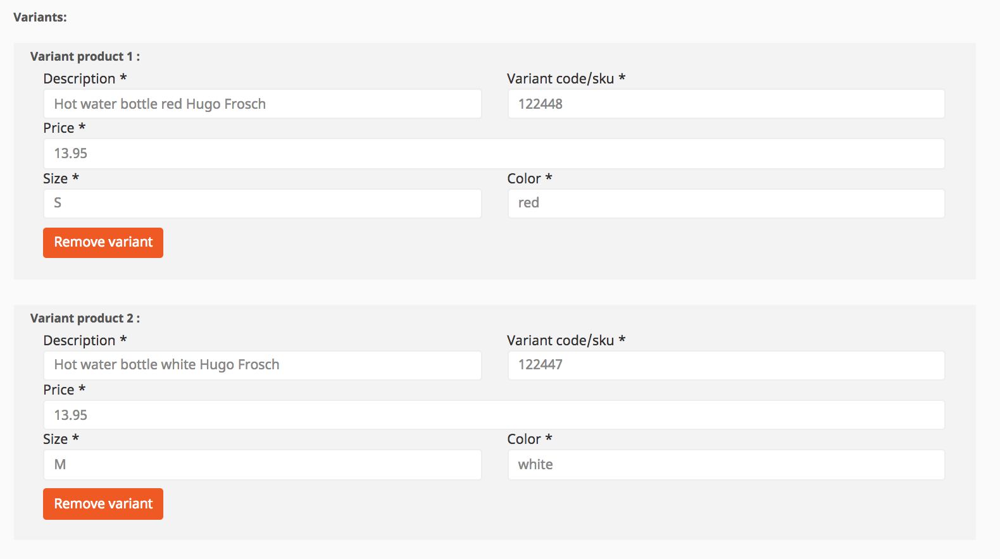

## Preview mode for products

While editing a product the preview function allows to display exactly how the product will look on desktops or mobile devices including product variants.

This simplifies the work of a shop owner/editor since he can see how a complex product would look before it is published in the shop.

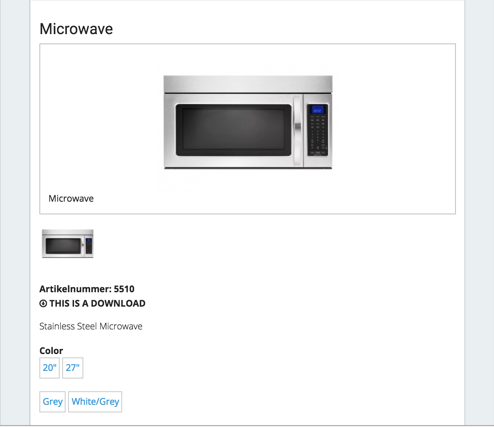

## Product assets - images, videos and pdfs
	
silver.eShop supports assets per product (not per variant). In the standard

- one main image
- up to 3 additional images
- one pdf
- one link to a video (e.g. YouTube)

silver.eShop is using the image system of the eZ Platform CMS including the features to scale images in different resolutions.

## Product - stock

The stock can be managed by sku and sku/variant. This can be done manually or per upload.

In addition a stock text can be added (e.g. not on stock but will be back on 1st April). After an order is placed the stock will be reduced by the number of products bought by the customer.

Ther are two places where stock and prices can be managed:

1\. In the product on the tab "eCommerce":

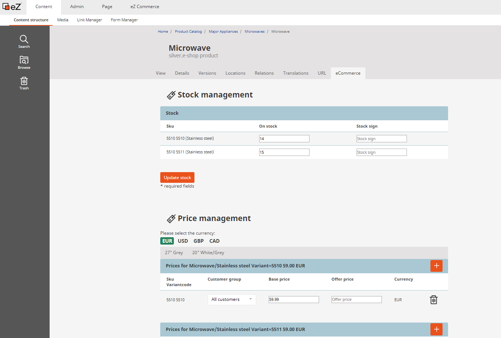

2\. In the section "eCommerce" under "Price and Stock Management":

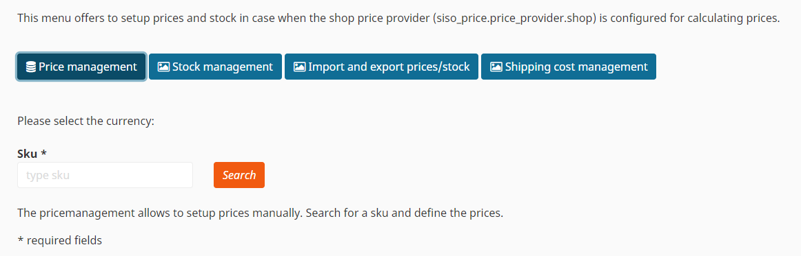

## Product prices

	
The price management allows to setup prices manually. A price can be setup per sku and sku/variant. Each price can contain an offer price and a base price. If an offer price is set it will be displayed in the shop as

~~Old price: 10.00 €~~ New price: 9.80 €

In addition prices can vary per customer group. There are 3 customer goups set up per default. 

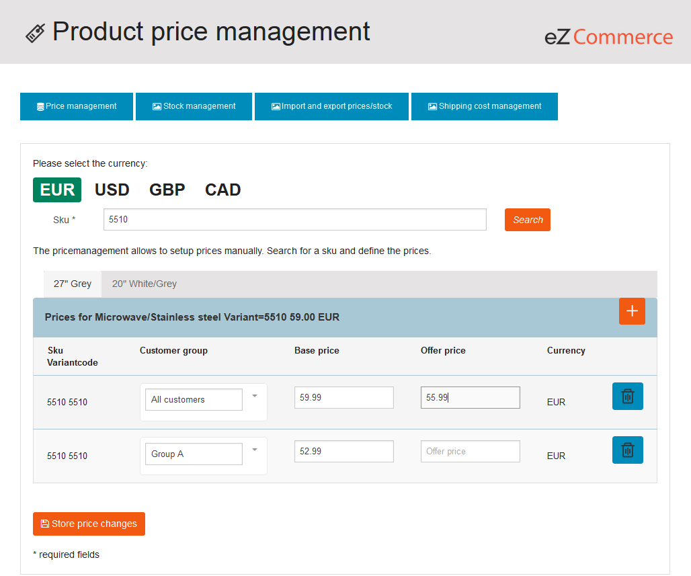

Currencies in silver.eShop:

The currency is configured per country in the [configuration settings](ecommerce_administration.md).

- if a product has a price for a product and a currency this price will be displayed in the shop
- if no price for a currency is set in a shop silver.eShop offers 2 options, these can be set in the configuration per shop.
    - Calculate the price for the requested currency using the base price defined in the product (using the base currency setup for the installation) and an exchange rate defined in the configuration
    - Display an error in the frontend that no price is available
    
## Import/export stock and price information

This feature allows to update stock and prices using a csv file. Prices and stock can be downloaded and uploaded.

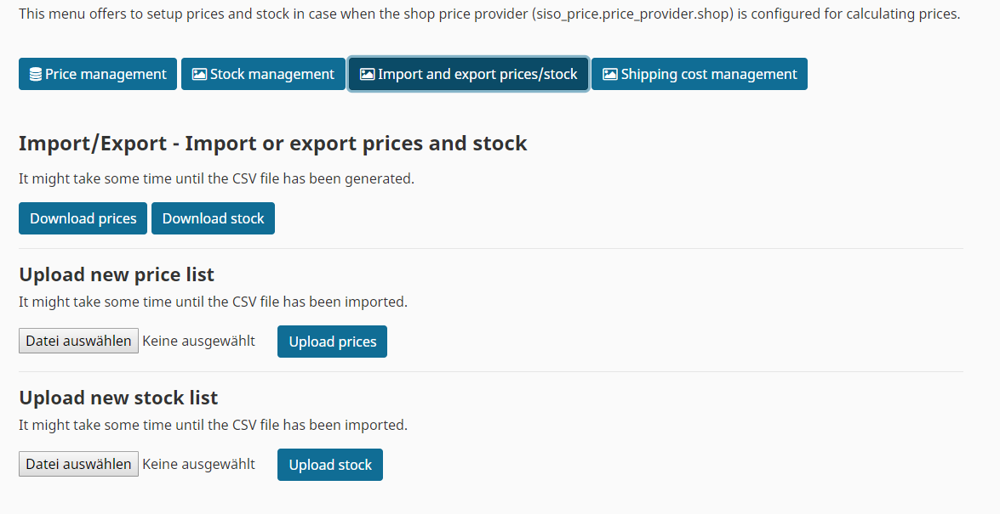
