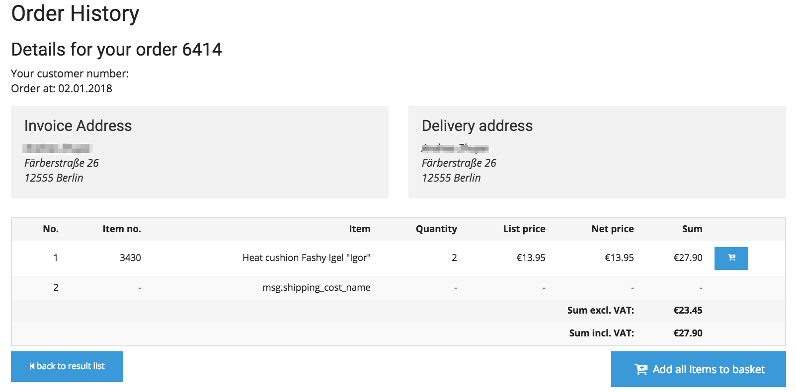

#  Order History 

## The order history

In silver.eShop the order history allows to search for orders from the past.

Advanced version only

In silver.eShop Advanced the order history allows to display invoices, orders, delivery notes or credit memos from the central ERP. It does not matter which channel has been used to create an order (multichannel). The orders can be made by phone, fax, email or via online shop. 

The user can choose which documents he wants to look for and decide for a period. If the ERP provides a tracking link this information will be displayed as well. 

A customer can reorder products easily:

