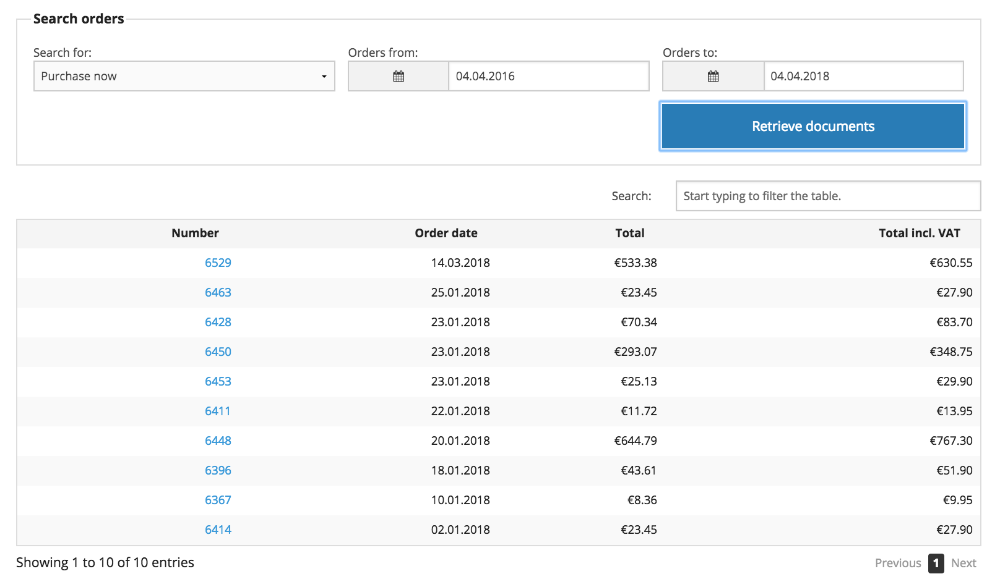
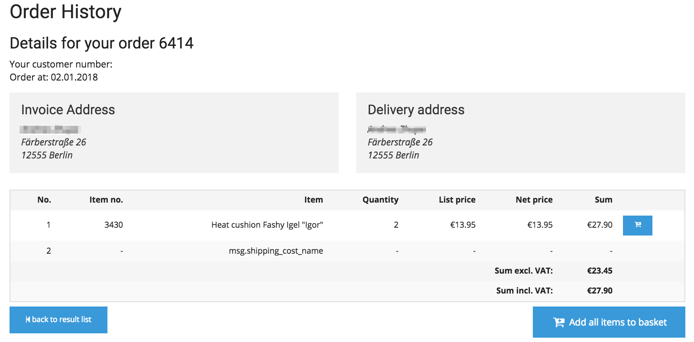

# Ordering process

## Ordering

### Quickorder

This form supports the ordering process for B2B customers and reduces the time to set up an order.

A customer can enter several products and add them to the basket.

An upload function allows to upload a csv file containing a list of skus and quantities. Even more convenient is the drag & drop function.

Variant products can be added as well.

### Add to basket

The user can add products (not a variant) product to the basket directly from the search result in the auto suggest function,

from the product catalog, the product detail page,

from the wishlist and comparison list

from stored basket

and from order history.

## The checkout

### The basket and stored basket

The basket allows to change quantities and to set a remark per order line if this was enabled in the configuration settings. 

The basket can be stored as a new stored basket.

In a stored basket the products can be edited, deleted or added to the active shopping cart.

### Checkout

The checkout is set up on one page and offers 5 steps.

silver.eShop

Step 1: A user can register as a new customer or he can buy as a guest.

Customers with an existing login can login and proceed to the checkout process

Advanced version only

Step 1: A user can register as a new customer, existing customer or he can buy as a guest.

Customers with an existing login can login and proceed to the checkout process

### Invoice and delivery address

Step 2: Invoice address needs to be filled out by new customers or guests ordering and will be prefilled for logged in customers.

Step 3: For delivery address the user can either choose the invoice address, one of the addresses from his address book or enter a new delivery address. For Advanced version only the offered delivery addresses will be fetched from the ERP.

### Delivery options

Step 4: The shipping methods and costs can be setup by a configuration.

### Payment options

The eCommerce solution offers a plugin for PayPal electronic payment (PayPal express). The payment is based on a standard Symfony Bundle. An eZ Partner can integrate other payment providers.

### Order overview

Step 5: The last step summarizes the order. Checkboxes for accepting T&C, Cancellation policy and data protection documents are offered.

### Order

The order is stored in the shop. A confirmation e-mail is sent to the customer and the email address which is set in the configuration.

Advanced version only

The order is forwared to the ERP system and also stored in the shop. A confirmation e-mail is sent to the customer and the email address which is set in the configuration.

## Order History

### The order history

In silver.eShop the order history allows to search for orders from the past.

Advanced version only

In the advanced version the order history allows to search for orders, invoices, delivery note and credit memo from the ERP. The documents for the chosen dates are fetched in real time.

A customer can reorder products easily:

