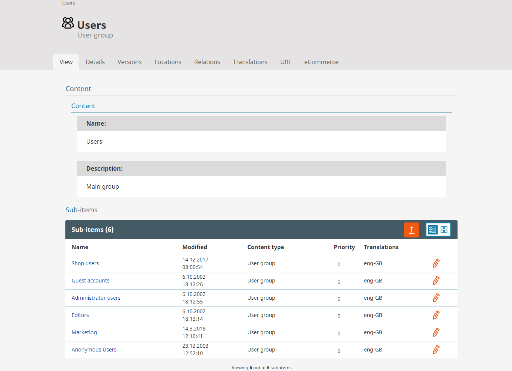
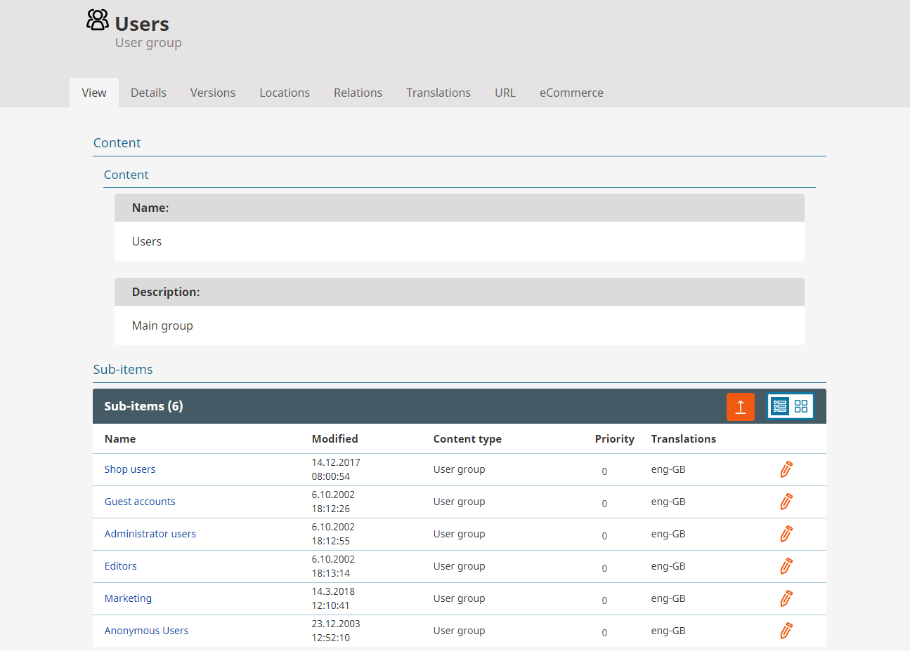
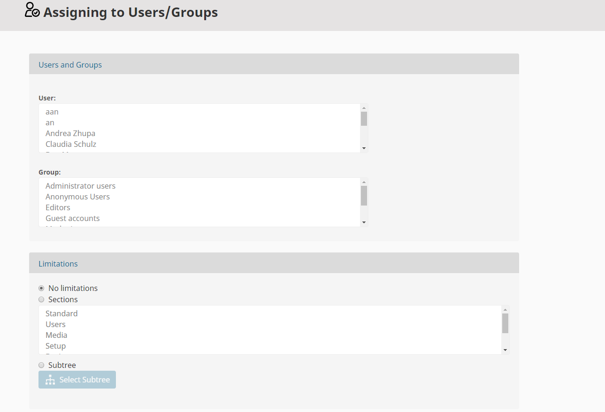
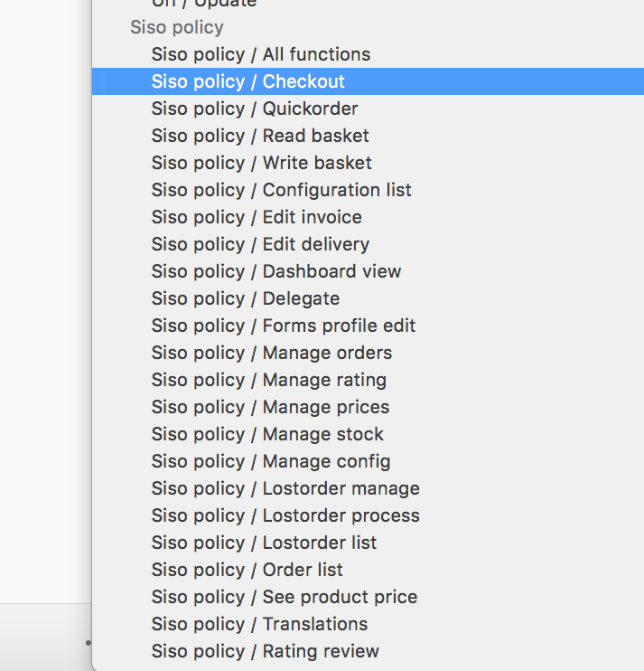
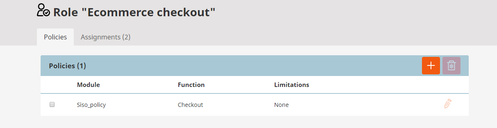
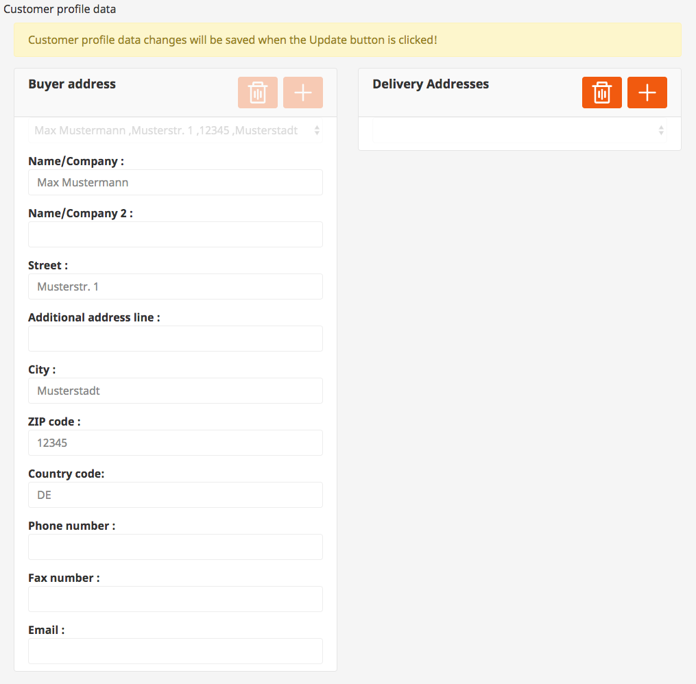

# User management

## Users

silver.eShop users are stored as eZ Users. This enables the shop owner to use the full power of the rights and role system of the CMS.

In addition a shop owner gets infos about the last orders and the sales statistics of the customer. If a user has a current basket it is displayed as well.

## User Groups

In the backend user groups can be created.

Afterwards specific roles can be assigned to the user group (In silver.eShop new users are created in a given user group. The location Id of the user group is configured in a yml file).

## Available policies

For silver.eShop special policies are defined that can be assigned to specific roles.

## Profile Data
	
Buyer and Delivery Addresses of an user can be edited in the backend. It's possible to add, remove and edit addresses.

