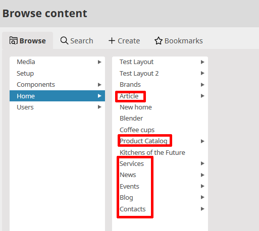

# User manual

eZ Commerce is based on eZ Platform and shares the same Back Office.
This enables the user to create and maintain a website and a shop in only one system. 

See [eZ Platform User Guide](https://doc.ezplatform.com/projects/userguide/en/latest/) for more information.

