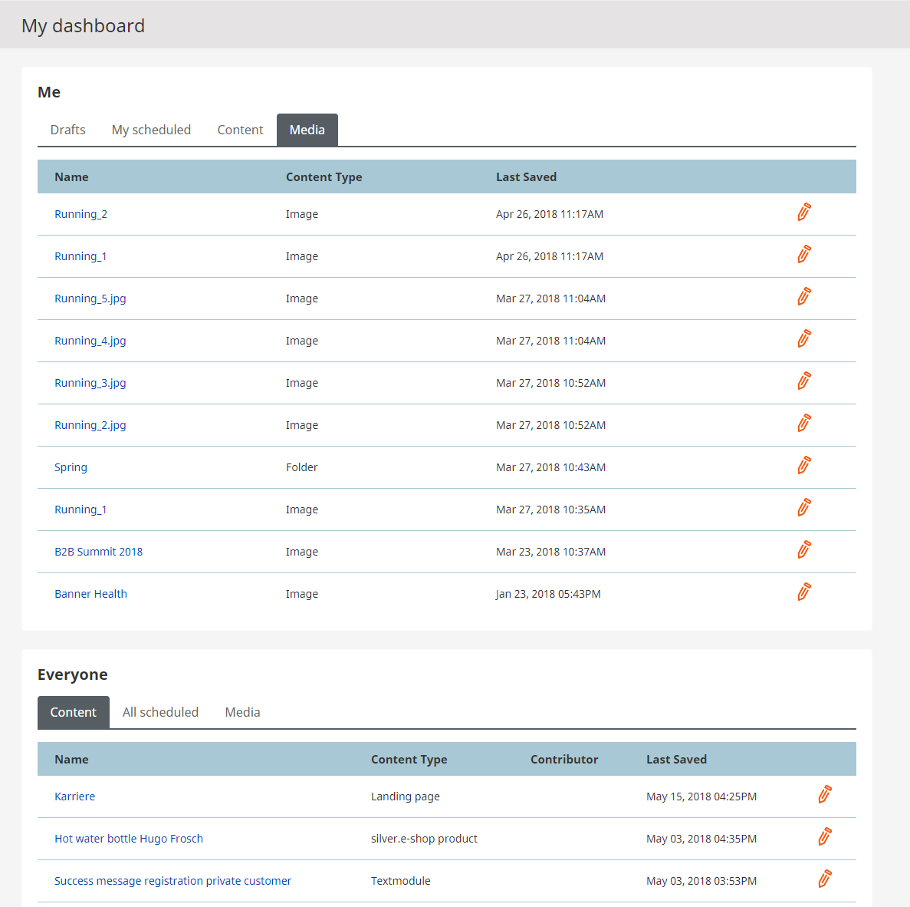

#  Dashboard 

## eZ Platform and eZ Commerce

Information about the user's drafts, scheduled content, content and used media can be found in the Dashboard tab.
Furthermore the dashboard gives an overview of all created content, scheduled content and media of the whole website and/or shop.

