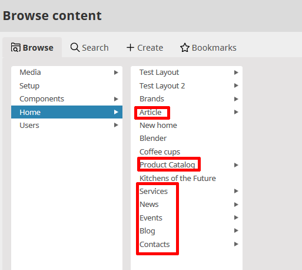

# General

eZ Commerce is based on eZ Platform and shares the same backend.
The shop backend is part of the eZ Backend.
This allows the user to create and maintain website and shop in only one system. 

Link to **eZ Platform User Manual**: <https://doc.ezplatform.com/projects/userguide/en/latest/>

