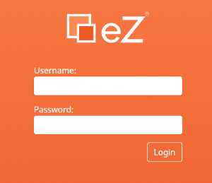
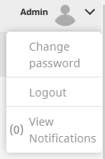

#  Login and logout 

Go to the URL of the backend, then enter your user name and password.

## Login

1. Go to the URL of the backend
1. Enter your user name and password
1. Click Login

##  Logout

To log out select Logout in the upper right corner of the page

The login window appears after logging out.