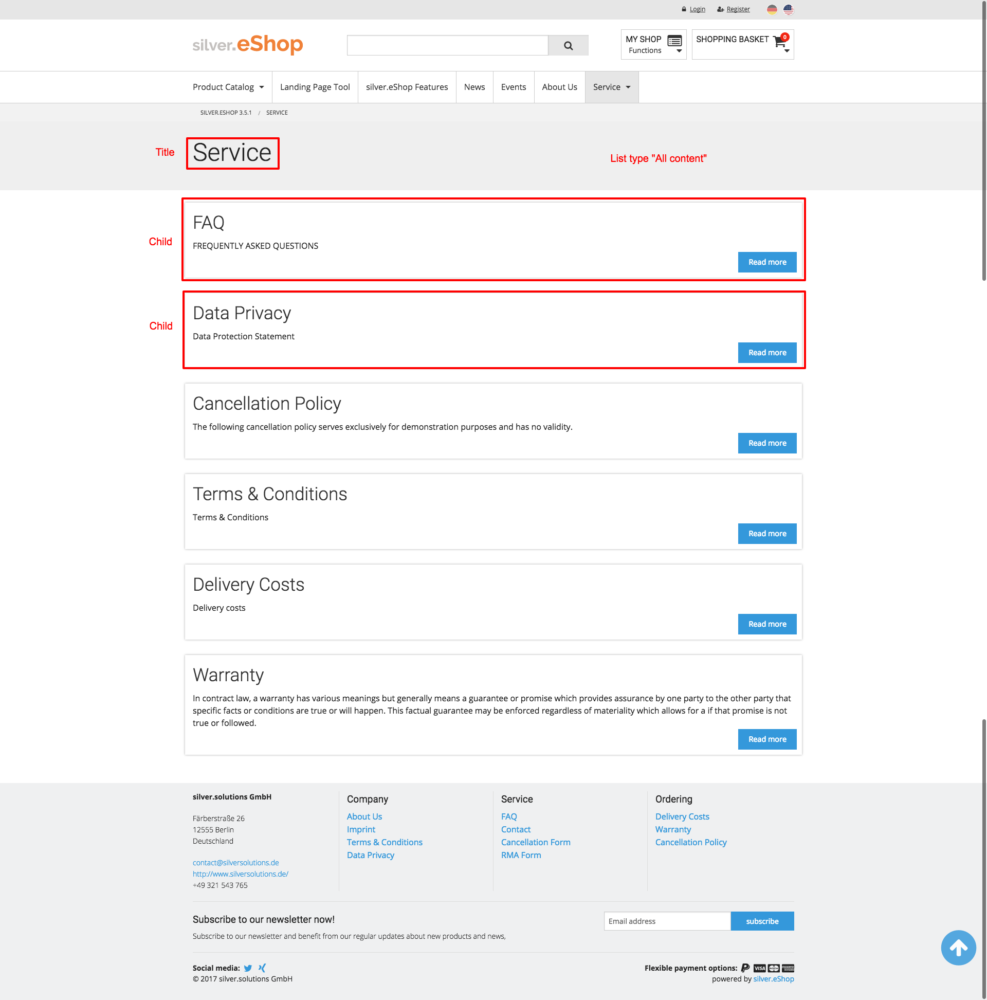

# Folder

## Content class

|Category|Name|Identifier|Type|Description|
|--------|----|----------|----|-----------|
|Content|Internal name|internal_name|Text line|Internal name will be used and shown only in the backend (recommended for multilingual environments)|
|Content|Title|title|Text line|Title will be shown in navigation, breadcrumb and on detailpages. (also used as fallback for landingpages and listpages)|
|Content|Intro|intro|XML block|Intro text will be shown on detailpages. (also used as fallback for landingpages and listpages)|
|Content|Body|body|XML block|Body text will be shown on detailpages.|
|Content|Media|media|Object relations|Images and videos for detailpages (also used as fallback for landingpages and listpages)|
|Content|Layout|	layout|	Layout|	eZ Flow blocks and elements|
|Content|Listtype|	listtype|	SesSelection|List of predefined list configurations (How children will be fetched and shown on this page): "All content" "News" "Events" "Blog" "Contacts" "Downloads"|
|Landingpages and Listpages|Title|	alternative_title|	Text line|	This title will be shown on landingpages or listpages (if empty the common title will be used)|
|Landingpages and Listpages|Intro	|alternative_intro|	XML block|	This intro text will be shown on landingpages or listpages (if empty the common intro text will be used)|
|Landingpages and Listpages|Image|	alternative_image|	Object relation|	This image will be shown on landingpages or listpages (if empty the first image of the "Media" attribute will be used)|
|Meta|Meta title|	meta_title|	Text line|	Meta title for SEO|
|Meta|Meta description|	meta_description|	Text line|	Meta description for SEO|
|Meta|Meta keywords|	meta_keywords|	Text line|	Meta keywords for SEO|

## List types

There a different kind of List definitions configured in configuration files.  
The editor can choose on of these predefined lists.

If the editor is choosing "News", "Events", "Contacts" and "Blog" he can also use the special folder classes "Folder (News)", "Folder (Events)", "Folder (Contacts)" and "Blog".

### All content

- **Layout:** list view  
- **Depth:** 1  
- **Classes:** all classes  
- **Items per page:** 10  
- **Sort by:** priority (ascending)

### News

News will be shown only if the "Date" is today or newer.

- **Layout:** list view  
- **Depth:** 1  
- **Classes:** news  
- **Items per page:** 10  
- **Sort by:** "Date" (descending)

### Events

The editor can create folders inside this folder to organize events (e.g. fairs or workshops).  
Events will be fetched with a depth of two and shown grouped by folder.  
If the events are grouped a inside navigation with anchors to the groups will be visible on top of the page.

Events will be fetched only if the "End date" is today or newer.

- **Layout:** list view  
- **Depth:** 2  
- **Classes:** event  
- **Items per page:** 10  
- **Sort by:** "Start date" (ascending)

### Blog

Blog posts will be shown only if the "Date" is today or newer.

- **Layout:** grid view (with two blog posts in a row)  
- **Depth:** 1  
- **Classes:** blog\_post  
- **Items per page:** 10  
- **Sort by:** "Date" (descending)

### Contacts

Contact will be shown only if the "priority" is greater than 0.

- **Layout:** grid view (with 4 contacts in a row)  
- **Depth:** 1  
- **Classes:** contact  
- **Items per page:** unlimited  
- **Sort by:** priority (ascending)

### Downloads

The editor can create folders inside this folder to organize downloads (e.g. Manuals or data sheets).  
Downloads will be fetched with a depth of two and shown grouped by folder.  
If the downloads are grouped a inside navigation with anchors to the groups will be visible on top of the page.

Downloads (files) will be shown only if the "priority" is greater than 0.

- **Layout:** grid view (with 2 downloads in a row)  
- **Depth:** 2  
- **Classes:** file  
- **Items per page:** unlimited  
- **Sort by:** priority (ascending)

## Create

You can create a folder everywhere in the content structure.
