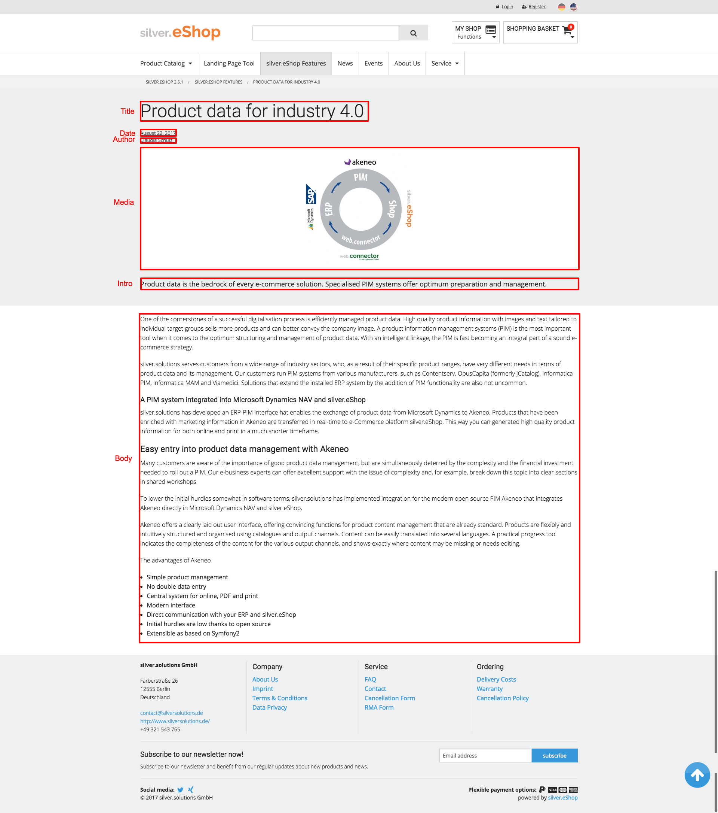
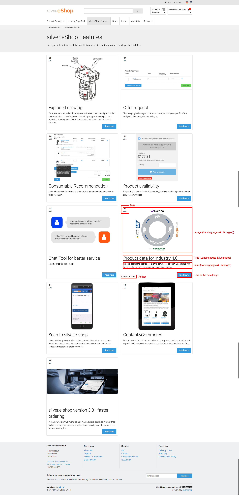

#  Blog post 

## Content class

|Category|Name|Identifier|Type|Description|
|--------|----|----------|----|-----------|
|Content|Internal name|internal_name|Text line|Internal name will be used and shown only in the backend (recommended for multilingual environments)|
|Content|Title|title|Text line|Title will be shown in navigation, breadcrumb and on detailpages. (also used as fallback for landingpages and listpages)|
|Content|Intro|intro|XML block|Intro text will be shown on detailpages. (also used as fallback for landingpages and listpages)|
|Content|Body|body|XML block|Body text will be shown on detailpages.|
|Content|Media|media|Object relations|Images and videos for detailpages (also used as fallback for landingpages and listpages)|
|Content|Date|date|	Date|	The date when the article should be visible in the frontend.|
|Content|Author|	author|	Author|	Name of the author|
|Content|Comments enabled|	comments_enabled|	Checkbox|	The editor can choose if the user can comment this post or not.|
|Landingpages and Listpages|Title|	alternative_title|	Text line|	This title will be shown on landingpages or listpages (if empty the common title will be used)|
|Landingpages and Listpages|Intro	|alternative_intro|	XML block|	This intro text will be shown on landingpages or listpages (if empty the common intro text will be used)|
|Landingpages and Listpages|Image|	alternative_image|	Object relation|	This image will be shown on landingpages or listpages (if empty the first image of the "Media" attribute will be used)|
|Meta|Meta title|	meta_title|	Text line|	Meta title for SEO|
|Meta|Meta description|	meta_description|	Text line|	Meta description for SEO|
|Meta|Meta keywords|	meta_keywords|	Text line|	Meta keywords for SEO|

## Create

You can create an blog post only as a child of a "Folder" oder "Blog".
