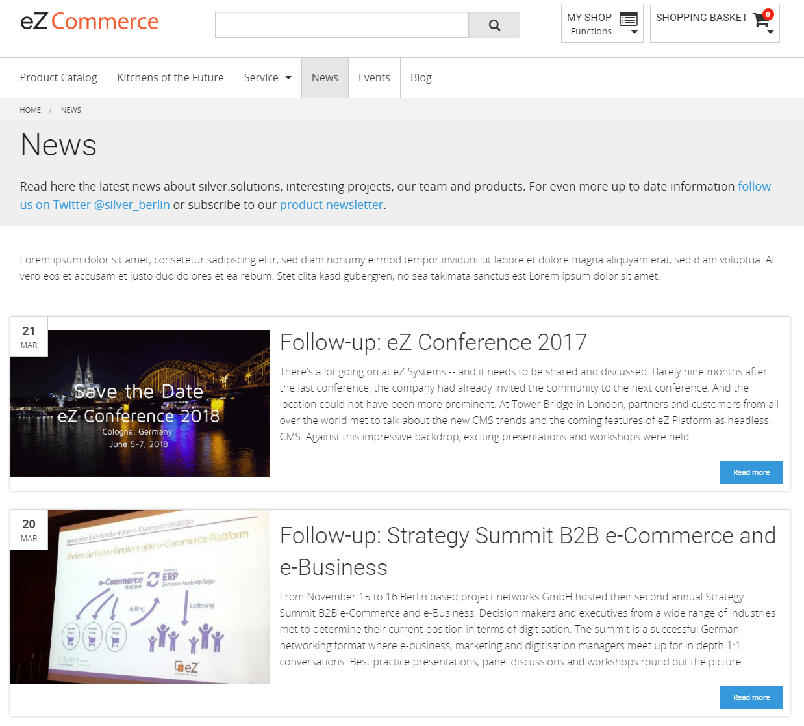
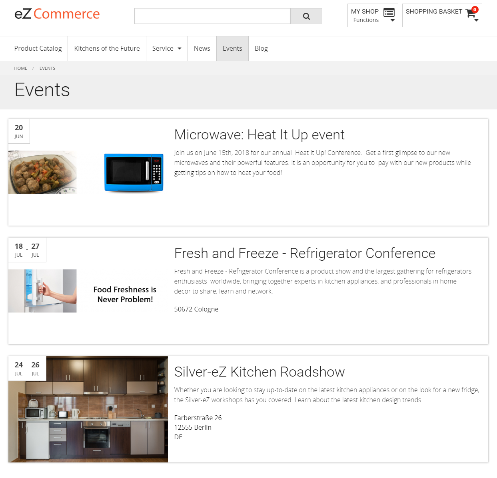

# ContentPluginBundle

## Introduction 

The ContentPlugin is part of the eZ Commerce package.  

The editor can create content like article, news, events etc. For these content detail pages are existing.  
To give the user an overview about the website content the editor can create different kind of folder (folders in general, folders for news, events etc.).

   

## Detail pages

In the latest version the following content types have detail pages:

- [Article](article.md)
- [News](news.md)
- [Blog posts](blog_post.md)

Content like contacts, events and downloads are only visible on List pages.

## List pages

There are different kind of list pages.

The general "Folder" where the editor can choose one of the predefined listtypes:

  - All Content
  - Blog
  - News
  - [Events](event.md)
  - [Contacts](contact.md)
  - Downloads

To simplify the maintenance of website (e.g. assign special rights for editors and contenttypes) content there a special folders for specific cases:

  - [Folder (News)](folder_news.md)
  - [Folder (Events)](folder_events.md)
  - [Folder (Contacts)](folder_contacts.md)
  - [Blog](blog_post.md)
